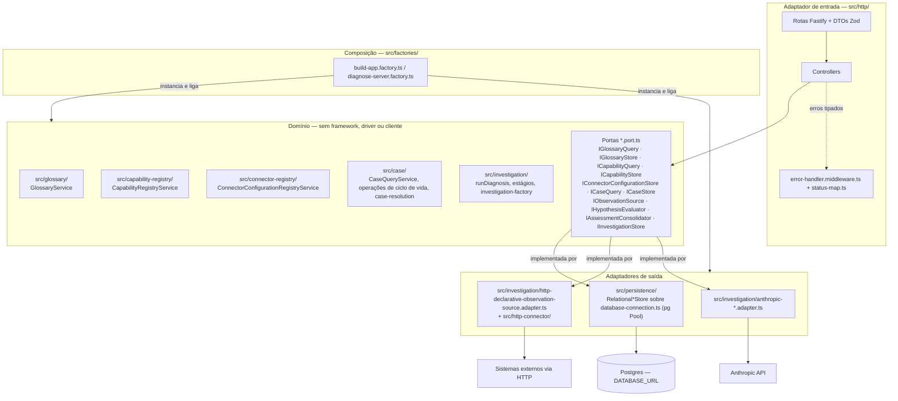
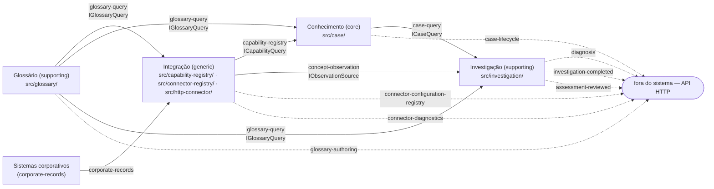

# Visão geral

## 1. O que o sistema é e o que resolve

O **ServiceDeskN1** é um *resolvedor de casos*: um serviço HTTP em Node.js/TypeScript que recebe um caso curado e um sujeito e devolve um desfecho (`outcome`), um encaminhamento (`referral` — ação e destinatário) e um texto de conclusão. Ele resolve **um caso por vez** e não sabe nada sobre o domínio do caso: todo o conhecimento de troubleshooting vive em dados — a ficha do caso, o glossário e o registro de capacidades — e não no código.

Um **caso** (`Case`) é uma ficha de troubleshooting escrita por quem conhece o problema: um tipo de sujeito, um conjunto de **hipóteses** ordenadas por precedência — cada uma com um critério em prosa, os conceitos que precisa observar (`collects`) e a resolução que segue se ela for confirmada — e um desfecho padrão (`fallback`) para quando nenhuma confirma.

Ao receber um pedido de diagnóstico (`POST /v1/diagnose`), o serviço:

| Etapa | O que faz | Onde vive |
|---|---|---|
| 1. Leitura | Lê a versão pinada do caso (slug + versão) e a valida por inteiro — estrutura e coerência contra o estado atual do glossário e do registro de capacidades (`knowledge/rules/knowledge/validation-runs-at-every-read.md`) | `src/case/case-query.service.ts` |
| 2. Coleta | Coleta uma evidência por conceito do plano de coleta, em paralelo, dentro de um orçamento de tempo próprio (`knowledge/rules/investigation/collection-has-its-own-budget-within-the-total.md`) | `src/investigation/evidence-collection-stage.ts` |
| 3. Julgamento | Julga cada hipótese exigida em uma chamada isolada a um avaliador, sob limite de concorrência configurável (`knowledge/constraints/hypotheses-are-judged-in-isolated-parallel-calls.md`) | `src/investigation/judgment-stage.ts` |
| 4. Resolução | Resolve o desfecho pela primeira hipótese confirmada na ordem de precedência, ou pelo `fallback` (`knowledge/rules/investigation/the-outcome-comes-from-the-case.md`) | `src/case/case-resolution.ts` |
| 5. Redação | Redige o texto da conclusão a partir apenas do que foi citado (`knowledge/rules/investigation/the-writing-input-is-narrowed.md`) | `src/investigation/draft-assessment-text.ts` |
| 6. Gravação | Grava a investigação inteira como registro imutável e só então responde (`knowledge/rules/investigation/an-investigation-is-written-once.md`, `knowledge/rules/investigation/the-response-follows-the-record.md`) | `src/investigation/run-diagnosis.ts` |

Todo o pedido corre contra um prazo absoluto único, repartido entre as etapas (`knowledge/constraints/the-deadline-is-an-absolute-propagated-instant.md`). A gravação final é a única etapa que nunca degrada silenciosamente: se não concluir a tempo, o pedido falha em vez de responder sem o registro correspondente.

O que o sistema resolve, em termos de negócio:

- **Conhecimento como dado, não como código.** Cadastrar um caso novo, corrigir um critério ou apontar um conceito para outro sistema externo é curadoria de dados, feita pela API HTTP; nada disso recompila nada.
- **Rastreabilidade.** Todo julgamento decidido cita a evidência que o fundamentou (`knowledge/rules/investigation/a-decided-evaluation-cites-evidence.md`) e toda investigação fica gravada com os pinos de replay — caso, versão, modelo, versão do prompt e evidências (`knowledge/rules/investigation/replay-is-pinned.md`).
- **Vocabulário único.** Todos os nomes que um caso, uma capacidade ou uma investigação usam existem uma única vez no glossário, o que impede a grafia de derivar e permite relatórios que cruzam casos (ver [Glossário](02-glossario.md)).

O pipeline em si é detalhado em [Pipeline](07-pipeline.md); este capítulo apresenta o mapa.

## 2. Vocabulário essencial

Nomes de entidades permanecem como no código e na especificação (`knowledge/domain/`). Cada linha aponta o capítulo que detalha a entidade.

### Contexto Glossário (`knowledge/domain/glossary/`, `src/glossary/`) — [capítulo 5](02-glossario.md)

| Termo | Em uma linha |
|---|---|
| **Concept** | Uma observação nomeada que uma hipótese pode coletar; declara quais tipos de sujeito aceita (`accepts`) e seu `ttl` em segundos. |
| **SubjectType** | Um tipo de coisa que uma investigação pode examinar — um contrato, um cliente, um elemento de rede. |
| **SubjectAttribute** | Um atributo identificador que uma instância de sujeito pode carregar — um id, um telefone, um número de contrato. |
| **Outcome** | O que uma hipótese confirmada, ou o `fallback`, conclui (o "desfecho"). |
| **Action** | O que o destinatário de um encaminhamento faz (a "ação"). |
| **Recipient** | A fila operacional a que um encaminhamento se dirige (o "destinatário") — sempre um papel, nunca uma pessoa. |

### Contexto Integração (`knowledge/domain/integration/`, `src/capability-registry/`, `src/connector-registry/`, `src/http-connector/`) — [capítulo 6](03-integracao.md)

| Termo | Em uma linha |
|---|---|
| **Capability** | Uma observação read-only registrada, identificada por nome e versão, que responde exatamente um Concept; declara schemas de entrada/saída, timeout e conector. |
| **CapabilityNature** | O que uma capacidade pode fazer ao mundo; só `read-only` é registrável, `mutating` existe para o registro ter o que recusar. |
| **CapabilityRegistry** | A busca de um Concept para a Capability que o responde, um para um. |
| **ConnectorConfiguration** | Uma configuração nomeada e opaca (objeto JSON) que diz a um conector tudo o que ele precisa para derivar e emitir sua chamada. |
| **ConnectorConfigurationRegistry** | Registra uma ConnectorConfiguration por nome, substituindo por inteiro a que já respondia por ele. |

### Contexto Conhecimento (`knowledge/domain/knowledge/`, `src/case/`) — [capítulo 7](04-conhecimento.md)

| Termo | Em uma linha |
|---|---|
| **Case** | A identidade estável de um caso: `slug` e o contador `next_version` que numera o próximo rascunho. |
| **CaseVersion** | Uma tentativa numerada do procedimento do caso — título, sujeito, `fallback`, manifesto — livre em `draft`, imutável depois de `released`. |
| **CaseVersionState** | Os dois estados do ciclo de vida de uma versão: `draft` e `released`. |
| **Hypothesis** | A identidade estável de uma afirmação falsificável dentro do caso; seu conteúdo vive nas revisões. |
| **HypothesisRevision** | Um estado numerado do conteúdo de uma hipótese: critério em prosa, `collects` e resolução; nunca alterado depois que uma versão liberada o manifesta. |
| **ManifestEntry** | Uma linha do manifesto de uma versão: a posição de precedência e qual revisão de qual hipótese ela usa. |
| **Resolution** | O que segue uma posição decidida: um Outcome e um Referral. |
| **Referral** | O encaminhamento que uma resolução carrega: uma Action e um Recipient. |
| **ConsolidationRegister** | O registro de escrita pedido pelo curador — `formal` ou `plain`. |
| **CaseSummary** | Um resumo de um caso calculado a partir de suas versões (estado, quantidade de versões, último toque), guardado em lugar nenhum. |

### Contexto Investigação (`knowledge/domain/investigation/`, `src/investigation/`) — [capítulo 8](05-investigacao.md)

| Termo | Em uma linha |
|---|---|
| **Investigation** | Um diagnóstico de um sujeito sob uma versão pinada de caso, escrito uma vez e nunca mutado. |
| **Subject** | O que a investigação examina: um SubjectType e o conjunto de atributos-valores que identificam a instância. |
| **SubjectAttributeValue** | Um fato sobre a identidade do sujeito: um SubjectAttribute governado e o valor concreto que ele tem nesta instância. |
| **Evidence** | O que um conceito coletado devolveu, normalizado ao vocabulário do glossário, com a capacidade (nome e versão) que o produziu. |
| **EvidenceResult** | Como uma coleta terminou: só `ok` carrega observação usável; as outras são fatos sobre a tentativa. |
| **Evaluation** | O julgamento de uma hipótese, identificado pelo nome da hipótese dentro do caso pinado. |
| **Verdict** | O que o julgamento de uma hipótese concluiu. |
| **EvaluationReason** | Por que uma avaliação foi inconclusiva: falta de dados, chamada falha ou prazo expirado. |
| **Citation** | A rastreabilidade de uma avaliação decidida: um Concept e um campo da observação que fundamentou o veredito. |
| **Assessment** | A resposta: Outcome, Referral, hipótese determinante (quando houve) e o texto redigido. |
| **Cost** | O que a investigação custou no provedor de LLM. |
| **Durations** | Quanto cada etapa levou, em milissegundos. |
| **HypothesisEvaluator** | A porta pela qual uma hipótese é julgada contra sua evidência (LLM em produção, dublê em teste). |
| **AssessmentConsolidator** | A porta pela qual o texto do parecer é redigido depois que todos os julgamentos fecharam. |

## 3. Arquitetura hexagonal

O serviço segue arquitetura hexagonal (portas e adaptadores) com uma regra estrita, fixada pela especificação em `knowledge/constraints/the-domain-depends-on-no-infrastructure.md`: **o domínio nunca importa infraestrutura**. A camada de domínio — comportamento do caso, fábrica de investigação, avaliação, vocabulário — não importa framework, driver de banco nem cliente de provedor; a infraestrutura só a alcança por portas. O critério de aderência declarado pelo próprio nó é uma auditoria de dependências sobre os imports dos módulos de domínio que não encontra nenhum pacote de framework, driver ou cliente.

### 3.1 Portas (`*.port.ts`)

Cada módulo de domínio declara suas interfaces em arquivos `*.port.ts`. Há dois tipos de porta:

- **Portas de saída (stores e fontes externas)** — o que o domínio precisa que alguém implemente: persistência, observação, julgamento, redação.
- **Portas de consulta publicadas (queries)** — o contrato que um contexto oferece a outro, em processo. Um consumidor depende só da interface, nunca do serviço ou do store que a responde.

| Porta | Arquivo | Contexto | Papel |
|---|---|---|---|
| `IGlossaryQuery` | `src/glossary/glossary-query.port.ts` | Glossário | Contrato publicado `contracts/glossary/glossary-query`: ler/listar termos e conceitos |
| `IGlossaryStore` | `src/glossary/glossary-store.port.ts` | Glossário | Persistência dos cinco vocabulários e dos conceitos |
| `ICapabilityQuery` | `src/capability-registry/capability-query.port.ts` | Integração | Contrato publicado `contracts/integration/capability-registry`: resolver um conceito para a capacidade que o responde |
| `ICapabilityStore` | `src/capability-registry/capability-store.port.ts` | Integração | Persistência das capacidades |
| `IConnectorConfigurationStore` | `src/connector-registry/connector-configuration-store.port.ts` | Integração | Persistência das configurações de conector |
| `ICaseQuery` | `src/case/case-query.port.ts` | Conhecimento | Contrato publicado `contracts/knowledge/case-query`: ler um caso validado por inteiro |
| `ICaseStore` | `src/case/case-store.port.ts` | Conhecimento | Persistência de casos, versões, hipóteses e revisões |
| `IObservationSource` | `src/investigation/observation-source.port.ts` | Investigação | Observar um conceito para um sujeito (`contracts/investigation/observation-source`) |
| `IHypothesisEvaluator` | `src/investigation/hypothesis-evaluator.port.ts` | Investigação | Julgar uma hipótese (`knowledge/constraints/judgment-runs-behind-a-port.md`) |
| `IAssessmentConsolidator` | `src/investigation/assessment-consolidator.port.ts` | Investigação | Redigir o parecer (`knowledge/constraints/consolidation-runs-behind-a-port.md`) |
| `IInvestigationStore` | `src/investigation/investigation-store.port.ts` | Investigação | Gravar a investigação uma única vez |

### 3.2 Adaptadores

Quem implementa uma porta vive fora do domínio. Os adaptadores de produção e os dublês de teste que a árvore contém hoje:

| Porta | Adaptador de produção | Dublê / alternativa |
|---|---|---|
| `IGlossaryStore` | `RelationalGlossaryStore` — `src/persistence/relational-glossary-store.repository.ts` | — |
| `ICapabilityStore` | `RelationalCapabilityStore` — `src/persistence/relational-capability-store.repository.ts` | — |
| `IConnectorConfigurationStore` | `RelationalConnectorConfigurationStore` — `src/persistence/relational-connector-configuration-store.repository.ts` | — |
| `ICaseStore` | `RelationalCaseStore` — `src/persistence/relational-case-store.repository.ts` | — |
| `IInvestigationStore` | `RelationalInvestigationStore` — `src/persistence/relational-investigation-store.repository.ts` | — |
| `IObservationSource` | `HttpDeclarativeObservationSource` — `src/investigation/http-declarative-observation-source.adapter.ts` | `FakeObservationSource` — `src/investigation/fake-observation-source.adapter.ts` |
| `IHypothesisEvaluator` | `AnthropicHypothesisEvaluator` — `src/investigation/anthropic-hypothesis-evaluator.adapter.ts` | `FakeHypothesisEvaluator` — `src/investigation/fake-hypothesis-evaluator.adapter.ts` |
| `IAssessmentConsolidator` | `AnthropicAssessmentConsolidator` — `src/investigation/anthropic-assessment-consolidator.adapter.ts` | `FakeAssessmentConsolidator` — `src/investigation/fake-assessment-consolidator.adapter.ts` |

Um único `Pool` do `pg` (`src/persistence/database-connection.ts`) é a única peça do código que sabe que existe um banco; todo repositório relacional o recebe pronto e todo helper de leitura, escrita e transação (`src/persistence/database-access.ts`) roda por cima dele (`knowledge/constraints/the-system-persists-to-one-relational-database.md`). Os repositórios não importam `pg` diretamente — nomeiam apenas o tipo `DatabaseConnection` e os helpers `runStatement`/`runInTransaction`.

A camada HTTP (`src/http/`) é igualmente um adaptador: rotas Fastify validam a entrada com Zod (`src/http/dto/*.dto.ts`), chamam um controller que traduz o pedido para uma chamada de porta ou operação, e um tratador de erro único (`src/http/error-handler.middleware.ts`) resolve cada erro tipado de domínio para um status HTTP pela tabela de `src/errors/status-map.ts`. Erros que a tabela não nomeia respondem 500.

### 3.3 Factories (`src/factories/`)

A amarração entre porta e adaptador acontece **exclusivamente** nas factories. Cada módulo tem uma factory nomeada para ele; nenhuma factory constrói algo além de ligar folhas já construídas a partir de uma única `DatabaseConnection`.

| Factory | O que compõe |
|---|---|
| `src/factories/glossary.factory.ts` | `createGlossary` → `GlossaryService(RelationalGlossaryStore)`; `createGlossaryQuery` devolve o mesmo objeto tipado como `IGlossaryQuery` |
| `src/factories/capability-registry.factory.ts` | `createCapabilityRegistry` → `CapabilityRegistryService(RelationalCapabilityStore)`; `createCapabilityQuery` devolve-o como `ICapabilityQuery` |
| `src/factories/connector-configuration-registry.factory.ts` | `createConnectorConfigurationRegistry` → `ConnectorConfigurationRegistryService(RelationalConnectorConfigurationStore)` |
| `src/factories/case-store.factory.ts` | `createCaseStore` → `RelationalCaseStore` |
| `src/factories/case-query.factory.ts` | `createCaseQuery` → `CaseQueryService(caseStore, glossaryQuery, capabilityQuery)` |
| `src/factories/case-lifecycle.factory.ts` | `createCaseLifecycle` → as seis operações do ciclo de vida do caso (`createDraft`, `reviseHypothesis`, `placeHypothesis`, `removeHypothesis`, `release`, `discard`) |
| `src/factories/investigation-store.factory.ts` | `createInvestigationStore` → `RelationalInvestigationStore` |
| `src/factories/diagnose.factory.ts` | `createDiagnoseRunner` → `runDiagnosis` com store, glossário, capacidades e os adaptadores de observação/julgamento/redação que o chamador escolhe |
| `src/factories/production-diagnose.factory.ts` | `createProductionDiagnoseRunner` → fixa os dois adaptadores Anthropic e carimba o prazo absoluto (`TOTAL_DEADLINE_BUDGET_MS = 20_000`) em cada chamada |
| `src/factories/build-app.factory.ts` | `buildAppDependencies` → as dependências de todas as rotas HTTP a partir da mesma conexão, reutilizando uma instância de cada serviço |
| `src/factories/diagnose-server.factory.ts` | `createDiagnoseHttpServer` → cria a conexão a partir de `DATABASE_URL`, monta o `HttpDeclarativeObservationSource`, o `CaseQueryService` e o runner de produção, e devolve o app Fastify **sem** escutar |

O ponto de entrada do processo é `src/index.ts`: lê o ambiente (`src/config/env.ts`), chama `createDiagnoseHttpServer` e é o único arquivo que chama `.listen()`. Importar qualquer outro módulo para teste nunca abre uma porta.

### 3.4 Diagrama de camadas

A seta que importa é a de composição: **só** as factories conhecem simultaneamente uma porta e sua implementação. O domínio conhece as portas; os adaptadores conhecem as portas; nenhum dos dois conhece o outro.

## 4. Mapa de contextos

A especificação divide o sistema em quatro bounded contexts (`knowledge/domain/*/_context.md`), cada um com uma classificação estratégica registrada em `knowledge/projections/overview.md`:

| Contexto | Classificação | Pasta de código | Responsabilidade |
|---|---|---|---|
| **Glossário** (`glossary`) | supporting | `src/glossary/` | A linguagem publicada do sistema: os cinco vocabulários de termos e os conceitos que um caso pode coletar. Dado puro, sem comportamento; todos os outros contextos dependem dele e traduzem para ele, nunca o contornam. |
| **Integração** (`integration`) | generic | `src/capability-registry/`, `src/connector-registry/`, `src/http-connector/` | Acesso aos sistemas externos: capacidades read-only registradas, configurações de conector, e a normalização que mantém o vocabulário do sistema-fonte fora do domínio. Substituível por construção. |
| **Conhecimento** (`knowledge`) | **core** | `src/case/` | O conhecimento curado de troubleshooting: que hipóteses existem para um caso, o que confirma cada uma e qual domina qual. O modelo vive no schema do caso e no seu validador. |
| **Investigação** (`investigation`) | supporting | `src/investigation/` | A execução de um caso sobre um sujeito: coletar, julgar, resolver, escrever, persistir, responder — sob prazo absoluto. Fino e óbvio por design: a lógica de negócio está no caso. |

### 4.1 Diagrama

Adaptado de `knowledge/projections/context-map.mmd`. Setas cheias são contratos consumidos em processo entre contextos; setas tracejadas são contratos publicados para fora do sistema (a API HTTP e os eventos que o material nomeia).

### 4.2 As dependências, uma a uma

**Glossário → todos.** O glossário não depende de ninguém e todos dependem dele, pelo contrato `contracts/glossary/glossary-query` (`IGlossaryQuery`, `src/glossary/glossary-query.port.ts`):

- **Conhecimento** consome `read-vocabulary-term` e `read-concept` (`knowledge/contracts/knowledge/vocabulary-terms.md`) para validar um caso: todo tipo de sujeito, desfecho, ação, destinatário e conceito que uma versão de caso ou suas revisões manifestadas nomeiam precisa existir no glossário no momento da leitura (`knowledge/rules/knowledge/case-terms-exist-in-the-glossary.md`). Implementado em `src/case/validate-case-coherence.ts`, chamado por `src/case/case-query.service.ts` e `src/case/release.operation.ts`; `src/case/revise-hypothesis.operation.ts` também lê `readConcept` para recusar uma revisão que colete um conceito inexistente.
- **Investigação** consome `read-vocabulary-term` (`knowledge/contracts/investigation/glossary-source.md`) para recusar um sujeito cujos atributos o glossário não publica (`knowledge/rules/investigation/a-subject-attribute-is-drawn-from-the-glossary.md`), em `src/investigation/investigation-factory.ts`.
- **Integração** consome `read-concept` na especificação (`knowledge/contracts/integration/glossary-vocabulary.md`) — a normalização traduz para o vocabulário do glossário, e é por isso que a Integração depende do Glossário e não do Conhecimento (`knowledge/rules/integration/evidence-arrives-in-the-glossary-vocabulary.md`). No código, essa dependência aparece como a chave estrangeira `capabilities.concept → concepts(name)` (`migrations/0007-capability-concept.sql`) e como os schemas da capacidade "declarados no vocabulário do glossário" (`src/capability-registry/capability.ts`); nenhum módulo de `src/capability-registry/` ou `src/http-connector/` chama `IGlossaryQuery` diretamente.

**Integração → Conhecimento.** O contrato `contracts/integration/capability-registry` (`ICapabilityQuery`, `src/capability-registry/capability-query.port.ts`) é consumido pela validação do caso: todo conceito coletado precisa ter uma capacidade read-only registrada no momento da leitura (`knowledge/rules/knowledge/every-collected-concept-has-a-read-only-capability.md`, `knowledge/rules/knowledge/the-contract-check-reads-the-current-registration.md`), em `src/case/validate-case-coherence.ts`.

**Integração → Investigação.** O contrato `contracts/integration/concept-observation` (`IObservationSource`, `src/investigation/observation-source.port.ts`) é como a coleta obtém uma observação por conceito. Em produção, `HttpDeclarativeObservationSource` resolve a capacidade pelo `ICapabilityQuery`, lê a configuração do conector pelo `ConnectorConfigurationRegistryService` e emite a chamada HTTP pelo `src/http-connector/`.

**Conhecimento → Investigação.** O contrato `contracts/knowledge/case-query` (`ICaseQuery`, `src/case/case-query.port.ts`) entrega à investigação o caso lido e validado por inteiro; só uma versão `released` é diagnosticada (`knowledge/rules/investigation/only-a-released-case-version-is-diagnosed.md`). A investigação também usa a resolução pura de `src/case/case-resolution.ts` para escolher o desfecho — a lógica é do caso, não da investigação.

**Sistemas corporativos → Integração.** A capacidade `corporate-records` (`knowledge/contracts/system/corporate-records.md`) é a única fonte externa que a especificação mapeia; ela entra no sistema apenas pela Integração.

### 4.3 O que essa direção garante

- O **núcleo** (Conhecimento) não conhece a Investigação nem a camada HTTP; ele conhece só o Glossário e o registro de capacidades, ambos por interface.
- A **Investigação** é o contexto mais dependente e o mais fino: consome três contratos e não é consumida por nenhum outro contexto — só pelo mundo externo, via `POST /v1/diagnose`.
- A **Integração** é substituível: nada fora dela sabe qual sistema responde a um conceito hoje; trocar o sistema por trás de um conceito é registrar outra capacidade e outra configuração de conector, sem tocar em caso algum.
- O **Glossário** é a única fonte de nomes. Uma grafia divergente é recusada na validação do caso, na montagem do sujeito e — pelas chaves estrangeiras das migrações — no próprio banco.

A composição de todas essas dependências em objetos concretos é o que `src/factories/build-app.factory.ts` e `src/factories/diagnose-server.factory.ts` fazem, a partir de uma única conexão. Os contratos em detalhe estão em [Portas e adaptadores](12-portas-adaptadores.md).
