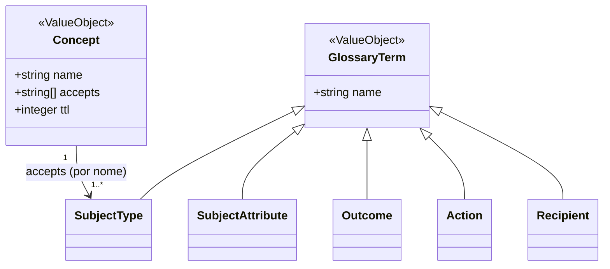

# Contexto Glossário

O Glossário é a linguagem publicada do sistema (`knowledge/domain/glossary/_context.md`): os **cinco vocabulários de termos** — tipos de sujeito, atributos de sujeito, desfechos, ações, destinatários — e os **conceitos** que um caso pode coletar. É dado puro, sem comportamento: cada termo existe exatamente uma vez, para que a grafia não derive e relatórios possam cruzar casos. Todos os outros contextos dependem dele e traduzem para ele, nunca o contornam (ver [mapa de contextos](01-visao-geral.md)).

No código, o contexto vive em `src/glossary/`:

| Arquivo | Papel |
|---|---|
| `src/glossary/terms.ts` | As formas dos dados: `GlossaryTerm`, os cinco aliases (`SubjectType`, `SubjectAttribute`, `Outcome`, `Action`, `Recipient`), `TERM_VOCABULARIES`, `TermVocabulary`, `Concept`, `ConceptRegistration`, `DEFAULT_CONCEPT_TTL_SECONDS`, `NON_CONCLUSION_OUTCOMES` |
| `src/glossary/glossary-query.port.ts` | O contrato publicado `IGlossaryQuery` (`contracts/glossary/glossary-query`) e os tipos de resolução `TermResolution` e `ConceptResolution` |
| `src/glossary/glossary-store.port.ts` | A porta de persistência `IGlossaryStore` |
| `src/glossary/glossary.service.ts` | `GlossaryService`, que implementa `IGlossaryQuery` e a operação `registerConcept` (`contracts/glossary/glossary-authoring`) |
| `src/persistence/relational-glossary-store.repository.ts` | `RelationalGlossaryStore`, o adaptador Postgres da porta |
| `src/factories/glossary.factory.ts` | `createGlossary` / `createGlossaryQuery`, a amarração |
| `migrations/0002-glossary-vocabulary.sql` | As sete tabelas do contexto |

Os cinco vocabulários de termos compartilham uma única forma — um `name` — e são tratados de maneira uniforme pelo serviço, pela porta e pelo store: a diferença entre eles é apenas qual tabela responde (`VOCABULARY_TABLES` em `src/persistence/relational-glossary-store.repository.ts`). O Concept tem forma própria, mais rica.

Adaptado de `knowledge/projections/class-diagram-glossary.mmd`; o supertipo `GlossaryTerm` é o que `src/glossary/terms.ts` declara e a projeção omite.

### Como o glossário é lido e escrito

Antes das entidades, o mecanismo comum a todas:

- **Toda leitura é fresca.** `GlossaryService.terms(vocabulary)` e `GlossaryService.concepts()` leem o store a cada chamada e nunca guardam o resultado (`src/glossary/glossary.service.ts`); o store, por sua vez, faz um `SELECT` a cada chamada (`RelationalGlossaryStore.readTerms`, `readConcepts`). É isso que permite à validação de um caso ler o glossário "como ele está agora" (`knowledge/rules/knowledge/validation-runs-at-every-read.md`).
- **Toda leitura verifica unicidade de nomes** antes de responder (`assertUniqueNames`, ver 5.7).
- **A ausência é dado, não erro, no domínio.** `readVocabularyTerm` e `readConcept` devolvem `{ held: false, ... }` para um nome não mantido (`TermResolution`, `ConceptResolution` em `src/glossary/glossary-query.port.ts`). É a camada HTTP que converte essa ausência em erro tipado e 404 (ver 5.7).
- **Listagens são paginadas em memória**: `listVocabularyTerms` e `listConcepts` leem a vocabulário inteiro e recortam por `offset`/`limit`, calculando `pageCount = ceil(total / limit)` (`knowledge/constraints/listings-are-paged.md`; `src/glossary/glossary.service.ts`, `src/types/pagination.ts`).
- **Escrita dos vocabulários de termos** acontece só pela porta `IGlossaryStore`: `writeTerms` substitui a tabela inteira numa transação (`DELETE` + um `INSERT` por termo) e `insertMissingTerms` adiciona apenas o que falta (`INSERT ... ON CONFLICT DO NOTHING`, sem `DELETE`). **Não há rota HTTP** que escreva um termo de vocabulário: hoje eles entram pelo `seed` (`src/seed.ts`, usando `insertMissingTerms` sobre `src/fixtures/glossary/*.json`) ou por cuidado direto no banco.
- **Escrita de conceitos** tem operação de domínio e rota: `GlossaryService.registerConcept` (ver 5.1).

## 5.1 Concept

**Propósito** — Uma observação nomeada que uma hipótese pode coletar (o "conceito" do material). Declara quais tipos de sujeito aceita e seu `ttl` — a tolerância de frescor mais estrita entre os casos que o usam, em segundos. Deliberadamente fino: a forma do dado que ele nomeia pertence ao schema de saída da capacidade que o produz, nunca ao conceito (`knowledge/domain/glossary/concept.md`).

**Atributos**

| Atributo | Tipo | Obrigatório | Descrição / regra |
|---|---|---|---|
| `name` | `string` | sim | Identidade do conceito; chave primária de `concepts`. Na API, mínimo 1 caractere (`src/http/dto/register-concept.dto.ts`, `read-concept.dto.ts`) |
| `accepts` | `string[]` (nomes de SubjectType) | sim | Os tipos de sujeito que o conceito aceita, por nome. Persistido em `concept_accepts`, uma linha por tipo, com chave estrangeira para `subject_types(name)`. Lido de volta ordenado por nome de tipo (`acceptsByConceptName`) |
| `ttl` | `integer` (segundos) | sim no conceito mantido; opcional no registro | Tolerância de frescor. Um registro (`ConceptRegistration`) que não declara `ttl` recebe `DEFAULT_CONCEPT_TTL_SECONDS = 60` (`knowledge/rules/knowledge/a-collected-concept-declares-a-ttl.md`). Na API, inteiro positivo |

**Invariantes e regras**

- Cada nome existe uma vez; uma leitura que encontra um nome repetido é recusada com `DuplicateGlossaryNameError` (`knowledge/rules/glossary/a-vocabulary-holds-each-name-once.md`; `assertUniqueNames('concept', ...)` em `src/glossary/glossary.service.ts`).
- Um conceito sem `ttl` registrado é lido com 60 segundos, tanto por `concepts()` quanto por `registerConcept` (`knowledge/rules/knowledge/a-collected-concept-declares-a-ttl.md`; `src/glossary/terms.ts`).
- Registrar um conceito cria-o no nome dado ou **substitui por inteiro** o que já estava nesse nome, nunca deixando uma segunda entrada: `registerConcept` lê o conjunto atual, remove a entrada de mesmo nome e grava o conjunto inteiro de volta com `writeConcepts` (`knowledge/contracts/glossary/glossary-authoring.md`; `src/glossary/glossary.service.ts`). A rota responde 200 tanto para criação quanto para substituição — o serviço não distingue as duas.
- `writeConcepts` substitui `concepts` e `concept_accepts` inteiras numa única transação, apagando `concept_accepts` antes de `concepts` e repovoando na ordem inversa, porque a chave estrangeira exige que a linha do conceito exista antes (`src/persistence/relational-glossary-store.repository.ts`).
- O `accepts` de um conceito só pode nomear tipos de sujeito que existam: a chave estrangeira `concept_accepts.subject_type_name → subject_types(name)` recusa no banco um tipo não mantido (`migrations/0002-glossary-vocabulary.sql`). Não há verificação anterior em código; a falha chega como `GlossaryStoreError`.
- Uma leitura por nome que o glossário não mantém é recusada na API com 404 e `ConceptNotHeldError` (`knowledge/rules/glossary/a-glossary-read-by-an-unheld-name-is-refused.md`; `src/http/read-concept.controller.ts`).
- Regras de outros contextos que constrangem o Concept: todo conceito que uma revisão de hipótese coleta existe no glossário (`knowledge/rules/knowledge/case-terms-exist-in-the-glossary.md`) e aceita o tipo de sujeito que a versão do caso declara (`knowledge/rules/knowledge/a-concept-accepts-the-declared-subject-type.md`) — ambas verificadas em `src/case/validate-case-coherence.ts` (`conceptViolations`) a cada leitura do caso, e em `src/case/revise-hypothesis.operation.ts` no momento da revisão; cada conceito é respondido por exatamente uma capacidade (`knowledge/rules/integration/one-capability-answers-one-concept.md`, ver [Integração](03-integracao.md)).

**Relacionamentos**

- Aceita um ou mais **SubjectType**, por nome (`accepts`; tabela `concept_accepts`).
- Coletado por **HypothesisRevision** (`collects`; tabelas `hypothesis_revision_collects` / `hypothesis_collects` com chave estrangeira para `concepts(name)`, `migrations/0004-case-and-hypothesis.sql`, `0009-case-version-lifecycle-schema.sql`).
- Respondido por exatamente uma **Capability** (`capabilities.concept → concepts(name)`, `migrations/0007-capability-concept.sql`).
- Identifica uma **Evidence** dentro de uma investigação e é nomeado por cada **Citation** (`investigation_evidence.concept`, `investigation_evaluation_citations.concept`, `migrations/0005-investigation.sql`).

**Erros que pode disparar**

| Classe (`src/errors/`) | Quando | Status HTTP |
|---|---|---|
| `ConceptNotHeldError` (`concept-not-held.error.ts`) | `GET /v1/glossary/concepts/{name}` para um nome não mantido | 404 |
| `DuplicateGlossaryNameError` (`duplicate-glossary-name.error.ts`) | Uma leitura encontra o mesmo `name` duas vezes em `concepts` | 500 (não mapeado) |
| `GlossaryStoreError` (`glossary-store.error.ts`) | Falha de leitura ou escrita no store (inclui violação de chave estrangeira em `concept_accepts`) | 500 (não mapeado) |
| `ConceptNotInGlossaryError` (`concept-not-in-glossary.error.ts`) | Contexto Conhecimento: uma revisão de hipótese coleta conceito que o glossário não mantém (`src/case/revise-hypothesis.operation.ts`) | 500 (não mapeado) |
| `ConceptRefusesSubjectTypeError` (`concept-refuses-subject-type.error.ts`) | Contexto Conhecimento: uma revisão coleta conceito que não aceita o tipo de sujeito do caso (`src/case/revise-hypothesis.operation.ts`) | 500 (não mapeado) |
| `ConceptNotAnsweredError` (`concept-not-answered.error.ts`) | Contexto Integração: `GET /v1/capabilities/{concept}` para conceito que nenhuma capacidade responde | 404 |
| `ConceptAlreadyAnsweredError` (`concept-already-answered.error.ts`) | Contexto Integração: registro de capacidade para conceito que outra já responde | 409 |

Os quatro últimos são erros de outros contextos que nomeiam um conceito; estão listados aqui porque o nome do conceito é o que carregam. Ver [Erros](17-erros.md).

**Onde vive**

- Domínio: `src/glossary/terms.ts` (`Concept`, `ConceptRegistration`, `DEFAULT_CONCEPT_TTL_SECONDS`), `src/glossary/glossary.service.ts` (`concepts`, `readConcept`, `listConcepts`, `registerConcept`).
- Banco: tabelas `concepts (name PK, ttl INTEGER NOT NULL)` e `concept_accepts (concept_name FK, subject_type_name FK, PK composta)` — `migrations/0002-glossary-vocabulary.sql`.
- Rotas HTTP:

| Rota | Arquivos | Resposta |
|---|---|---|
| `GET /v1/glossary/concepts` | `src/http/list-concepts.routes.ts`, `list-concepts.controller.ts`, `dto/list-concepts.dto.ts` | 200 `PaginatedResponse<Concept>`; `offset`/`limit` opcionais, malformados → 400 |
| `GET /v1/glossary/concepts/{name}` | `src/http/read-concept.routes.ts`, `read-concept.controller.ts`, `dto/read-concept.dto.ts` | 200 `{ name, accepts, ttl }`; não mantido → 404 |
| `PUT /v1/glossary/concepts/{name}` | `src/http/register-concept.routes.ts`, `register-concept.controller.ts`, `dto/register-concept.dto.ts` | Corpo `{ accepts: string[], ttl?: int > 0 }`; 200 com o conceito mantido |

## 5.2 SubjectType

**Propósito** — Um tipo de sujeito que uma investigação pode examinar — um contrato, um cliente, um elemento de rede, uma região (o "tipo de sujeito" do material). Vocabulário *descoberto*: cresce conforme os casos declaram seus sujeitos, nunca é desenhado de antemão (`knowledge/domain/glossary/subject-type.md`).

**Atributos**

| Atributo | Tipo | Obrigatório | Descrição / regra |
|---|---|---|---|
| `name` | `string` | sim | O único atributo; chave primária de `subject_types` |

**Invariantes e regras**

- Cada nome existe uma vez (`knowledge/rules/glossary/a-vocabulary-holds-each-name-once.md`; `assertUniqueNames` em `src/glossary/glossary.service.ts`; `PRIMARY KEY (name)`).
- Leitura por nome não mantido é recusada na API com 404 e `VocabularyTermNotHeldError` (`knowledge/rules/glossary/a-glossary-read-by-an-unheld-name-is-refused.md`; `src/http/read-vocabulary-term.controller.ts`).
- Toda versão de caso declara um tipo de sujeito que existe no glossário (`knowledge/rules/knowledge/case-terms-exist-in-the-glossary.md`; `namedVocabularyTerms` em `src/case/validate-case-coherence.ts` emite `{ vocabulary: 'subject-type', name: theCase.subject }`).
- Um conceito só é coletável por um caso se aceitar o tipo de sujeito que a versão declara (`knowledge/rules/knowledge/a-concept-accepts-the-declared-subject-type.md`).

**Relacionamentos**

- Aceito por **Concept** (`concept_accepts.subject_type_name`).
- Declarado por **CaseVersion** (`case_versions.subject → subject_types(name)`, `migrations/0004-case-and-hypothesis.sql`).
- Tipo do **Subject** de uma **Investigation** (`investigations.subject_type → subject_types(name)`, `migrations/0005-investigation.sql`).

**Erros que pode disparar**

| Classe (`src/errors/`) | Quando | Status HTTP |
|---|---|---|
| `VocabularyTermNotHeldError` (`vocabulary-term-not-held.error.ts`) | `GET /v1/glossary/subject-type/{name}` para nome não mantido | 404 |
| `DuplicateGlossaryNameError` | Nome repetido em `subject_types` | 500 |
| `GlossaryStoreError` | Falha de leitura/escrita | 500 |

**Onde vive**

- Domínio: `src/glossary/terms.ts` (`SubjectType = GlossaryTerm`; entrada `'subject-type'` de `TERM_VOCABULARIES`).
- Banco: `subject_types (name TEXT PK)` — `migrations/0002-glossary-vocabulary.sql`.
- Rotas: `GET /v1/glossary/subject-type` e `GET /v1/glossary/subject-type/{name}` (ver tabela de rotas comuns em 5.7).

## 5.3 SubjectAttribute

**Propósito** — Um atributo identificador que uma instância de sujeito pode carregar — um id, um número de telefone, um número de contrato (o "atributo do sujeito" do material). Vocabulário descoberto, com a mesma forma dos demais: cresce quando um novo tipo de dado identificador entra (`knowledge/domain/glossary/subject-attribute.md`).

**Atributos**

| Atributo | Tipo | Obrigatório | Descrição / regra |
|---|---|---|---|
| `name` | `string` | sim | O único atributo; chave primária de `subject_attributes` |

**Invariantes e regras**

- Cada nome existe uma vez (`knowledge/rules/glossary/a-vocabulary-holds-each-name-once.md`).
- Leitura por nome não mantido é recusada na API com 404 (`knowledge/rules/glossary/a-glossary-read-by-an-unheld-name-is-refused.md`).
- Todo atributo que os atributos-valores de um sujeito nomeiam existe no glossário (`knowledge/rules/investigation/a-subject-attribute-is-drawn-from-the-glossary.md`). Diferente dos outros quatro vocabulários, **um caso nunca declara atributos**: eles são montados pelo ponto de entrada no momento do pedido, então a verificação acontece na montagem da investigação, não na validação do caso — `refuseAttributesNotInGlossary` em `src/investigation/investigation-factory.ts` chama `readVocabularyTerm('subject-attribute', name)` para cada atributo e recusa todos os ausentes de uma vez com `SubjectAttributeNotInGlossaryError`. Em `src/case/validate-case-coherence.ts`, a chave `'subject-attribute'` de `VOCABULARY_ROLES` existe só para o mapa compilar; nenhuma violação é produzida por ela.

**Relacionamentos**

- Nomeado por **SubjectAttributeValue** de um **Subject** (`investigation_subject_attribute_values.attribute → subject_attributes(name)`, `migrations/0005-investigation.sql`).
- Usado pelo conector HTTP para resolver placeholders `${subject:<atributo>}` no endereço da chamada (`src/http-connector/connector-request-resolver.ts`, ver [Coleta](08-coleta.md)).

**Erros que pode disparar**

| Classe (`src/errors/`) | Quando | Status HTTP |
|---|---|---|
| `VocabularyTermNotHeldError` | `GET /v1/glossary/subject-attribute/{name}` para nome não mantido | 404 |
| `SubjectAttributeNotInGlossaryError` (`subject-attribute-not-in-glossary.error.ts`) | Contexto Investigação: um `POST /v1/diagnose` cujo sujeito nomeia atributo que o glossário não mantém; contexto `{ type, attributes[] }` | 500 (não mapeado) |
| `DuplicateGlossaryNameError` | Nome repetido em `subject_attributes` | 500 |
| `GlossaryStoreError` | Falha de leitura/escrita | 500 |

**Onde vive**

- Domínio: `src/glossary/terms.ts` (`SubjectAttribute = GlossaryTerm`; entrada `'subject-attribute'`).
- Banco: `subject_attributes (name TEXT PK)` — `migrations/0002-glossary-vocabulary.sql`.
- Rotas: `GET /v1/glossary/subject-attribute` e `GET /v1/glossary/subject-attribute/{name}`.

## 5.4 Outcome

**Propósito** — O que uma hipótese confirmada, ou o `fallback`, conclui (o "desfecho" do material). Vocabulário *contribuído*: cada hipótese confirmável de cada caso contribui um, registrado globalmente só para manter a grafia estável e permitir relatórios entre casos. Os dois desfechos de não-conclusão existem antes do primeiro caso (`knowledge/domain/glossary/outcome.md`).

**Atributos**

| Atributo | Tipo | Obrigatório | Descrição / regra |
|---|---|---|---|
| `name` | `string` | sim | O único atributo; chave primária de `outcomes` |

**Invariantes e regras**

- Cada nome existe uma vez (`knowledge/rules/glossary/a-vocabulary-holds-each-name-once.md`).
- Leitura por nome não mantido é recusada na API com 404 (`knowledge/rules/glossary/a-glossary-read-by-an-unheld-name-is-refused.md`).
- **Os dois desfechos de não-conclusão precedem o primeiro caso** — `inconclusive-no-data` e `inconclusive-hypotheses-exhausted` (`NON_CONCLUSION_OUTCOMES` em `src/glossary/terms.ts`; `knowledge/rules/glossary/the-non-conclusion-outcomes-precede-the-first-case.md`). A garantia é implementada em três lugares coerentes:
  - toda leitura do vocabulário `outcome` (`GlossaryService.terms('outcome')`) verifica se os dois estão presentes e, se algum falta, o insere por `insertMissingTerms` — nunca por `writeTerms`, cujo `DELETE` falharia sobre um desfecho já referenciado por chave estrangeira (`withNonConclusionOutcomes` em `src/glossary/glossary.service.ts`);
  - o `seed` grava o vocabulário `outcome` junto com os dois, antes de tudo (`seedOutcomes` em `src/seed.ts`);
  - a suíte de testes os semeia após migrar (`seedNonConclusionOutcomes` em `src/vitest-global-setup.ts`).
  A regra também diz que um desfecho nomeado por uma versão liberada ou por uma revisão liberada nunca é removido; no código, isso é garantido pelas chaves estrangeiras `case_versions.fallback_outcome` e `hypothesis_revisions.resolution_outcome`, que impedem o `DELETE`, e pelo fato de `ensure` só usar `insertMissingTerms`.
- **Cada revisão de hipótese confirmável contribui exatamente um desfecho** (`knowledge/rules/glossary/an-outcome-is-contributed-by-a-confirmable-hypothesis.md`, política de consistência eventual). Não implementado como registro automático: a decisão registrada em `knowledge/decision-log.md` é que a contribuição é um ato de curadoria na mesma mudança que introduz o caso — a validação continua recusando um caso cujo desfecho está ausente no momento da leitura. Em código, isso é apenas a verificação de existência em `src/case/validate-case-coherence.ts`.
- Todo desfecho que uma versão de caso ou suas revisões nomeiam existe no glossário (`knowledge/rules/knowledge/case-terms-exist-in-the-glossary.md`; `termsOf('outcome', ...)` em `src/case/validate-case-coherence.ts`, cobrindo cada `resolution.outcome` das hipóteses e o `fallback`).

**Relacionamentos**

- Nomeado pela **Resolution** de cada **HypothesisRevision** (`hypothesis_revisions.resolution_outcome → outcomes(name)`, `migrations/0004-case-and-hypothesis.sql`, `0009-case-version-lifecycle-schema.sql`) e pelo `fallback` de cada **CaseVersion** (`case_versions.fallback_outcome → outcomes(name)`).
- Nomeado pelo **Assessment** de cada **Investigation** (`investigations.assessment_outcome → outcomes(name)`, `migrations/0005-investigation.sql`).
- O desfecho da investigação vem sempre do caso, nunca do julgamento (`knowledge/rules/investigation/the-outcome-comes-from-the-case.md`).

**Erros que pode disparar**

| Classe (`src/errors/`) | Quando | Status HTTP |
|---|---|---|
| `VocabularyTermNotHeldError` | `GET /v1/glossary/outcome/{name}` para nome não mantido | 404 |
| `DuplicateGlossaryNameError` | Nome repetido em `outcomes` | 500 |
| `GlossaryStoreError` | Falha de leitura/escrita, inclusive na inserção dos desfechos de não-conclusão | 500 |

**Onde vive**

- Domínio: `src/glossary/terms.ts` (`Outcome = GlossaryTerm`; entrada `'outcome'`; `NON_CONCLUSION_OUTCOMES`), `src/glossary/glossary.service.ts` (`withNonConclusionOutcomes`).
- Banco: `outcomes (name TEXT PK)` — `migrations/0002-glossary-vocabulary.sql`.
- Rotas: `GET /v1/glossary/outcome` e `GET /v1/glossary/outcome/{name}`.

## 5.5 Action

**Propósito** — O que o destinatário de um encaminhamento faz (a "ação" do material). Vocabulário global: um termo novo entra quando *o que alguém faz* muda, nunca quando só o motivo muda (`knowledge/domain/glossary/action.md`).

**Atributos**

| Atributo | Tipo | Obrigatório | Descrição / regra |
|---|---|---|---|
| `name` | `string` | sim | O único atributo; chave primária de `actions` |

**Invariantes e regras**

- Cada nome existe uma vez (`knowledge/rules/glossary/a-vocabulary-holds-each-name-once.md`).
- Leitura por nome não mantido é recusada na API com 404 (`knowledge/rules/glossary/a-glossary-read-by-an-unheld-name-is-refused.md`).
- **Uma ação nomeia o que seu destinatário faz** — duas hipóteses com causas diferentes e o mesmo ato compartilham uma ação (`knowledge/rules/glossary/an-action-names-what-its-recipient-does.md`). Regra de governança de curadoria; não há verificação em código que a decida.
- Toda ação que uma versão de caso ou suas revisões nomeiam existe no glossário (`knowledge/rules/knowledge/case-terms-exist-in-the-glossary.md`; `termsOf('action', ...)` em `src/case/validate-case-coherence.ts`).
- Ações e destinatários fazem parte do subconjunto de vocabulários que precisa existir antes do primeiro caso (descrição de `knowledge/rules/glossary/the-non-conclusion-outcomes-precede-the-first-case.md`); o `seed` os grava antes de autorar o caso (`src/seed.ts`).

**Relacionamentos**

- Nomeada pelo **Referral** de cada **Resolution** — de cada revisão de hipótese (`hypothesis_revisions.resolution_action → actions(name)`) e do `fallback` de cada versão (`case_versions.fallback_action → actions(name)`).
- Nomeada pelo **Assessment** de cada **Investigation** (`investigations.assessment_action → actions(name)`).

**Erros que pode disparar**

| Classe (`src/errors/`) | Quando | Status HTTP |
|---|---|---|
| `VocabularyTermNotHeldError` | `GET /v1/glossary/action/{name}` para nome não mantido | 404 |
| `DuplicateGlossaryNameError` | Nome repetido em `actions` | 500 |
| `GlossaryStoreError` | Falha de leitura/escrita | 500 |

**Onde vive**

- Domínio: `src/glossary/terms.ts` (`Action = GlossaryTerm`; entrada `'action'`).
- Banco: `actions (name TEXT PK)` — `migrations/0002-glossary-vocabulary.sql`.
- Rotas: `GET /v1/glossary/action` e `GET /v1/glossary/action/{name}`.

## 5.6 Recipient

**Propósito** — A fila operacional a que um encaminhamento se dirige (o "destinatário" do material). Global e estável: filas operacionais reais, um papel e nunca uma pessoa (`knowledge/domain/glossary/recipient.md`).

**Atributos**

| Atributo | Tipo | Obrigatório | Descrição / regra |
|---|---|---|---|
| `name` | `string` | sim | O único atributo; chave primária de `recipients` |

**Invariantes e regras**

- Cada nome existe uma vez (`knowledge/rules/glossary/a-vocabulary-holds-each-name-once.md`).
- Leitura por nome não mantido é recusada na API com 404 (`knowledge/rules/glossary/a-glossary-read-by-an-unheld-name-is-refused.md`).
- **Um destinatário é um papel, nunca uma pessoa** — vincular um encaminhamento a um indivíduo quebraria na primeira mudança de equipe (`knowledge/rules/glossary/a-recipient-is-a-role.md`). Regra de governança de curadoria; não há verificação em código que a decida.
- Todo destinatário que uma versão de caso ou suas revisões nomeiam existe no glossário (`knowledge/rules/knowledge/case-terms-exist-in-the-glossary.md`; `termsOf('recipient', ...)` em `src/case/validate-case-coherence.ts`).
- Faz parte do subconjunto que precede o primeiro caso, junto com ações e os dois desfechos de não-conclusão (`knowledge/rules/glossary/the-non-conclusion-outcomes-precede-the-first-case.md`).

**Relacionamentos**

- Nomeado pelo **Referral** de cada **Resolution** (`hypothesis_revisions.resolution_recipient → recipients(name)`, `case_versions.fallback_recipient → recipients(name)`).
- Nomeado pelo **Assessment** de cada **Investigation** (`investigations.assessment_recipient → recipients(name)`).

**Erros que pode disparar**

| Classe (`src/errors/`) | Quando | Status HTTP |
|---|---|---|
| `VocabularyTermNotHeldError` | `GET /v1/glossary/recipient/{name}` para nome não mantido | 404 |
| `DuplicateGlossaryNameError` | Nome repetido em `recipients` | 500 |
| `GlossaryStoreError` | Falha de leitura/escrita | 500 |

**Onde vive**

- Domínio: `src/glossary/terms.ts` (`Recipient = GlossaryTerm`; entrada `'recipient'`).
- Banco: `recipients (name TEXT PK)` — `migrations/0002-glossary-vocabulary.sql`.
- Rotas: `GET /v1/glossary/recipient` e `GET /v1/glossary/recipient/{name}`.

## 5.7 Regras do contexto

As regras em `knowledge/rules/glossary/` e onde cada uma está implementada.

| Regra (`knowledge/rules/glossary/`) | Tipo | Enunciado | Implementação |
|---|---|---|---|
| `a-vocabulary-holds-each-name-once.md` | invariante | Uma leitura sobre um vocabulário ou sobre os conceitos que encontra um nome mais de uma vez é recusada com 500 e `DuplicateGlossaryNameError`, em vez de responder qualquer dos registros | `assertUniqueNames` em `src/glossary/glossary.service.ts`, chamado em `terms()` e `concepts()` antes de qualquer resposta ou escrita. No banco, `PRIMARY KEY (name)` em cada tabela impede a duplicata de surgir; a verificação em código cobre um store corrompido. `DuplicateGlossaryNameError` não está em `src/errors/status-map.ts`, então `src/http/error-handler.middleware.ts` responde 500 `INTERNAL_ERROR` — exatamente o status que a regra pede |
| `a-glossary-read-by-an-unheld-name-is-refused.md` | invariante | Leitura de termo por nome que o vocabulário não mantém → 404 com `VocabularyTermNotHeldError`; leitura de conceito por nome não mantido → 404 com `ConceptNotHeldError` | O domínio responde a ausência como dado (`{ held: false }`); `src/http/read-vocabulary-term.controller.ts` e `src/http/read-concept.controller.ts` convertem-na em erro tipado; `src/errors/status-map.ts` mapeia ambos para 404 |
| `the-non-conclusion-outcomes-precede-the-first-case.md` | política | O glossário mantém `inconclusive-no-data` e `inconclusive-hypotheses-exhausted` antes da primeira versão de caso validar; garantir os dois só adiciona o que falta e nunca remove ou reescreve um desfecho; um desfecho nomeado por versão ou revisão liberada nunca é removido | `NON_CONCLUSION_OUTCOMES` (`src/glossary/terms.ts`), `withNonConclusionOutcomes` via `insertMissingTerms` (`src/glossary/glossary.service.ts`, `src/persistence/relational-glossary-store.repository.ts`), `seedOutcomes` (`src/seed.ts`), `seedNonConclusionOutcomes` (`src/vitest-global-setup.ts`); chaves estrangeiras de `case_versions` e `hypothesis_revisions` para `outcomes(name)` |
| `an-outcome-is-contributed-by-a-confirmable-hypothesis.md` | política | Toda revisão de hipótese confirmável contribui exatamente um desfecho ao glossário | Não há registro automático (decisão em `knowledge/decision-log.md`: a contribuição é ato de curadoria na mesma mudança). O código só garante a consequência: a validação do caso recusa um desfecho ausente (`src/case/validate-case-coherence.ts`) |
| `an-action-names-what-its-recipient-does.md` | invariante | Uma ação nova entra só quando o que alguém faz muda, nunca quando só o motivo muda | Governança de curadoria; sem verificação em código |
| `a-recipient-is-a-role.md` | invariante | Um destinatário nomeia um papel operacional, nunca uma pessoa | Governança de curadoria; sem verificação em código |

### Regras de outros contextos que constrangem o glossário

| Regra | O que exige do glossário | Onde |
|---|---|---|
| `knowledge/rules/knowledge/case-terms-exist-in-the-glossary.md` | Todo SubjectType, Concept, Outcome, Action e Recipient que uma versão de caso ou suas revisões nomeiam existe no glossário | `vocabularyViolations` e `conceptViolations` em `src/case/validate-case-coherence.ts`; recusa via `IncoherentCaseError`/`CaseNotValidError` na leitura e `CaseVersionNotReleasableError` na liberação |
| `knowledge/rules/knowledge/a-concept-accepts-the-declared-subject-type.md` | O `accepts` de cada conceito coletado inclui o `subject` da versão | `conceptViolations` em `src/case/validate-case-coherence.ts`; `ConceptRefusesSubjectTypeError` em `src/case/revise-hypothesis.operation.ts` |
| `knowledge/rules/knowledge/a-collected-concept-declares-a-ttl.md` | Todo conceito tem `ttl`; sem declaração, 60 segundos | `DEFAULT_CONCEPT_TTL_SECONDS`, `GlossaryService.concepts` e `registerConcept` |
| `knowledge/rules/investigation/a-subject-attribute-is-drawn-from-the-glossary.md` | Todo atributo de um sujeito existe no vocabulário `subject-attribute` | `refuseAttributesNotInGlossary` em `src/investigation/investigation-factory.ts` |
| `knowledge/rules/integration/evidence-arrives-in-the-glossary-vocabulary.md` | A evidência chega no vocabulário do glossário | Mapeamento de campos do conector (`src/http-connector/response-path-extractor.ts`); ver [Integração](03-integracao.md) |

### Contratos publicados

| Contrato | Operações | Porta / método | Rota |
|---|---|---|---|
| `knowledge/contracts/glossary/glossary-query.md` | `read-vocabulary-term` | `IGlossaryQuery.readVocabularyTerm(vocabulary, name)` | `GET /v1/glossary/{vocabulary}/{name}` |
| | `read-concept` | `IGlossaryQuery.readConcept(name)` | `GET /v1/glossary/concepts/{name}` |
| | `list-vocabulary-terms` | `IGlossaryQuery.listVocabularyTerms(vocabulary, pagination)` | `GET /v1/glossary/{vocabulary}` |
| | `list-concepts` | `IGlossaryQuery.listConcepts(pagination)` | `GET /v1/glossary/concepts` |
| `knowledge/contracts/glossary/glossary-authoring.md` | `register-concept` | `GlossaryService.registerConcept(registration)` | `PUT /v1/glossary/concepts/{name}` |

Consumidores em processo do `glossary-query`: `knowledge/contracts/knowledge/vocabulary-terms.md` (validação do caso), `knowledge/contracts/investigation/glossary-source.md` (montagem do sujeito) e `knowledge/contracts/integration/glossary-vocabulary.md` (normalização — na especificação; no código a dependência da Integração aparece só pela chave estrangeira `capabilities.concept`).

### Rotas comuns aos cinco vocabulários de termos

`{vocabulary}` é um dos cinco valores de `TERM_VOCABULARIES`: `subject-type`, `subject-attribute`, `outcome`, `action`, `recipient`. Um valor fora desse conjunto é recusado pelo DTO (`z.enum(TERM_VOCABULARIES)`) com 400 `VALIDATION_ERROR`, nunca por erro de domínio. `GET /v1/glossary/concepts` é uma rota estática que o Fastify casa antes da parametrizada, então não colide com `GET /v1/glossary/{vocabulary}`.

| Rota | Arquivos | Entrada | Resposta |
|---|---|---|---|
| `GET /v1/glossary/{vocabulary}` | `src/http/list-vocabulary-terms.routes.ts`, `list-vocabulary-terms.controller.ts`, `dto/list-vocabulary-terms.dto.ts` | `offset` (inteiro ≥ 0, opcional), `limit` (inteiro > 0, opcional; padrão `PAGINATION_DEFAULT_LIMIT`, teto `PAGINATION_MAX_LIMIT`) | 200 `{ data: [{ name }], total, limit, offset, pageCount }` |
| `GET /v1/glossary/{vocabulary}/{name}` | `src/http/read-vocabulary-term.routes.ts`, `read-vocabulary-term.controller.ts`, `dto/read-vocabulary-term.dto.ts` | `name` não vazio | 200 `{ name }`; 404 `VocabularyTermNotHeldError` com `details: { vocabulary, name }` |

Nenhuma rota exige autenticação (`knowledge/constraints/no-route-enforces-authentication.md`). O envelope de erro é `{ error: { code, message, details? } }`, onde `code` é o `name` da classe do erro e `details` o seu `context` (`src/http/error-handler.middleware.ts`).

### Erros do contexto — resumo

| Classe | Arquivo em `src/errors/` | Contexto que carrega | Status |
|---|---|---|---|
| `VocabularyTermNotHeldError` | `vocabulary-term-not-held.error.ts` | `{ vocabulary, name }` | 404 |
| `ConceptNotHeldError` | `concept-not-held.error.ts` | `{ name }` | 404 |
| `DuplicateGlossaryNameError` | `duplicate-glossary-name.error.ts` | `{ vocabulary, name }` | 500 (não mapeado) |
| `GlossaryStoreError` | `glossary-store.error.ts` | `{ operation: 'read' \| 'write' }`, com `cause` | 500 (não mapeado) |

O comentário de cabeçalho de `GlossaryStoreError` ainda fala em "arquivo de vocabulário" — herança do store em arquivo que o adaptador relacional substituiu; hoje a classe é lançada por `RelationalGlossaryStore` em qualquer falha do driver.
