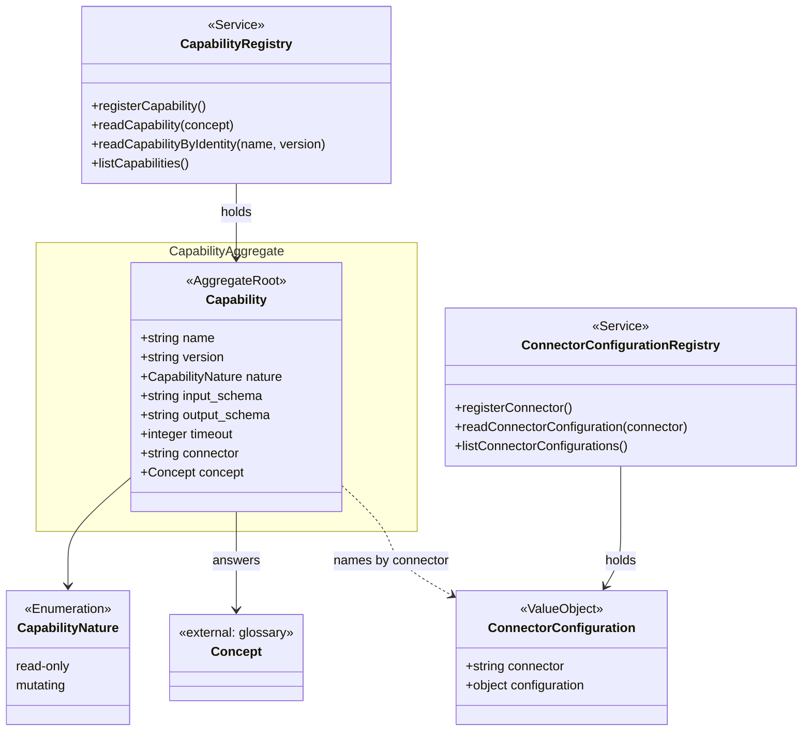

# Contexto Integração

O contexto **Integração** é a porta do sistema para os sistemas externos. Ele responde a uma pergunta única: *dado um conceito do glossário, como o sistema observa esse conceito no mundo real?* A resposta é uma **Capability** (a "capacidade" do material de origem) — uma observação somente-leitura registrada por um operador — que nomeia um **conector**; o conector, por sua vez, é descrito por uma **ConnectorConfiguration**, o objeto JSON que diz ao adaptador HTTP como montar e disparar a chamada e como traduzir a resposta para o vocabulário do glossário.

A especificação classifica este contexto como **genérico** (`knowledge/domain/integration/_context.md`): nada nele é conhecimento de negócio além do contrato que promete. Os sistemas por trás de uma capability formam um conjunto aberto e variável — um pode passar a existir, outro deixar de existir — e nenhum outro contexto precisa saber qual deles responde a um conceito hoje. Sua responsabilidade declarada é executar capabilities somente-leitura dentro do escopo de autorização do requisitante, entregar observações já traduzidas para o vocabulário do glossário, guardar o que um operador registra diretamente (uma capability, uma configuração de conector) e permitir que uma configuração seja exercida uma vez, diagnosticamente, através de uma capability já comprometida como somente-leitura.

Duas decisões de projeto atravessam o capítulo inteiro:

- **Só o somente-leitura registra** (`knowledge/rules/integration/a-capability-is-read-only.md`). O sistema diagnostica e encaminha, nunca age. A restrição é imposta pelo registro, não por disciplina.
- **Um conceito, uma capability** (`knowledge/rules/integration/one-capability-answers-one-concept.md`). Não há cadeia de fallback; ela foi cortada e fica cortada até doer.

O diagrama de classes da especificação (`knowledge/projections/class-diagram-integration.mmd`) resume os elementos:



A ligação pontilhada entre `Capability` e `ConnectorConfiguration` é deliberada: o atributo `connector` da capability é uma string opaca, e nada garante que exista uma configuração registrada sob esse nome no momento do registro (`knowledge/domain/integration/connector-configuration.md`). Uma capability pode ser registrada antes de seu conector ser configurado.

## 6.1 Capability

**Propósito** — Uma observação somente-leitura que o sistema sabe realizar, identificada por `name` e `version`. Responde a exatamente um conceito do glossário — aquele pelo qual o registro a resolve. Seu `output_schema`, escrito no vocabulário do glossário, delimita toda citação sobre a evidência que produz; seu `timeout` é o orçamento próprio dentro do prazo global da coleta; seu `connector` nomeia o adaptador que a executa (`knowledge/domain/integration/capability.md`).

**Atributos** — tipo `Capability` em `src/capability-registry/capability.ts`; os nomes são exatamente os da especificação, para que o registro persistido e o nó leiam igual.

| Atributo | Tipo | Obrigatório | Descrição / regra |
|---|---|---|---|
| `name` | string | sim | Metade da identidade. Junto com `version`, forma a chave primária em `capabilities` (`src/migrations/0003-capability-registry.sql`). |
| `version` | string | sim | Outra metade da identidade. Re-registrar sob o mesmo `name`+`version` substitui o registro anterior (`registerCapability` em `src/capability-registry/capability-registry.service.ts`). |
| `nature` | `CapabilityNature` | sim | O que a capability pode fazer ao mundo. Só `read-only` registra (`knowledge/rules/integration/a-capability-is-read-only.md`). |
| `input_schema` | string (JSON) | sim | Esquema do que a capability recebe. Precisa ser JSON sintaticamente válido (`knowledge/rules/integration/a-capability-declares-well-formed-schemas.md`). Não interpretado além disso em tempo de registro. |
| `output_schema` | string (JSON) | sim | Esquema do que produz, no vocabulário do glossário. É o que delimita as citações do julgamento: um campo citado deve existir entre suas `properties`. Precisa ser JSON válido. |
| `timeout` | integer (ms) | sim (com default) | Orçamento da observação em milissegundos. Um registro que não declara toma o default de 60 segundos — `DEFAULT_CAPABILITY_TIMEOUT_MS = 60_000` (`knowledge/rules/integration/a-capability-declares-its-contract.md`). Se declarado, deve ser inteiro. |
| `connector` | string | sim | Nome opaco do adaptador que executa a capability. Pode nomear uma `ConnectorConfiguration` por seu `connector`, sem que o registro exija que ela exista. |
| `concept` | string (nome de Concept) | sim | O conceito que a capability responde, por seu nome no glossário. Coluna adicionada por `src/migrations/0007-capability-concept.sql`, com `REFERENCES concepts (name)`. |

### O `output_schema` e suas `properties`

O `output_schema` é guardado como texto JSON. O registro só exige que ele seja sintaticamente válido; quem o lê estruturalmente é o julgamento, ao validar citações. A função `declaredFieldsOf` (em `src/investigation/citation-validation.ts`, ver [Julgamento](09-julgamento.md)) lê as chaves de `properties` do esquema e trata um esquema malformado ou sem `properties` como "nenhum campo declarado". Foi exatamente essa degradação silenciosa que motivou a regra `a-capability-declares-well-formed-schemas`: antes dela, um esquema digitado errado por um humano passava pelo registro e, no julgamento, toda citação sobre ele falhava sem explicação.

O adaptador HTTP também consulta `properties`: ao montar a observação a partir da resposta, `observationOf` (em `src/investigation/http-declarative-observation-source.adapter.ts`) filtra os campos extraídos pelo `responseMap`, mantendo apenas os que o `output_schema` declara. Assim, o que chega ao domínio é sempre um subconjunto do vocabulário prometido.

Exemplo de `output_schema` mínimo aceito:

```json
{
  "type": "object",
  "properties": {
    "status": { "type": "string" },
    "since": { "type": "string" }
  }
}
```

### Natureza somente-leitura

A natureza não é uma informação descritiva; é uma barreira. `heldCapability` em `src/capability-registry/capability-registry.service.ts` recusa qualquer registro com `nature !== 'read-only'` antes de qualquer escrita, lançando `CapabilityNotReadOnlyError`. A especificação chama isso de "decisão de projeto, não limitação": apaga aprovação humana de mutação, escopos de escrita e metade das preocupações de segurança.

### O conceito que responde e o tipo de sujeito

A capability não declara um tipo de sujeito próprio. O tipo de sujeito que ela aceita é o do **conceito** que responde: um `Concept` do glossário declara `accepts` (a lista de `SubjectType` que admite — ver [Glossário](02-glossario.md)), e a coerência do caso garante que todo conceito coletado aceita o tipo de sujeito declarado pela versão do caso (`knowledge/rules/knowledge/a-concept-accepts-the-declared-subject-type.md`). Portanto, a corrente é: versão do caso → `subject` → conceitos coletados aceitam esse `subject` → cada conceito resolve para uma capability. A capability resolve internamente qualquer derivação de que o conceito precise (um endereço a partir de um contrato, uma região a partir de um acesso), de modo que derivar nunca é trabalho do caso.

**Invariantes e regras**

- Declara seu contrato completo — `name`, `version`, `nature`, `input_schema`, `output_schema`, `connector`, `concept` (lista `REQUIRED_REGISTRATION_ATTRIBUTES` em `src/capability-registry/capability.ts`); ausente ou string vazia conta como não declarado; `timeout` declarado deve ser inteiro — `knowledge/rules/integration/a-capability-declares-its-contract.md`, função `contractProblems` no serviço.
- `input_schema` e `output_schema` são JSON sintaticamente válido — `knowledge/rules/integration/a-capability-declares-well-formed-schemas.md`, função `refuseMalformedSchemas`.
- `nature` é `read-only` — `knowledge/rules/integration/a-capability-is-read-only.md`.
- Nenhuma outra capability de identidade diferente responde ao mesmo `concept` — `knowledge/rules/integration/one-capability-answers-one-concept.md`, função `refuseAnsweredConcept`.
- Identificada por (`name`, `version`): re-registro substitui — `PRIMARY KEY (name, version)` em `src/migrations/0003-capability-registry.sql`.
- Do lado do Conhecimento: todo conceito coletado por uma revisão de hipótese precisa ter uma capability somente-leitura registrada que declare `output_schema` e `timeout` — `knowledge/rules/knowledge/every-collected-concept-has-a-read-only-capability.md`, verificado por `capabilityViolations` em `src/case/validate-case-coherence.ts` (ver [Conhecimento](04-conhecimento.md)).

**Relacionamentos**

- `concept` → `Concept` do glossário (referência por nome; FK `concepts(name)`).
- `connector` → `ConnectorConfiguration.connector` (referência por nome, não imposta).
- Lida pelo caso na validação de coerência (`ICapabilityQuery.readCapability`), pela coleta de evidências (`src/investigation/evidence-collection-stage.ts`) e pelo adaptador HTTP.

**Erros que pode disparar**

| Erro | HTTP | Quando |
|---|---|---|
| `IncompleteCapabilityContractError` | 422 | Atributo obrigatório ausente/vazio ou `timeout` não inteiro. |
| `CapabilitySchemaNotWellFormedError` | 422 | `input_schema` ou `output_schema` não é JSON válido. |
| `CapabilityNotReadOnlyError` | 422 | `nature` diferente de `read-only`. |
| `ConceptAlreadyAnsweredError` | 409 | Outra identidade já responde ao conceito. |
| `DuplicateConceptAnswerError` | 500 | A leitura por conceito encontra mais de uma capability (estado inconsistente do armazenamento). |
| `CapabilityIdentityNotFoundError` | 404 | Leitura por identidade sem registro. |
| `CapabilityStoreError` | 500 | Falha de leitura/escrita no banco. |

Os mapeamentos HTTP estão em `src/errors/status-map.ts`; tudo que não está no mapa cai em 500 `INTERNAL_ERROR` (`src/http/error-handler.middleware.ts`).

**Onde vive**

- Domínio: `src/capability-registry/capability.ts` (tipos `Capability`, `CapabilityRegistration`, constantes).
- Tabela: `capabilities` (`src/migrations/0003-capability-registry.sql` + `0007-capability-concept.sql`), adaptador `src/persistence/relational-capability-store.repository.ts` — lê tudo a cada chamada e substitui inteiro numa transação (`DELETE` + `INSERT`s).
- Rotas (todas sob `/v1`, ver [API HTTP](14-api-http.md)):

| Método e caminho | Operação | Arquivo | Sucesso |
|---|---|---|---|
| `PUT /v1/capabilities/{name}/{version}` | register-capability | `src/http/register-capability.routes.ts` | 200, a capability como guardada |
| `GET /v1/capabilities` | list-capabilities (paginado) | `src/http/list-capabilities.routes.ts` | 200, `PaginatedResponse<Capability>` |
| `GET /v1/capabilities/{concept}` | read-capability (por conceito) | `src/http/read-capability.routes.ts` | 200 |
| `GET /v1/capabilities/{name}/{version}` | read-capability-by-identity (com rate limit) | `src/http/read-capability-by-identity.routes.ts` | 200 |

O corpo de `PUT` (`src/http/dto/register-capability.dto.ts`) leva `nature`, `input_schema`, `output_schema`, `connector`, `concept` obrigatórios e `timeout` opcional; `name` e `version` vêm do caminho. Um `nature` fora do vocabulário (`read-only`/`mutating`) é recusado com 400 `VALIDATION_ERROR` na borda; `mutating` passa pela borda e é recusado pelo registro com 422.

## 6.2 CapabilityNature

**Propósito** — Enumeração do que uma capability pode fazer ao mundo. Só `read-only` registra; `mutating` existe como valor para que o registro tenha algo a recusar (`knowledge/domain/integration/capability-nature.md`).

**Atributos**

| Valor | Descrição |
|---|---|
| `read-only` | Observa sem alterar. O único valor que o registro aceita (`READ_ONLY_NATURE` em `src/capability-registry/capability.ts`). |
| `mutating` | Alteraria o mundo. Reconhecido pelo vocabulário (passa pela validação da borda HTTP) e recusado pelo registro. |

**Invariantes e regras**

- Fechado a dois valores: `CAPABILITY_NATURES = ['read-only', 'mutating']` em `src/capability-registry/capability.ts`; `CHECK (nature IN ('read-only','mutating'))` em `src/migrations/0003-capability-registry.sql`.
- O adaptador relacional recusa uma linha cuja `nature` não esteja na enumeração com `CapabilityStoreError` (`toCapability` em `src/persistence/relational-capability-store.repository.ts`).

**Relacionamentos** — Valor do atributo `Capability.nature`.

**Erros que pode disparar** — `CapabilityNotReadOnlyError` (via registro), `CapabilityStoreError` (linha fora da enumeração).

**Onde vive** — `src/capability-registry/capability.ts`; coluna `capabilities.nature`; DTOs de registro e leitura usam `z.enum(CAPABILITY_NATURES)`.

## 6.3 CapabilityRegistry

**Propósito** — Serviço de domínio: a única consulta de um conceito para a capability que o responde, um para um, sem cadeia de fallback (`knowledge/domain/integration/capability-registry.md`). É a peça mais genérica do sistema; nada nele é para a curadoria de casos ler diretamente.

**Operações** — classe `CapabilityRegistryService` em `src/capability-registry/capability-registry.service.ts`, que implementa a porta publicada `ICapabilityQuery` (`src/capability-registry/capability-query.port.ts`).

| Operação | Método | O que faz |
|---|---|---|
| register-capability | `registerCapability(registration)` | Valida contrato completo → esquemas JSON → natureza somente-leitura → conceito não respondido por outra identidade; só então lê tudo do store, remove o registro de mesma identidade (se houver), acrescenta o novo e grava inteiro. Devolve a capability como guardada, com `timeout` defaultado. |
| read-capability (resolve-concept) | `readCapability(concept)` | Lê o store, filtra por `concept`. Zero respostas → `{ held: false, concept }` (ausência como dado, nunca erro). Uma → `{ held: true, capability }`. Mais de uma → lança `DuplicateConceptAnswerError` em vez de escolher. |
| read-capability-by-identity | `readCapabilityByIdentity(name, version)` | Lê o store e procura por identidade; ausência como dado (`{ held: false, name, version }`). Não faz parte do contrato publicado `ICapabilityQuery`; usada pelo teste de conector. |
| read-capability-by-identity (com recusa) | `readCapabilityByIdentityOrThrow(name, version)` | Envelope para a rota HTTP: converte `held: false` em `CapabilityIdentityNotFoundError` (`knowledge/constraints/the-capability-identity-read-refuses-an-unregistered-identity.md`). |
| list-capabilities | `listCapabilities({ offset, limit })` | Lê tudo e pagina em memória; devolve `data`, `total`, `limit`, `offset`, `pageCount` (`knowledge/constraints/listings-are-paged.md`). Registro vazio devolve página vazia. |

Tudo é lido do store a cada chamada, nunca lembrado — o que sustenta a regra do Conhecimento `the-contract-check-reads-the-current-registration` (a verificação de capability do caso lê o registro como está agora).

**Porta de persistência** — `ICapabilityStore` (`src/capability-registry/capability-store.port.ts`): `readCapabilities()` e `writeCapabilities(all)`. O domínio declara; a infraestrutura implementa (`knowledge/constraints/the-domain-depends-on-no-infrastructure.md`). Ver [Portas e adaptadores](12-portas-adaptadores.md).

**Invariantes e regras**

- Toda recusa acontece antes de qualquer escrita (`heldCapability` roda antes de `store.readCapabilities()`).
- Um conceito resolve para exatamente uma capability; mais de uma é recusada com 500 em vez de uma escolha silenciosa — `knowledge/rules/integration/one-capability-answers-one-concept.md`.
- Leitura por identidade não registrada é recusada com 404 `CapabilityIdentityNotFoundError` — `knowledge/constraints/the-capability-identity-read-refuses-an-unregistered-identity.md`.
- Leitura por identidade limitada a 60 requisições por minuto por IP de origem — `knowledge/constraints/the-capability-identity-read-is-rate-limited.md` (detalhes abaixo).

**Relacionamentos** — Mantém `Capability`; é consultado por `validate-case-coherence.ts`, `evidence-collection-stage.ts`, `http-declarative-observation-source.adapter.ts` (via `ICapabilityQuery`) e por `test-connector.controller.ts` (via `readCapabilityByIdentity`).

**Erros que pode disparar** — `IncompleteCapabilityContractError`, `CapabilitySchemaNotWellFormedError`, `CapabilityNotReadOnlyError`, `ConceptAlreadyAnsweredError`, `DuplicateConceptAnswerError`, `CapabilityIdentityNotFoundError`, `CapabilityStoreError`.

**Onde vive** — `src/capability-registry/capability-registry.service.ts`; store relacional `src/persistence/relational-capability-store.repository.ts`; fábrica `src/factories/capability-registry.factory.ts`; rotas listadas em 6.1.

### Leitura por identidade com rate limit

A rota `GET /v1/capabilities/{name}/{version}` é a única do sistema com limite de taxa (`knowledge/constraints/the-capability-identity-read-is-rate-limited.md`). A restrição é confinada a esta rota porque é a que o material nomeia; um limite para toda a API seria decisão separada.

Implementação em `src/http/read-capability-by-identity-rate-limit.middleware.ts`:

| Aspecto | Valor / comportamento |
|---|---|
| Limite | `RATE_LIMIT_MAX_REQUESTS_PER_WINDOW = 60` requisições por janela. |
| Janela | `RATE_LIMIT_WINDOW_MS = 60_000` ms, janela fixa (não deslizante): começa na primeira requisição de um IP e é descartada quando envelhece ≥ 60 s. |
| Quem é "um chamador" | O IP de origem (`request.ip`), já que nenhuma rota verifica identidade (`knowledge/constraints/no-route-enforces-authentication.md`). |
| Estado | `Map<ip, { requestCount, windowStartMs }>` em memória, um por instância do hook; janelas expiradas são podadas a cada chamada, então o mapa nunca cresce além dos IPs ativos no último minuto. Nenhum pacote externo de rate limit. |
| Resposta ao exceder | 429 com header `Retry-After` (segundos inteiros até a janela resetar, mínimo 1) e envelope `{ error: { code: 'RATE_LIMIT_EXCEEDED', message, details: { retryAfterSeconds } } }`. |
| Escopo | Registrado como hook `onRequest` dentro do plugin Fastify da rota (`src/http/read-capability-by-identity.routes.ts`); o encapsulamento do Fastify confina o hook a esta rota. |

A rota valida os dois segmentos do caminho (`readCapabilityByIdentityParamsSchema` em `src/http/dto/read-capability-by-identity.dto.ts`), chama `readCapabilityByIdentityOrThrow` e devolve os oito atributos da capability. Note que `GET /v1/capabilities/{concept}` (um segmento) e `GET /v1/capabilities/{name}/{version}` (dois segmentos) coexistem porque o Fastify despacha por forma do caminho.

## 6.4 ConnectorConfiguration

**Propósito** — Uma configuração nomeada e opaca que um operador escreve diretamente, contendo tudo de que um conector precisa para derivar e emitir sua chamada (`knowledge/domain/integration/connector-configuration.md`). O domínio não fixa sua forma: exige apenas que seja um objeto JSON bem formado. O que suas chaves significam é declaração do conector que a executa — para o conector HTTP, a regra `an-http-connector-configuration-declares-its-call` — e é aplicado na observação, não no registro.

**Atributos** — tipo `ConnectorConfiguration` em `src/connector-registry/connector-configuration.ts`.

| Atributo | Tipo | Obrigatório | Descrição / regra |
|---|---|---|---|
| `connector` | string | sim | A única identidade. `PRIMARY KEY` em `connector_configurations` (`src/migrations/0008-connector-configuration.sql`). Ausente ou vazio é recusado (`knowledge/rules/integration/a-connector-configuration-names-its-connector.md`). É o mesmo valor que `Capability.connector` nomeia. |
| `configuration` | objeto JSON (no fio: string JSON) | sim | Payload opaco. A especificação declara o tipo como string; o registro aceita texto ou o objeto já analisado, e guarda/responde como objeto internamente (coluna `JSONB`) e como texto JSON na API (`knowledge/rules/integration/a-connector-configuration-holds-a-well-formed-object.md`). Deve analisar para um objeto simples — não array, não primitivo. |

Substituição inteira a cada edição: re-registrar sob o mesmo `connector` troca a configuração por completo, nunca faz merge (`registerConnector` em `src/connector-registry/connector-configuration-registry.service.ts`).

### O conector HTTP declarativo

O único tipo de conector desta versão é o HTTP declarativo, implementado no diretório `src/http-connector/` e no adaptador `src/investigation/http-declarative-observation-source.adapter.ts`. Ele é *genérico*: nenhum nome, host ou forma de sistema externo aparece no código; tudo vem da `configuration`. A mesma configuração é lida em duas camadas:

**(a) Descritor de chamada** — `ConnectorCallDescriptor` em `src/http-connector/connector-call-descriptor.ts`, validado por `asConnectorCallDescriptor` em `src/http-connector/connector-request-resolver.ts`:

| Chave | Tipo | Obrigatória | Descrição |
|---|---|---|---|
| `address` | string (template) | sim | URL base da chamada. Não pode ser vazia. |
| `query` | objeto string→string (templates) | não | Parâmetros de consulta, anexados à URL por `connectorRequestUrl`. |
| `headers` | objeto string→string (templates) | não | Cabeçalhos da requisição. |
| `body` | qualquer JSON (templates nas folhas string) | não | Corpo; serializado com `JSON.stringify` a menos que já seja string. |

Um descritor que falte `address` ou cujos `query`/`headers` não sejam objetos de strings é recusado com `IncompleteConnectorCallDescriptorError`.

**(b) Campos HTTP** — `HttpConnectorCallConfiguration` em `src/http-connector/http-connector-call-configuration.ts`, validado por `asHttpConnectorCallConfiguration` no adaptador (`knowledge/rules/integration/an-http-connector-configuration-declares-its-call.md`):

| Chave | Tipo | Obrigatória | Descrição |
|---|---|---|---|
| `method` | `GET` \| `POST` \| `PUT` \| `PATCH` \| `DELETE` | sim | Verbo HTTP; conjunto fechado (`HTTP_METHODS`). |
| `responseMap` | objeto campo→path | sim | Mapeia um nome de campo **no vocabulário do glossário** para um caminho dentro do corpo da resposta (ver extração por path). |
| `statusMap` | objeto status→`EvidenceResult` | sim | Mapeia um status HTTP (como string, ex.: `"200"`) para um dos quatro finais de evidência: `ok`, `unavailable`, `denied`, `timeout`. |

Faltando qualquer um dos três, o adaptador lança `MalformedHttpConnectorConfigurationError` nomeando o conector e os problemas.

### Placeholders resolvidos a partir de atributos do sujeito

Cada valor string em `address`, `query`, `headers` e nas folhas de `body` pode conter um ou mais placeholders `${kind[:argumento]}`, substituídos como texto puro — nunca avaliados como código — por `resolveConnectorRequest` em `src/http-connector/connector-request-resolver.ts`:

| Placeholder | Resolve para | Falha |
|---|---|---|
| `${subject:<atributo>}` | O valor do `SubjectAttributeValue` do sujeito com esse nome de atributo (`subject.attributes.find(pair => pair.attribute === nome)`). | Atributo ausente no sujeito ou vazio → `ConnectorPlaceholderNotResolvedError('subject-attribute', nome)`, antes de montar qualquer requisição. |
| `${requester}` | A identidade do requisitante que a coleta carrega (`knowledge/rules/investigation/collection-runs-in-the-requester-scope.md`). | — |
| `${credential:<VAR>}` | O valor da variável de ambiente `VAR`, lida de `process.env` no momento da resolução. Segredos nunca ficam na configuração. | Variável não definida ou vazia → `ConnectorPlaceholderNotResolvedError('credential', VAR)`. |
| Qualquer outro `kind`, ou `subject`/`credential` sem argumento | — | `IncompleteConnectorCallDescriptorError`. |

Exemplo de `configuration` completa para o conector HTTP:

```json
{
  "method": "GET",
  "address": "https://crm.example/api/customers/${subject:customer_id}/access",
  "query": { "requested_by": "${requester}" },
  "headers": { "Authorization": "Bearer ${credential:CRM_API_TOKEN}" },
  "responseMap": {
    "access_status": "data.status",
    "last_sync": "data.readings[0].at"
  },
  "statusMap": { "200": "ok", "403": "denied", "404": "unavailable" }
}
```

O resultado da resolução é um `AssembledConnectorRequest` (`address`, `query`, `headers` sempre presentes, `body` opcional), que `issueConnectorHttpCall` em `src/http-connector/connector-http-issuer.ts` dispara exatamente uma vez, limitado pelo `timeout` da capability via `AbortController`. Um aborto por timeout vira `{ kind: 'timed-out', elapsedMs }`; qualquer outra rejeição (falha de rede) propaga sem modificação.

### Extração por path da resposta

`extractResponseFields(responseMap, body)` em `src/http-connector/response-path-extractor.ts` é a camada anticorrupção (`knowledge/constraints/evidence-normalization-is-an-anticorruption-layer.md`, `knowledge/rules/integration/evidence-arrives-in-the-glossary-vocabulary.md`): devolve um objeto plano cujas chaves são exatamente os nomes de campo do `responseMap`, nunca nomes tirados da estrutura da resposta.

Sintaxe do path (projeto técnico próprio deste módulo, não JSONPath):

| Forma | Significado | Exemplo |
|---|---|---|
| `a.b.c` | Chaves de objeto aninhadas, separadas por ponto. | `data.status` |
| `chave[n]` | Índice `n` (inteiro ≥ 0) do array sob `chave`. | `readings[0].value` |
| `chave[n][m]` | Índices encadeados. | `matrix[0][1]` |
| `[n].chave` | Path que começa por índice (corpo cujo topo é um array). | `[0].id` |
| `""` (vazio) | O corpo inteiro. | — |

Um path que não resolve (chave ausente, índice fora dos limites, tipo inesperado) é **omitido** do resultado — nunca incluído como `undefined`, nunca lançado. Nomes de chave não podem conter `.`, `[` ou `]` (não há escape).

Fluxo completo de uma observação no adaptador (`observeConcept` em `src/investigation/http-declarative-observation-source.adapter.ts`):

1. Resolve o conceito para a capability (`ICapabilityQuery.readCapability`); ausência → `CapabilityNotResolvedForObservationError`.
2. Resolve `capability.connector` para a configuração (`readConnectorConfiguration`); ausência → `ConnectorConfigurationNotRegisteredError`.
3. Valida `method`/`responseMap`/`statusMap` (`asHttpConnectorCallConfiguration`).
4. Resolve placeholders com o sujeito e o requisitante (`resolveConnectorRequest`).
5. Dispara uma chamada dentro de `capability.timeout`.
6. Timeout → `{ result: 'timeout' }`. Resposta → `statusMap[String(status)]`; status não classificado → `unavailable` (`DEFAULT_STATUS_ENDING`, `knowledge/rules/integration/an-unclassified-status-ends-unavailable.md`). Só `ok` lê o corpo: JSON analisado (ou `undefined` se não analisável), extraído pelo `responseMap` e filtrado pelas `properties` do `output_schema`; a observação é serializada como JSON.

Sobre a regra `an-unresolvable-observation-ends-unavailable` e a cláusula "issues no call and ends unavailable" de `an-http-connector-configuration-declares-its-call`: no código, o adaptador **lança** os erros tipados dos passos 1–4 (`CapabilityNotResolvedForObservationError`, `ConnectorConfigurationNotRegisteredError`, `MalformedHttpConnectorConfigurationError`, `IncompleteConnectorCallDescriptorError`, `ConnectorPlaceholderNotResolvedError`); a etapa de coleta (`src/investigation/evidence-collection-stage.ts`) só produz por si mesma a evidência `unavailable` com `result_detail` quando o registro não resolve o conceito *antes* de chamar o adaptador (`unavailableEvidence`). A conversão dos demais erros do adaptador em um final `unavailable` com `result_detail` não está implementada nessa etapa. Ver [Coleta](08-coleta.md).

**Invariantes e regras**

- `connector` presente e não vazio — `knowledge/rules/integration/a-connector-configuration-names-its-connector.md` → `IncompleteConnectorConfigurationError` (422).
- `configuration` é texto JSON válido que analisa para objeto simples — `knowledge/rules/integration/a-connector-configuration-holds-a-well-formed-object.md` → `ConnectorConfigurationNotWellFormedError` (422). A borda HTTP (`registerConnectorBodySchema`) exige só string não vazia; a sintaxe é conferida pelo registro.
- Substituição inteira a cada edição — `knowledge/domain/integration/connector-configuration.md`.
- Para o conector HTTP: declara `method`, `responseMap`, `statusMap` — `knowledge/rules/integration/an-http-connector-configuration-declares-its-call.md`.
- Status não classificado termina `unavailable` — `knowledge/rules/integration/an-unclassified-status-ends-unavailable.md`.
- Nada impõe que `Capability.connector` resolva para uma configuração existente.

**Relacionamentos** — Nomeada por `Capability.connector`; lida pelo adaptador HTTP e pela operação testar-conector.

**Erros que pode disparar**

| Erro | HTTP | Onde |
|---|---|---|
| `IncompleteConnectorConfigurationError` | 422 | Registro sem `connector` ou `configuration` não objeto. |
| `ConnectorConfigurationNotWellFormedError` | 422 | Texto que não é JSON ou não analisa para objeto. |
| `ConnectorConfigurationNotFoundError` | 404 | Leitura por nome não registrado; teste de conector sem configuração. |
| `ConnectorConfigurationNotRegisteredError` | (lançado no adaptador de observação) | Capability nomeia conector sem configuração durante uma observação. |
| `MalformedHttpConnectorConfigurationError` | (lançado no adaptador / teste de conector) | Falta `method`, `responseMap` ou `statusMap`. |
| `IncompleteConnectorCallDescriptorError` | (lançado no resolvedor) | Sem `address`, `query`/`headers` malformados, placeholder de tipo desconhecido ou sem argumento. |
| `ConnectorPlaceholderNotResolvedError` | (lançado no resolvedor) | Atributo do sujeito ou credencial ausente/vazio. |
| `ConnectorConfigurationStoreError` | 500 | Falha de banco. |

Os erros marcados como "lançado" não estão em `src/errors/status-map.ts`; se atingirem a borda HTTP (por exemplo via `POST /v1/test-connector`), respondem 500 `INTERNAL_ERROR`.

**Onde vive**

- Domínio: `src/connector-registry/connector-configuration.ts`; leitura HTTP: `src/http-connector/*`.
- Tabela: `connector_configurations (connector TEXT PK, configuration JSONB NOT NULL)` — `src/migrations/0008-connector-configuration.sql`; adaptador `src/persistence/relational-connector-configuration-store.repository.ts` (leitura integral, substituição integral em transação; `JSON.stringify` na escrita, objeto na leitura).
- Rotas:

| Método e caminho | Operação | Arquivo | Sucesso |
|---|---|---|---|
| `PUT /v1/connectors/{connector}` | register-connector | `src/http/register-connector.routes.ts` | 200, a configuração como guardada |
| `GET /v1/connectors` | list-connector-configurations (paginado) | `src/http/list-connector-configurations.routes.ts` | 200 |
| `GET /v1/connectors/{connector}` | read-connector-configuration | `src/http/read-connector-configuration.routes.ts` | 200, `configuration` re-serializada como string JSON (`toReadConnectorConfigurationResponse` em `src/http/read-connector-configuration.controller.ts`) |
| `POST /v1/test-connector` | test-connector | `src/http/test-connector.routes.ts` | 200 |

## 6.5 ConnectorConfigurationRegistry

**Propósito** — Serviço de domínio que registra uma configuração de conector por nome, substituindo a que já respondia a ele (`knowledge/domain/integration/connector-configuration-registry.md`). É mantido separado do `CapabilityRegistry` porque uma configuração não responde a conceito nenhum e não resolve para capability: ela é *nomeada*, não *resolvida*.

**Operações** — classe `ConnectorConfigurationRegistryService` em `src/connector-registry/connector-configuration-registry.service.ts`.

| Operação | Método | O que faz |
|---|---|---|
| register-connector | `registerConnector(registration)` | Se `configuration` vier como string, analisa como JSON e exige objeto simples (`wellFormedConfiguration`); depois exige `connector` não vazio e `configuration` objeto (`refuseRegistrationDepartures`). Lê tudo, remove a de mesmo `connector`, acrescenta e grava inteiro. |
| read-connector-configuration | `readConnectorConfiguration(connector)` | Ausência como dado: `{ held: false, connector }` ou `{ held: true, configuration }`. |
| read-connector-configuration (com recusa) | `readConnectorConfigurationOrThrow(connector)` | Envelope para a rota `GET /v1/connectors/{connector}`: `held: false` → `ConnectorConfigurationNotFoundError` (`knowledge/rules/integration/a-connector-configuration-read-by-an-unregistered-name-is-refused.md`). |
| list-connector-configurations | `listConnectorConfigurations({ offset, limit })` | Paginação em memória sobre a leitura integral, mesma forma de `listCapabilities`. |

**Porta de persistência** — `IConnectorConfigurationStore` (`src/connector-registry/connector-configuration-store.port.ts`): `readConnectorConfigurations()` / `writeConnectorConfigurations(all)`.

**Invariantes e regras**

- Recusa antes de escrever registro sem nome ou com payload malformado — `a-connector-configuration-names-its-connector`, `a-connector-configuration-holds-a-well-formed-object`.
- Guarda a configuração corrente de cada nome; re-registro substitui — `PRIMARY KEY (connector)`.
- Não lê nem restringe nenhuma chave interna do payload; isso é do conector executor.
- Leitura por nome não registrado é recusada com 404.

**Relacionamentos** — Mantém `ConnectorConfiguration`; consultado pelo adaptador HTTP (`IConnectorConfigurationQuery`) e pelo teste de conector.

**Erros que pode disparar** — `IncompleteConnectorConfigurationError`, `ConnectorConfigurationNotWellFormedError`, `ConnectorConfigurationNotFoundError`, `ConnectorConfigurationStoreError`.

**Onde vive** — `src/connector-registry/connector-configuration-registry.service.ts`; store `src/persistence/relational-connector-configuration-store.repository.ts`; rotas em 6.4.

### A operação testar conector

`POST /v1/test-connector` (`src/http/test-connector.routes.ts`, `src/http/test-connector.controller.ts`) exercita uma configuração **uma vez, diagnosticamente**, através de uma capability já registrada que a nomeia (`knowledge/rules/integration/a-connector-configuration-is-tested-through-a-registered-capability.md`). Como o registro só guarda capabilities somente-leitura, ancorar o teste em uma capability é o que impede exercitar algo que o registro não comprometeu como somente-leitura, sem precisar de uma segunda invariante sobre a ação de teste. Uma configuração que nenhuma capability referencia não pode ser testada contra um sujeito real.

Corpo da requisição (`testConnectorRequestSchema` em `src/http/dto/test-connector.dto.ts`):

| Campo | Tipo | Obrigatório | Descrição |
|---|---|---|---|
| `capability` | `{ name, version }` | sim | Identidade da capability a testar. |
| `connector` | string | sim | Nome da configuração a exercitar; deve ser igual a `capability.connector`. |
| `subject` | `{ type, attributes: [{ attribute, value }] }` | sim (≥ 1 atributo) | Sujeito montado só a partir do corpo (`buildSubject`), nunca lido de um store — nada no sistema armazena sujeitos. |
| `requester` | string | sim | Identidade não verificada, para resolver `${requester}`. |
| `input` | qualquer | não | Amostra aceita e não usada na tradução. |

Passos do controlador:

1. `readCapabilityByIdentity(name, version)`; `held: false` → `CapabilityNotRegisteredForTestError` (404) — recusa **própria** do teste, nunca o `CapabilityIdentityNotFoundError` da leitura por identidade reutilizado.
2. `capability.connector !== body.connector` → `CapabilityConnectorMismatchError` (409).
3. `readConnectorConfiguration(connector)`; `held: false` → `ConnectorConfigurationNotFoundError` (404).
4. `asHttpConnectorCallConfiguration` e `resolveConnectorRequest` — a mesma tradução de uma observação real.
5. Dispara uma vez via `issueConnectorHttpCall`, limitado por `capability.timeout`.
6. Não grava nada: nenhuma evidência, nenhuma citação, nenhuma investigação lê o resultado.

Resposta (`testConnectorResponseSchema`):

| Campo | Conteúdo |
|---|---|
| `request` | `{ method, address (com query mesclada, via connectorRequestUrl), headers, body? }` — o pedido realmente montado, com todo `${credential:...}` substituído por `***REDACTED***` (a resolução é feita uma segunda vez com um ambiente que responde o marcador; a chamada real usa o segredo verdadeiro). |
| `response` | União por `kind`: `response` → `{ status, headers, body (JSON analisado ou texto cru; undefined se vazio), elapsedMs }`; `timed-out` → `{ elapsedMs }`; `error` → `{ message, elapsedMs }` (mensagem do erro, nunca stack trace). Nunca reclassificado num final de evidência. |

A rota não declara autenticação (`knowledge/constraints/no-route-enforces-authentication.md`) e valida o corpo antes do controlador (400 `VALIDATION_ERROR`).

## 6.6 Regras do contexto

Tabela consolidada das regras e restrições que governam a Integração, com o arquivo da especificação e o ponto do código que as implementa.

| Regra / restrição | Tipo | Enunciado resumido | Implementação |
|---|---|---|---|
| `knowledge/rules/integration/a-capability-is-read-only.md` | invariante | Só `read-only` registra; senão 422 `CapabilityNotReadOnlyError`. | `heldCapability` em `src/capability-registry/capability-registry.service.ts` |
| `knowledge/rules/integration/a-capability-declares-its-contract.md` | invariante | `input_schema`, `output_schema`, `timeout` inteiro (default 60 s); ausente/vazio = não declarado; 422 `IncompleteCapabilityContractError`. | `contractProblems`, `DEFAULT_CAPABILITY_TIMEOUT_MS` |
| `knowledge/rules/integration/a-capability-declares-well-formed-schemas.md` | invariante | Esquemas JSON sintaticamente válidos; 422 `CapabilitySchemaNotWellFormedError`. | `refuseMalformedSchemas` |
| `knowledge/rules/integration/one-capability-answers-one-concept.md` | política | Um conceito ↔ uma capability; 409 `ConceptAlreadyAnsweredError` no registro; 500 `DuplicateConceptAnswerError` na leitura. | `refuseAnsweredConcept`, `readCapability` |
| `knowledge/rules/integration/a-connector-configuration-names-its-connector.md` | invariante | `connector` presente e não vazio; 422 `IncompleteConnectorConfigurationError`. | `registrationProblems` em `src/connector-registry/connector-configuration-registry.service.ts` |
| `knowledge/rules/integration/a-connector-configuration-holds-a-well-formed-object.md` | invariante | `configuration` é texto JSON de objeto; 422 `ConnectorConfigurationNotWellFormedError`. | `wellFormedConfiguration` |
| `knowledge/rules/integration/a-connector-configuration-read-by-an-unregistered-name-is-refused.md` | invariante | Leitura por nome não registrado: 404 `ConnectorConfigurationNotFoundError`. | `readConnectorConfigurationOrThrow` |
| `knowledge/rules/integration/a-connector-configuration-is-tested-through-a-registered-capability.md` | política | Teste só via capability registrada que nomeia o conector; 404 `CapabilityNotRegisteredForTestError`; 409 `CapabilityConnectorMismatchError`. | `resolveTestedCapability` em `src/http/test-connector.controller.ts` |
| `knowledge/rules/integration/an-http-connector-configuration-declares-its-call.md` | invariante | Conector HTTP declara `method`, `responseMap`, `statusMap`; falta → `MalformedHttpConnectorConfigurationError`. | `asHttpConnectorCallConfiguration` em `src/investigation/http-declarative-observation-source.adapter.ts` |
| `knowledge/rules/integration/an-unclassified-status-ends-unavailable.md` | política | Status fora do `statusMap` → `unavailable`. | `endingForStatus`, `DEFAULT_STATUS_ENDING` |
| `knowledge/rules/integration/an-unresolvable-observation-ends-unavailable.md` | política | Conceito sem capability, com mais de uma, ou conector sem configuração → `unavailable` com detalhe. | Parcial: `unavailableEvidence` em `src/investigation/evidence-collection-stage.ts` cobre "sem capability"; os demais casos lançam erros tipados no adaptador (ver 6.4). |
| `knowledge/rules/integration/evidence-arrives-in-the-glossary-vocabulary.md` | política | Observação chega no vocabulário do glossário, nunca no do sistema-fonte. | `extractResponseFields` em `src/http-connector/response-path-extractor.ts` + filtro por `output_schema` em `observationOf` |
| `knowledge/constraints/the-capability-identity-read-is-rate-limited.md` | restrição | 60 req/min por IP em `GET /v1/capabilities/{name}/{version}`; 429 com `Retry-After`. | `src/http/read-capability-by-identity-rate-limit.middleware.ts` |
| `knowledge/constraints/the-capability-identity-read-refuses-an-unregistered-identity.md` | restrição | Identidade não registrada: 404 `CapabilityIdentityNotFoundError`. | `readCapabilityByIdentityOrThrow` |
| `knowledge/constraints/evidence-normalization-is-an-anticorruption-layer.md` | restrição | A normalização é a única coisa entre o vocabulário dos sistemas-fonte e o do domínio. | `src/http-connector/response-path-extractor.ts` |
| `knowledge/constraints/listings-are-paged.md` | restrição | Listagens paginadas por `offset`/`limit` com default e máximo configurados. | `listCapabilities`, `listConnectorConfigurations`; limites em `PAGINATION_DEFAULT_LIMIT` / `PAGINATION_MAX_LIMIT` (ver [Configuração](16-configuracao.md)) |
| `knowledge/constraints/a-malformed-request-is-refused-with-a-validation-error.md` | restrição | Caminho/query/corpo fora da forma → 400 `VALIDATION_ERROR`. | Cada `*.routes.ts` com seu `*.dto.ts` |
| `knowledge/constraints/no-route-enforces-authentication.md` | restrição | Nenhuma rota verifica identidade; `requester` é uma alegação. | Nenhuma rota lê credenciais |
| `knowledge/constraints/the-domain-depends-on-no-infrastructure.md` | restrição | Registro e resolvedor não importam driver, cliente HTTP ou framework. | Portas `ICapabilityStore`, `IConnectorConfigurationStore`; adaptadores em `src/persistence/` |

Regras do contexto Conhecimento que negociam com a Integração — `every-collected-concept-has-a-read-only-capability` e `the-contract-check-reads-the-current-registration` — são descritas em [Conhecimento](04-conhecimento.md), seção 7.10.
