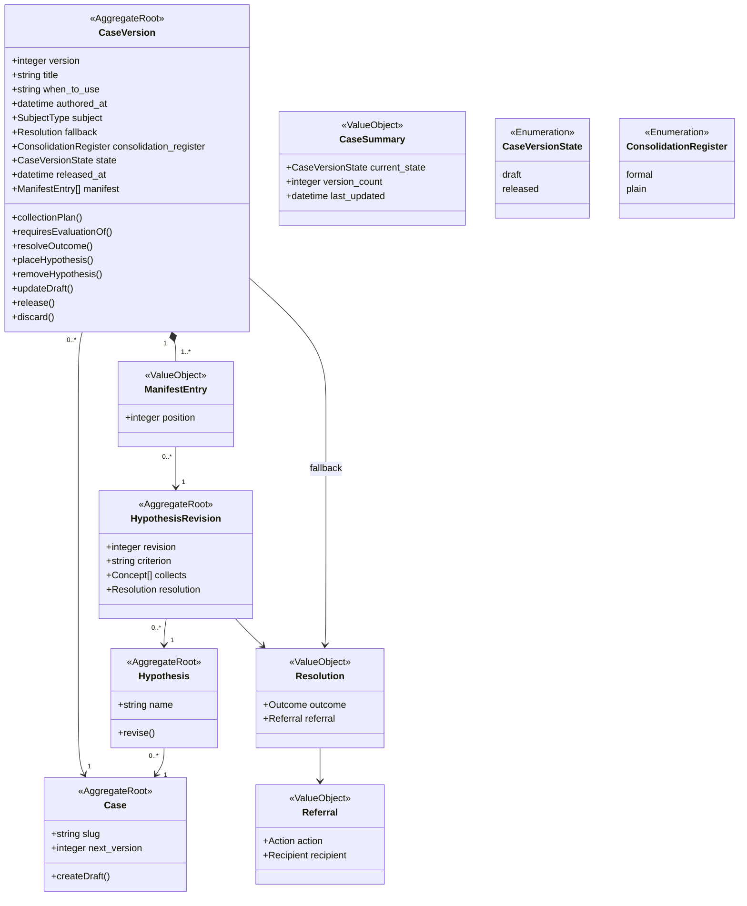
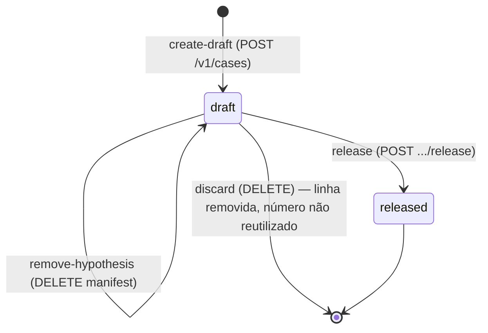

# Contexto Conhecimento

O contexto **Conhecimento** guarda o saber curado de troubleshooting: quais hipóteses existem para um caso, o que confirma cada uma e qual domina qual (`knowledge/domain/knowledge/_context.md`). É o **subdomínio central** do sistema — e, por decisão da especificação, "o modelo vive no esquema do caso e no seu validador, não em classes": o conhecimento é dado, exercitado por validação e teste, não por objetos com comportamento.

A responsabilidade do contexto é manter cada caso como uma identidade estável com suas próprias versões em rascunho e liberadas — cada uma válida só enquanto toda regra se mantiver contra o glossário e o registro de capabilities *correntes* — e cada hipótese como uma identidade estável com suas próprias revisões, que o manifesto de uma versão pode adotar.

Quatro ideias organizam o capítulo:

1. **Identidade separada de conteúdo.** `Case` é só um slug e um contador; `Hypothesis` é só um nome. Todo o conteúdo mora em `CaseVersion` e `HypothesisRevision`, numerados e imutáveis depois de liberados.
2. **Composição por manifesto.** Uma versão do caso não *contém* hipóteses; ela *aponta* para revisões de hipótese, cada uma em uma posição de precedência — o `ManifestEntry`.
3. **Ciclo de vida curto.** Uma versão nasce `draft`, pode ser corrigida e recomposta livremente, e ou é liberada (`released`, terminal e imutável) ou descartada (apagada, número nunca reutilizado).
4. **Validação a cada leitura.** Nada marca uma versão como "pronta"; uma versão que falha alguma regra estrutural ou de coerência simplesmente não lê como caso, seja rascunho ou liberada. A exceção é o replay, que lê o conteúdo pinado sem revalidar.

O diagrama de classes (`knowledge/projections/class-diagram-knowledge.mmd`, com os nomes de atributos como no código):

### Como o código organiza o contexto

| Arquivo | Papel |
|---|---|
| `src/case/case.ts` | Tipos do agregado como o motor o lê: `Case` (uma versão do caso, inteira), `ManifestEntry`, `HypothesisRevision`, `HypothesisIdentity`, `Resolution`, `Referral`, `CASE_VERSION_STATES`, e a projeção plana `Hypothesis` (nome + conteúdo da revisão) consumida pelo julgamento. |
| `src/case/case-store.port.ts` | Porta `ICaseStore` e os tipos de armazenamento: `AssembledCaseVersion`, `CreateDraftInput`, `HypothesisRevisionInput`, `UpdateDraftInput`, `PlaceHypothesisInput`, itens de listagem. |
| `src/case/case-query.port.ts` / `case-query.service.ts` | Contrato publicado `ICaseQuery` (read-case e listagens) e `replayCase`. |
| `src/case/parse-case-document.ts` | Validação estrutural de uma versão montada. |
| `src/case/validate-case-coherence.ts` | Validação de coerência contra glossário e registro de capabilities. |
| `src/case/case-resolution.ts` | `collectionPlan`, `requiresEvaluationOf`, `resolveOutcome`. |
| `src/case/create-draft.operation.ts`, `release.operation.ts`, `discard.operation.ts`, `manifest-composition.operations.ts`, `revise-hypothesis.operation.ts` | Operações do ciclo de vida. |
| `src/factories/case-lifecycle.factory.ts` | Compõe as operações com store, glossário e registro. |
| `src/persistence/relational-case-store.repository.ts` | Adaptador relacional de `ICaseStore`. |
| `src/investigation/consolidation-register.ts` | Enumeração `ConsolidationRegister`. |

Todas as rotas ficam sob `/v1` e validam caminho, query e corpo com Zod antes de chegar ao controlador; falhas respondem 400 `VALIDATION_ERROR` (`knowledge/constraints/a-malformed-request-is-refused-with-a-validation-error.md`). O mapeamento erro → status está em `src/errors/status-map.ts`; um erro fora do mapa responde 500 `INTERNAL_ERROR` (`src/http/error-handler.middleware.ts`).

## 7.1 Case

**Propósito** — A identidade estável de um caso: um `slug` nomeado uma vez e nunca compartilhado com outro caso, e o contador que atribui o número do próximo rascunho (`knowledge/domain/knowledge/case.md`). Quase tudo que um curador escrevia "no caso" — título, quando usar, sujeito, fallback, hipóteses — agora pertence a uma `CaseVersion` ou a uma `Hypothesis`, alcançadas só através desta identidade.

**Atributos**

| Atributo | Tipo | Obrigatório | Descrição / regra |
|---|---|---|---|
| `slug` | string | sim | Identidade. `PRIMARY KEY` em `cases` (`src/migrations/0004-case-and-hypothesis.sql`). `knowledge/rules/knowledge/a-slug-identifies-one-case.md`. |
| `next_version` | integer | sim | Número que o próximo rascunho recebe; sempre maior que todo número que o caso já teve, inclusive um depois descartado. Coluna `cases.next_version INTEGER NOT NULL DEFAULT 1` (`src/migrations/0009-case-version-lifecycle-schema.sql`). É um contador durável, nunca `MAX(version)` sobre linhas existentes. |

No código não há um tipo `Case` para a identidade sozinha: `CaseIdentity = { slug }` (`src/case/case-store.port.ts`) é o que as listagens devolvem, e `next_version` só é lido dentro do adaptador relacional (`assignNextVersion`, `UPDATE cases SET next_version = next_version + 1 ... RETURNING next_version - 1`). O tipo `Case` em `src/case/case.ts` representa **uma versão inteira** do caso, como o motor a consome.

**Operações**

| Operação | Onde | O que faz |
|---|---|---|
| create-draft | `CreateDraftOperation` em `src/case/create-draft.operation.ts` → `ICaseStore.createDraft` (`createDraftVersion` em `src/persistence/relational-case-store.repository.ts`) | Em uma transação: garante a linha em `cases` (`INSERT ... ON CONFLICT DO NOTHING`), incrementa `next_version` e toma o valor anterior como número, resolve a versão-fonte, insere a `case_versions` em `state = 'draft'` e copia o manifesto da fonte entrada por entrada. Devolve `{ slug, version }`. |

Sobre a versão-fonte (`knowledge/rules/knowledge/a-new-drafts-manifest-is-copied-from-an-existing-version.md`): se o corpo nomeia `source_version`, copia dela (o caminho de rollback); se não, copia da última versão **liberada** do caso (`SELECT MAX(version) ... WHERE state = 'released'`); se o caso não tem versão liberada, o rascunho começa sem manifesto. A cópia é um `INSERT ... SELECT` sobre `case_version_hypotheses`, preservando `hypothesis_name`, `revision` e `position`.

**Invariantes e regras**

- Nenhum outro caso compartilha o slug — `knowledge/rules/knowledge/a-slug-identifies-one-case.md`; `PRIMARY KEY (slug)`.
- No máximo um rascunho por vez; um segundo `create-draft` é recusado com 409 `CaseAlreadyHasDraftError` — `knowledge/rules/knowledge/a-case-has-at-most-one-draft.md`; índice parcial `case_versions_one_draft_per_case ON case_versions (slug) WHERE state = 'draft'` (`src/migrations/0009-...sql`), cuja violação o store traduz em `CaseAlreadyHasDraftError` (`raiseCreateDraftFailure`).
- O número de versão nunca é reutilizado — `knowledge/rules/knowledge/a-case-version-number-is-never-reused.md`; `next_version` só cresce, mesmo quando um rascunho é descartado.
- Toda versão permanece legível; o store guarda todas, não a última — `knowledge/rules/knowledge/every-case-version-remains-readable.md`.
- Leitura ou operação nomeando slug/versão que nada responde: 404 `CaseNotFoundError` — `knowledge/rules/knowledge/a-case-read-by-an-unknown-slug-or-version-is-refused.md`.

**Relacionamentos** — Um `Case` tem 0..* `CaseVersion` (FK `case_versions.slug → cases.slug`) e 0..* `Hypothesis` (FK `hypotheses.case_slug → cases.slug`).

**Erros que pode disparar** — `CaseAlreadyHasDraftError` (409), `CaseNotFoundError` (404), `CaseStoreError` (500).

**Onde vive**

- Tabela `cases (slug TEXT PK, next_version INTEGER NOT NULL DEFAULT 1)`.
- Rotas:

| Método e caminho | Operação | Arquivo | Sucesso |
|---|---|---|---|
| `POST /v1/cases` | create-draft | `src/http/create-draft.routes.ts` | 201 `{ slug, version }` |
| `GET /v1/cases` | list-cases (paginado) | `src/http/list-cases.routes.ts` | 200 `PaginatedResponse<{ slug }>` |
| `GET /v1/cases/{slug}/versions` | list-case-versions (paginado) | `src/http/list-case-versions.routes.ts` | 200 `PaginatedResponse<{ version, state }>`; 404 se o slug não existe; página vazia se o caso existe sem versões |

Corpo de `POST /v1/cases` (`createDraftBodySchema` em `src/http/dto/create-draft.dto.ts`): `slug`, `title`, `when_to_use`, `authored_at`, `subject`, `fallback { outcome, referral { action, recipient } }` obrigatórios; `consolidation_register` (`formal`/`plain`) e `source_version` (inteiro positivo) opcionais.

## 7.2 CaseVersion e CaseVersionState

**Propósito** — Uma tentativa numerada do procedimento de troubleshooting de um caso, referenciando o caso a que pertence (`knowledge/domain/knowledge/case-version.md`). Enquanto rascunho, seu manifesto pode ser composto livremente e seus atributos corrigidos quantas vezes a curadoria precisar. Uma vez liberada, nunca mais é alterada.

**Atributos** — tipo `Case` em `src/case/case.ts` (leitura validada) e `AssembledCaseVersion` em `src/case/case-store.port.ts` (leitura do store).

| Atributo | Tipo | Obrigatório | Descrição / regra |
|---|---|---|---|
| `version` | integer | sim | Número atribuído por `Case.next_version` na criação do rascunho. `PRIMARY KEY (slug, version)`. |
| `title` | string | sim | Título. Não vazio (`parse-case-document.ts`). |
| `when_to_use` | string | sim | Quando um atendente recorre a este caso. Não vazio. |
| `authored_at` | datetime (ISO-8601 como string) | sim | Quando a versão foi autorada. Coluna `TIMESTAMPTZ`. |
| `subject` | nome de `SubjectType` | sim | Tipo de sujeito que o caso examina. FK `subject_types(name)`. Todo conceito coletado deve aceitá-lo. |
| `fallback` | `Resolution` | sim | "Hipótese default disfarçada, explícita de propósito": não afirma nada sobre o mundo; responde quando nenhuma hipótese confirma. Colunas `fallback_outcome`, `fallback_action`, `fallback_recipient` com FKs ao glossário. |
| `consolidation_register` | `ConsolidationRegister` | não | Registro (`formal`/`plain`) que a consolidação deve manter; ausente, o adaptador de consolidação usa seu default. `CHECK (consolidation_register IN ('formal','plain'))`. |
| `state` | `CaseVersionState` | sim | `draft` ou `released`. Coluna com `CHECK`, `DEFAULT 'released'` (para linhas anteriores à migração 0009). |
| `released_at` | datetime | não | Presente só depois de liberada; gravado com `NOW()` no `release`. |
| `manifest` | `ManifestEntry[]` | sim (≥ 1 entrada) | As revisões de hipótese que esta versão usa, cada uma em uma posição. Tabela `case_version_hypotheses`. |

O tipo `Case` carrega ainda `slug` (da identidade) e `hypotheses`, uma projeção plana do manifesto (nome + `criterion` + `collects` + `resolution`) derivada em tempo de parse para os consumidores fora do contexto (julgamento, diagnóstico); nunca é declarada independentemente.

### CaseVersionState

Enumeração `CASE_VERSION_STATES = ['draft', 'released']` (`src/case/case.ts`; `knowledge/domain/knowledge/case-version-state.md`). Nomeia o único estado em que uma versão está agora.

| Valor | Significado |
|---|---|
| `draft` | Pode ser corrigida, ter o manifesto recomposto, ser liberada ou descartada. Só uma por caso. |
| `released` | Publicada e imutável; a única que pode ser diagnosticada (`knowledge/rules/investigation/only-a-released-case-version-is-diagnosed.md`, ver [Investigação](05-investigacao.md)). Terminal. |

### Ciclo de vida

Adaptado de `knowledge/projections/state-knowledge-case-version.mmd` e da máquina de estados `knowledge/rules/knowledge/a-case-version-moves-through-its-declared-lifecycle.md`:

`release` é o único gatilho que sai de `draft`; `released` é terminal porque nada transiciona uma versão além dela depois de ter respondido por uma investigação. `discard` não é uma transição: apaga a linha (e seus `case_version_hypotheses`), e o número fica queimado em `next_version`.

### Operações sobre a versão

| Operação | Onde | Comportamento |
|---|---|---|
| **create-draft** | ver 7.1 | Origina a versão em `draft` com manifesto copiado. |
| **update-draft** | `ICaseStore.updateDraft` (`updateDraftVersion` em `src/persistence/relational-case-store.repository.ts`), controlador `src/http/update-draft.controller.ts` | Lê o `state` da versão em transação; ausente → `CaseNotFoundError`; não `draft` → `CaseVersionNotDraftError`; senão `UPDATE` de exatamente `title`, `when_to_use`, `subject`, `fallback_*`, `consolidation_register`. Não altera `version`, `authored_at`, `state`, `released_at` nem o manifesto. Depois do update, o controlador chama `readCase` e devolve a versão validada — logo, um rascunho ainda incoerente responde a própria `CaseNotValidError`. |
| **place-hypothesis** | `placeHypothesis` em `src/case/manifest-composition.operations.ts` | Ver 7.5. |
| **remove-hypothesis** | `removeHypothesis` em `src/case/manifest-composition.operations.ts` | Ver 7.5. |
| **release** | `ReleaseOperation` em `src/case/release.operation.ts` | 1) `assembleVersion`; ausente → `CaseNotFoundError`. 2) `state !== 'draft'` → `CaseVersionNotDraftAtReleaseError` (409), antes de qualquer validação. 3) Roda a validação estrutural (`parseCaseDocument`) e, se ela passa, a de coerência (`caseCoherenceViolations`); qualquer violação → `CaseVersionNotReleasableError` (422) nomeando todas juntas. 4) `UPDATE case_versions SET state = 'released', released_at = NOW()`. Nada é gravado em caso de recusa. |
| **discard** | `discardCaseVersion` em `src/case/discard.operation.ts` | `assembleVersion`; ausente → `CaseNotFoundError`; não `draft` → `CaseVersionNotDraftError` (409); senão `DELETE` dos `case_version_hypotheses` e da `case_versions`, em transação. Nunca apaga revisões de hipótese. |
| **collection-plan** | `collectionPlan` em `src/case/case-resolution.ts` | União deduplicada dos `collects` de todas as revisões manifestadas, na ordem em que a precedência (posição) primeiro as nomeia. |
| **requires-evaluation-of** | `requiresEvaluationOf` | Um nome de hipótese por entrada do manifesto, na ordem do array. |
| **resolve-outcome** | `resolveOutcome(theCase, verdicts)` | Primeira hipótese `confirmed` em ordem de posição ascendente → seu `outcome`, `referral` e `determining` (nome); nenhuma → `fallback`, sem `determining`. |

Quanto a `a-release-refusal-with-no-named-violation-says-so` (`knowledge/rules/knowledge/`): a operação lança `CaseVersionNotReleasableError` só quando `violations.length > 0`; a lista vem de `InvalidCaseDocumentError.context.problems` ou de `caseCoherenceViolations`, ambas construídas item a item, então uma recusa com lista vazia não é produzida por este caminho. Um texto explícito de "nenhuma violação nomeada" não está implementado.

**Invariantes e regras**

- Manifesto com ao menos uma entrada — `knowledge/rules/knowledge/a-case-has-at-least-one-hypothesis.md`; `manifestProblems` em `src/case/parse-case-document.ts` ("the case declares no hypothesis"); `refuseEmptiedManifest` no remove-hypothesis.
- Liberada, nunca alterada — `knowledge/rules/knowledge/a-case-version-is-written-once.md`; regras SQL `case_versions_no_update` (`WHERE OLD.state = 'released' DO INSTEAD NOTHING`) e `case_versions_no_delete_when_released` (`src/migrations/0009-...sql`, evoluindo `0006-case-version-immutability.sql`); `case_version_hypotheses_no_update_when_released` / `_no_delete_when_released`.
- Move só ao longo do ciclo declarado — `knowledge/rules/knowledge/a-case-version-moves-through-its-declared-lifecycle.md`; `CaseVersionNotDraftError` (409) para operações que não são release, `CaseVersionNotDraftAtReleaseError` (409) para release.
- Só rascunho é descartável — `knowledge/rules/knowledge/only-a-draft-case-version-may-be-discarded.md`.
- Precedência é a posição declarada — `knowledge/rules/knowledge/hypotheses-are-ordered-by-precedence.md`; `byPrecedence` em `src/case/case-resolution.ts` ordena por `position`, nunca pelo array.
- Toda posição declara resolução — `knowledge/rules/knowledge/every-position-declares-a-resolution.md`; `resolutionProblems` no parse.
- Termos existem no glossário; conceitos aceitam o `subject` — ver 7.10.
- Validação a cada leitura — `knowledge/rules/knowledge/validation-runs-at-every-read.md`; ver 7.10.
- Não há coluna nem regra pareando presença de `released_at` com `state` no parse (`optionalStringProblems` aceita ausência; o comentário do módulo declara isso explicitamente).

**Relacionamentos** — Referencia 1 `Case`; compõe 1..* `ManifestEntry`; declara 1 `Resolution` (fallback); referencia 1 `SubjectType` do glossário.

**Erros que pode disparar** — `CaseNotFoundError` (404), `CaseVersionNotDraftError` (409), `CaseVersionNotDraftAtReleaseError` (409), `CaseVersionNotReleasableError` (422), `CaseNotValidError` (sem mapeamento → 500), `InvalidCaseDocumentError` (interno; convertido em `CaseNotValidError` ou `CaseVersionNotReleasableError`), `CaseVersionAlreadyStoredError` (definido em `src/errors/`; não referenciado pelas operações atuais), `CaseStoreError` (500).

**Onde vive**

- Tabela `case_versions` (`src/migrations/0004-...sql` + `0009-...sql`): `slug, version, title, when_to_use, authored_at, subject, fallback_outcome, fallback_action, fallback_recipient, consolidation_register, state, released_at`.
- Rotas:

| Método e caminho | Operação | Arquivo | Sucesso |
|---|---|---|---|
| `GET /v1/cases/{slug}/versions/{version}` | read-case | `src/http/read-case.routes.ts` | 200, versão validada (`readCaseResponseSchema` em `src/http/dto/read-case.dto.ts`) |
| `PATCH /v1/cases/{slug}/versions/{version}` | update-draft | `src/http/update-draft.routes.ts` | 200, versão validada |
| `POST /v1/cases/{slug}/versions/{version}/release` | release | `src/http/release.routes.ts` | 200 |
| `DELETE /v1/cases/{slug}/versions/{version}` | discard | `src/http/discard.routes.ts` | 204 |

Corpo de `PATCH` (`updateDraftBodySchema`): `title`, `when_to_use`, `subject`, `fallback` obrigatórios; `consolidation_register` opcional.

## 7.3 Hypothesis

**Propósito** — A identidade estável de uma afirmação falsificável dentro de seu caso, nomeada de forma única através de todas as versões que o caso já teve ou terá (`knowledge/domain/knowledge/hypothesis.md`). Seu conteúdo — `criterion`, `collects`, `resolution` — pertence às revisões; revisar nunca muda o nome, só acrescenta uma revisão para um manifesto adotar.

**Atributos** — `HypothesisIdentity = { name }` em `src/case/case.ts` e `src/case/case-store.port.ts`.

| Atributo | Tipo | Obrigatório | Descrição / regra |
|---|---|---|---|
| `name` | string | sim | Identidade dentro do caso. `PRIMARY KEY (case_slug, name)` em `hypotheses` (`src/migrations/0009-...sql`). Único através de todas as versões do caso (`knowledge/rules/knowledge/a-hypothesis-name-is-unique-within-its-case.md`) — as avaliações são indexadas por nome, e uma colisão sobrescreveria um veredito em silêncio. |

### Os três lados de uma hipótese

| Aspecto | Onde mora | Descrição |
|---|---|---|
| `criterion` | `HypothesisRevision` | Prosa de negócio curta (uma a três frases) que o julgamento aplica; o único campo em que a nuance do especialista é o valor. Um criterion afirma exatamente **uma** coisa falsificável — "confirma quando X, ou também quando Y" são duas hipóteses (`knowledge/rules/knowledge/one-falsifiable-claim-per-criterion.md`, verificado por revisão humana, não pelo validador). Não vazio (`knowledge/rules/knowledge/a-hypothesis-declares-a-criterion.md`). |
| `collects` | `HypothesisRevision` | Os conceitos do glossário que a hipótese precisa observar; ao menos um (`knowledge/rules/knowledge/a-hypothesis-collects-at-least-one-concept.md`) — sem coleta não há o que citar e a obrigação de citação seria insatisfazível. Cada um deve ter TTL no glossário (`knowledge/rules/knowledge/a-collected-concept-declares-a-ttl.md`) e uma capability somente-leitura registrada. |
| `resolution` | `HypothesisRevision` | O `outcome` e o `referral` que seguem a confirmação (7.6). |

**Operações**

| Operação | Onde | O que faz |
|---|---|---|
| revise | `ReviseHypothesisOperation` em `src/case/revise-hypothesis.operation.ts` | Ver 7.4. Cria a identidade (se nova) e uma revisão. |

**Invariantes e regras**

- Nome único no caso — `knowledge/rules/knowledge/a-hypothesis-name-is-unique-within-its-case.md`; `PRIMARY KEY (case_slug, name)`; no parse, `sharedHypothesisProblems` recusa um manifesto que adote a mesma hipótese em duas entradas.
- Revisada só contra o rascunho do caso — `knowledge/rules/knowledge/a-hypothesis-is-revised-only-against-its-cases-draft.md`; `refuseWithoutDraft` → `CaseHoldsNoDraftError`.
- Uma hipótese continua existindo mesmo que nenhum manifesto a adote; `list-hypotheses` lê `hypotheses` diretamente por `case_slug` (`listHypothesesPage`).

**Relacionamentos** — Referencia 1 `Case`; tem 0..* `HypothesisRevision`.

**Erros que pode disparar** — `CaseNotFoundError` (404, listagem com slug desconhecido), `CaseHoldsNoDraftError` (sem mapeamento → 500), e os de 7.4.

**Onde vive**

- Tabela `hypotheses (case_slug TEXT REFERENCES cases, name TEXT, PK (case_slug, name))`.
- Rotas:

| Método e caminho | Operação | Arquivo | Sucesso |
|---|---|---|---|
| `POST /v1/cases/{slug}/hypotheses` | revise-hypothesis | `src/http/revise-hypothesis.routes.ts` | 201 `{ hypothesis_name, revision }` |
| `GET /v1/cases/{slug}/hypotheses` | list-hypotheses (paginado) | `src/http/list-hypotheses.routes.ts` | 200 `PaginatedResponse<{ name }>` |
| `GET /v1/cases/{slug}/hypotheses/{name}/revisions` | list-hypothesis-revisions (paginado) | `src/http/list-hypothesis-revisions.routes.ts` | 200 `PaginatedResponse<{ revision, criterion, collects, resolution }>`; 404 `CaseNotFoundError` para slug ou nome desconhecidos (o store não distingue os dois) |

## 7.4 HypothesisRevision

**Propósito** — Um estado numerado do conteúdo de uma hipótese, referenciando a hipótese a que pertence (`knowledge/domain/knowledge/hypothesis-revision.md`). Sua investigação é o par `collects` + `criterion`. Uma vez que qualquer versão liberada a manifesta, esse conteúdo nunca muda: uma edição posterior cria a próxima revisão.

**Atributos** — tipo `HypothesisRevision` em `src/case/case.ts`; no store, `HypothesisRevisionContent` (plano, com `hypothesis_name`).

| Atributo | Tipo | Obrigatório | Descrição / regra |
|---|---|---|---|
| `hypothesis` | `HypothesisIdentity` | sim | A hipótese a que pertence (no store: `hypothesis_name`). |
| `revision` | integer | sim | Primeira revisão = 1; cada nova = maior existente + 1; nunca reutilizada (`knowledge/rules/knowledge/a-hypothesis-revision-number-is-never-reused.md`). Calculado por `COALESCE(MAX(revision), 0) + 1` dentro do `INSERT ... SELECT` (`revisionInsertStatement`). |
| `criterion` | string | sim | Não vazio. |
| `collects` | string[] (nomes de `Concept`) | sim (≥ 1) | Tabela `hypothesis_revision_collects`, FK `concepts(name)`. |
| `resolution` | `Resolution` | sim | Colunas `resolution_outcome`, `resolution_action`, `resolution_recipient` com FKs ao glossário. |

### revise-hypothesis

`ReviseHypothesisOperation.reviseHypothesis(input)` em `src/case/revise-hypothesis.operation.ts`, com `input = { slug, hypothesis_name, criterion, collects, resolution, subject }`:

1. `findDraftVersion(slug)`; nenhum rascunho → `CaseHoldsNoDraftError` (`knowledge/rules/knowledge/a-hypothesis-is-revised-only-against-its-cases-draft.md`).
2. `collects.length === 0` → `HypothesisRevisionCollectsNoConceptError`.
3. Resolve cada conceito no glossário (`IGlossaryQuery.readConcept`); ausentes → `ConceptNotInGlossaryError`, nomeando todos.
4. Conceitos cujo `accepts` não inclui `input.subject` → `ConceptRefusesSubjectTypeError`, nomeando todos.
5. `ICaseStore.insertHypothesisRevision`: em transação, `INSERT INTO hypotheses ... ON CONFLICT DO NOTHING`, insere a revisão com o próximo número e uma linha de `collects` por conceito. Devolve `{ hypothesis_name, revision }`.

Observação sobre o `subject` da verificação: a regra diz que a checagem de aceitação usa o tipo de sujeito **do rascunho**. No código, o `subject` é fornecido pelo chamador — a rota `POST /v1/cases/{slug}/hypotheses` recebe `subject` no corpo (`reviseHypothesisBodySchema` em `src/http/dto/revise-hypothesis.dto.ts`) e o repassa; a operação não o lê da versão em rascunho. A ancoragem automática ao `subject` do rascunho não está implementada.

**Invariantes e regras**

- `criterion` não vazio — `a-hypothesis-declares-a-criterion`; parse (`stringProblems`), borda HTTP (`z.string().min(1)`).
- Ao menos um conceito — `a-hypothesis-collects-at-least-one-concept`; `refuseEmptyCollects`; `collectsProblems` no parse.
- Número nunca reutilizado — `a-hypothesis-revision-number-is-never-reused`; `PRIMARY KEY (case_slug, hypothesis_name, revision)`, `COALESCE(MAX)+1`.
- Revisão referenciada por versão liberada nunca é alterada — `knowledge/rules/knowledge/a-released-hypothesis-revision-is-never-altered.md`; regras SQL `hypothesis_revisions_no_update` (incondicional), `hypothesis_revision_collects_no_update` e `hypothesis_revision_collects_no_delete_when_released` (`src/migrations/0010-protect-released-hypothesis-revision-collects.sql`). Revisões nunca são apagadas por operação alguma.
- Conceitos existem no glossário e aceitam o sujeito — `case-terms-exist-in-the-glossary`, `a-concept-accepts-the-declared-subject-type`; conferido na revisão e novamente a cada leitura da versão (7.10).
- Todo conceito coletado tem capability somente-leitura — `every-collected-concept-has-a-read-only-capability`; conferido só na leitura/release da versão, não na revisão.

**Relacionamentos** — Referencia 1 `Hypothesis`; é referenciada por 0..* `ManifestEntry` (possivelmente de versões diferentes — reuso, não cópia); referencia 1..* `Concept`; declara 1 `Resolution`.

**Erros que pode disparar** — `CaseHoldsNoDraftError`, `HypothesisRevisionCollectsNoConceptError`, `ConceptNotInGlossaryError`, `ConceptRefusesSubjectTypeError` (nenhum dos quatro está em `src/errors/status-map.ts`, logo respondem 500 `INTERNAL_ERROR` na API), `CaseStoreError`.

**Onde vive**

- Tabelas `hypothesis_revisions (case_slug, hypothesis_name, revision, criterion, resolution_outcome, resolution_action, resolution_recipient)` e `hypothesis_revision_collects (case_slug, hypothesis_name, revision, concept_name)` — `src/migrations/0009-...sql`.
- Rotas: `POST /v1/cases/{slug}/hypotheses` (corpo: `hypothesis_name`, `criterion`, `collects[]`, `resolution`, `subject`), `GET /v1/cases/{slug}/hypotheses/{name}/revisions`.

## 7.5 ManifestEntry

**Propósito** — Uma linha do manifesto de uma versão: a posição de precedência em que esta versão coloca uma hipótese e exatamente qual revisão do conteúdo dela usa (`knowledge/domain/knowledge/manifest-entry.md`). Reordenar duas hipóteses entre uma versão e a próxima muda só a `position` de duas entradas — nunca a revisão referenciada, nunca um fato da revisão.

**Atributos** — `ManifestEntry` em `src/case/case.ts` (aninhado) e em `src/case/case-store.port.ts` (com conteúdo plano).

| Atributo | Tipo | Obrigatório | Descrição / regra |
|---|---|---|---|
| `position` | integer | sim | Precedência; única dentro da versão (`UNIQUE (case_slug, case_version, position)`). Menor posição = maior precedência (`byPrecedence` ordena ascendente). |
| `hypothesis_revision` | `HypothesisRevision` | sim | A revisão adotada (no store: `hypothesis_name` + `revision`, FK composta para `hypothesis_revisions`). Uma hipótese aparece no máximo uma vez por versão: `PRIMARY KEY (case_slug, case_version, hypothesis_name)`. |

### Posição e precedência

A precedência que os especialistas afirmam é a `position` declarada, não a ordem em que as entradas foram gravadas ou lidas (`knowledge/rules/knowledge/hypotheses-are-ordered-by-precedence.md`). `collectionPlan` e `resolveOutcome` (`src/case/case-resolution.ts`) sempre passam por `byPrecedence`, que ordena por `position`; `requiresEvaluationOf` usa a ordem do array porque nenhum nó da especificação diz qual ordem esse conjunto deve ter. Qual causa domina qual é um fato de domínio verificado por revisão humana; o sinal de que a ordem está errada é duas hipóteses confirmarem com frequência na mesma investigação.

### place-hypothesis e remove-hypothesis

Ambas em `src/case/manifest-composition.operations.ts`, ambas exigem a versão em `draft`:

| Operação | Passos | Erros |
|---|---|---|
| `placeHypothesis(store, { slug, version, hypothesis_name, revision, position })` | 1) `assembleVersion`; ausente → `CaseNotFoundError`; não `draft` → `CaseVersionNotDraftError`. 2) Se a `position` já é ocupada por **outra** hipótese → `ManifestPositionOccupiedError`. 3) Se a mesma hipótese já está no manifesto (em qualquer posição), remove a entrada antiga (é um *move*). 4) `INSERT` em `case_version_hypotheses`. Uma corrida que viole `case_version_hypotheses_position_unique` também vira `ManifestPositionOccupiedError` (`raisePlaceHypothesisFailure`). | `CaseNotFoundError` 404, `CaseVersionNotDraftError` 409, `ManifestPositionOccupiedError` 409 |
| `removeHypothesis(store, { slug, version, hypothesis_name })` | 1) Mesmas recusas de versão. 2) Se remover deixaria zero entradas → `ManifestWouldHoldNoHypothesisError` (calculado contando as *outras* entradas, então remover uma hipótese não colocada não é recusado por este motivo). 3) `DELETE` da entrada. Nunca apaga a revisão referenciada. | `CaseNotFoundError` 404, `CaseVersionNotDraftError` 409, `ManifestWouldHoldNoHypothesisError` 422 |

Trocar duas hipóteses de posição, portanto, é colocar cada uma na posição liberada da outra, sem criar revisões.

**Invariantes e regras**

- Posição única na versão — `knowledge/rules/knowledge/a-hypothesis-position-is-unique-within-its-case.md`; `UNIQUE`, `refuseOccupiedByAnother`, `sharedPositionProblems` no parse.
- Hipótese única na versão — `PRIMARY KEY`, `sharedHypothesisProblems` no parse.
- Ao menos uma entrada — `a-case-has-at-least-one-hypothesis`.
- Imutável depois de liberada — `a-case-version-is-written-once`; regras SQL `case_version_hypotheses_no_update_when_released` / `_no_delete_when_released`.
- Copiada entrada a entrada ao criar um rascunho — `a-new-drafts-manifest-is-copied-from-an-existing-version`; `manifestCopyStatement`.

**Relacionamentos** — Pertence a 1 `CaseVersion`; referencia 1 `HypothesisRevision`.

**Erros que pode disparar** — `ManifestPositionOccupiedError` (409), `ManifestWouldHoldNoHypothesisError` (422), `CaseNotFoundError` (404), `CaseVersionNotDraftError` (409), `CaseStoreError`.

**Onde vive**

- Tabela `case_version_hypotheses (case_slug, case_version, hypothesis_name, revision, position)` — `src/migrations/0009-...sql`.
- Rotas:

| Método e caminho | Operação | Arquivo | Sucesso |
|---|---|---|---|
| `PUT /v1/cases/{slug}/versions/{version}/manifest/{hypothesis_name}` | place-hypothesis (corpo `{ revision, position }`) | `src/http/place-hypothesis.routes.ts` | 204 |
| `DELETE /v1/cases/{slug}/versions/{version}/manifest/{hypothesis_name}` | remove-hypothesis | `src/http/remove-hypothesis.routes.ts` | 204 |

## 7.6 Resolution

**Propósito** — O que segue uma posição decidida: o `outcome` concluído e o `referral` a executar (`knowledge/domain/knowledge/resolution.md`). Declarada por toda revisão de hipótese e pelo fallback da versão; o material cita os dois campos e a análise nomeia o agrupamento, para que nenhuma posição declare um sem o outro.

**Atributos** — `Resolution` em `src/case/case.ts`.

| Atributo | Tipo | Obrigatório | Descrição / regra |
|---|---|---|---|
| `outcome` | nome de `Outcome` | sim | O que a posição conclui. FK `outcomes(name)` em ambas as tabelas que a carregam. Deve existir no glossário. |
| `referral` | `Referral` | sim | O encaminhamento. |

**Invariantes e regras**

- Toda posição (revisão e fallback) declara `outcome` e `referral` — `knowledge/rules/knowledge/every-position-declares-a-resolution.md`; `resolutionProblems` em `src/case/parse-case-document.ts`.
- `outcome` existe no glossário — `case-terms-exist-in-the-glossary`; `vocabularyViolations` em `src/case/validate-case-coherence.ts`.

**Relacionamentos** — Contida em `CaseVersion.fallback` e `HypothesisRevision.resolution`; referencia `Outcome` do glossário; compõe `Referral`. `resolveOutcome` devolve exatamente um par `outcome` + `referral` (`ResolvedOutcome` em `src/case/case-resolution.ts`), nunca metade.

**Erros que pode disparar** — Via parse: `InvalidCaseDocumentError` → `CaseNotValidError` / `CaseVersionNotReleasableError`; via coerência: `IncoherentCaseError` (só através de `validateCaseCoherence`, não usado pelas rotas) ou `CaseNotValidError`.

**Onde vive** — Colunas `fallback_outcome` (+ referral) em `case_versions` e `resolution_outcome` (+ referral) em `hypothesis_revisions`. Trafega nos DTOs como `{ outcome, referral: { action, recipient } }`.

## 7.7 Referral

**Propósito** — O encaminhamento ("encaminhamento" do material) que uma resolução carrega: o que fazer e qual papel operacional faz (`knowledge/domain/knowledge/referral.md`). É exatamente a parte de um parecer sobre a qual se age — por isso a resposta nunca precede o registro.

**Atributos** — `Referral` em `src/case/case.ts`.

| Atributo | Tipo | Obrigatório | Descrição / regra |
|---|---|---|---|
| `action` | nome de `Action` | sim | O que o destinatário faz. FK `actions(name)`. |
| `recipient` | nome de `Recipient` | sim | A fila operacional que recebe. FK `recipients(name)`. |

**Invariantes e regras**

- Ambos presentes e não vazios — `referralProblems` em `src/case/parse-case-document.ts`.
- Ambos existem no glossário — `case-terms-exist-in-the-glossary`; `namedVocabularyTerms` coleta `action` e `recipient` de toda resolução.

**Relacionamentos** — Contido em `Resolution`; referencia `Action` e `Recipient` do glossário (ver [Glossário](02-glossario.md)).

**Erros que pode disparar** — Os mesmos de `Resolution`.

**Onde vive** — Colunas `fallback_action`, `fallback_recipient`, `resolution_action`, `resolution_recipient`.

## 7.8 ConsolidationRegister

**Propósito** — O registro em que o curador pede que a redação da consolidação seja escrita: `formal` ou `plain`, nada mais (`knowledge/domain/knowledge/consolidation-register.md`). Fixo e conhecido de antemão, ao contrário de um vocabulário descoberto como conceito ou atributo de sujeito: uma escolha de estilo fechada que nenhum caso novo estende.

**Atributos**

| Valor | Descrição |
|---|---|
| `formal` | Redação formal. |
| `plain` | Redação simples. |

`CONSOLIDATION_REGISTERS = ['formal', 'plain']` em `src/investigation/consolidation-register.ts`.

**Invariantes e regras**

- Opcional na versão; ausente, a consolidação usa o default do adaptador — `consolidationRegisterProblems` em `src/case/parse-case-document.ts` não recusa ausência; `CHECK (consolidation_register IN ('formal','plain'))` permite `NULL`.
- Se declarado, um dos dois valores — parse e `z.enum(CONSOLIDATION_REGISTERS)` nos DTOs.

**Relacionamentos** — Valor de `CaseVersion.consolidation_register`; lido pela etapa de consolidação (ver [Resolução, consolidação e gravação](10-resolucao-consolidacao-gravacao.md)).

**Erros que pode disparar** — `InvalidCaseDocumentError` ("consolidation_register is not one of formal, plain"), 400 `VALIDATION_ERROR` na borda.

**Onde vive** — `src/investigation/consolidation-register.ts`; coluna `case_versions.consolidation_register TEXT`.

## 7.9 CaseSummary

**Propósito** — Os três fatos que uma listagem de casos precisa sobre um caso — `current_state`, `version_count`, `last_updated` — cada um derivado das versões existentes do caso, nunca declarado pela identidade (`knowledge/domain/knowledge/case-summary.md`). Não é guardado por agregado nenhum nem armazenado: é computado a cada leitura.

**Atributos** (conforme a especificação)

| Atributo | Tipo | Obrigatório | Descrição / regra |
|---|---|---|---|
| `current_state` | `CaseVersionState` | sim | Estado da versão de maior número do caso. |
| `version_count` | integer | sim | Quantas versões o caso tem agora (descartadas não contam — não existem mais). |
| `last_updated` | datetime | sim | `authored_at` da versão de maior número. |

A regra `knowledge/rules/knowledge/a-case-summary-is-derived-from-its-existing-versions.md` justifica por que a versão de maior número é sempre a mais recente: `next_version` só cresce e uma versão só é criada depois de todas as anteriores, então a mais alta é a mais nova, seja `draft` ou `released`.

**Estado da implementação** — Não implementado. Nenhum tipo, consulta ou DTO em `src/` calcula `current_state`, `version_count` ou `last_updated`. `GET /v1/cases` devolve `PaginatedResponse<CaseIdentity>` — apenas `{ slug }` (`listCasesPage` em `src/persistence/relational-case-store.repository.ts`, `src/http/list-cases.controller.ts`). O que hoje permite compor esses fatos do lado do cliente é `GET /v1/cases/{slug}/versions`, que lista `{ version, state }` de cada versão.

**Relacionamentos** — Derivado de `Case` + suas `CaseVersion`.

**Erros que pode disparar** — Nenhum (não implementado).

**Onde vive** — Só na especificação: `knowledge/domain/knowledge/case-summary.md`.

## 7.10 Coerência do caso — o que "lido por inteiro" valida

A restrição `knowledge/constraints/a-case-is-read-whole.md` fixa a fronteira do agregado que responde a um diagnóstico: uma versão lida para diagnóstico é **montada e validada inteira** — seus atributos, seu manifesto e a revisão de hipótese de cada entrada, resolvidos em uma transação — ou não é lida. Uma versão parcialmente montada seria um caso com plano de coleta curto e precedência com buracos, e nenhum dos dois se anuncia; `resolve-outcome` responderia com o que tivesse chegado. Autorar, hipótese por hipótese, pode ser parcial; ler para diagnosticar, não.

A leitura acontece em três camadas, todas no caminho de `CaseQueryService.readCase` (`src/case/case-query.service.ts`) e de `ReleaseOperation.release` (`src/case/release.operation.ts`):

### Camada 1 — Montagem em uma transação

`ICaseStore.assembleVersion(slug, version)` (`assembleWholeVersion` em `src/persistence/relational-case-store.repository.ts`) lê, na mesma transação, a linha de `case_versions`, as entradas de `case_version_hypotheses` com o conteúdo de `hypothesis_revisions` (join) e todos os `hypothesis_revision_collects`, devolvendo um `AssembledCaseVersion` ou `undefined`. Ausente → `CaseNotFoundError` (`heldVersion`).

### Camada 2 — Validação estrutural (`parseCaseDocument`)

`src/case/parse-case-document.ts` recebe a versão montada projetada para uma forma plana (`assembledAsRawDocument`) e coleta **todos** os problemas de uma vez, lançando um único `InvalidCaseDocumentError` com a lista. Nada é defaultado ou coagido. O que confere:

| Verificação | Regra / nó | Mensagem de problema (exemplo) |
|---|---|---|
| Documento é um objeto JSON | — | `the document is not one JSON object` |
| `slug`, `title`, `when_to_use`, `authored_at`, `subject` strings não vazias | `domain/knowledge/case-version` | `title is empty` |
| `version` inteiro | idem | `version is not an integer` |
| `fallback` objeto com `outcome` string e `referral { action, recipient }` strings | `every-position-declares-a-resolution`, `domain/knowledge/resolution`, `referral` | `the fallback's referral's recipient is undeclared` |
| `consolidation_register` ausente ou `formal`/`plain` | `domain/knowledge/consolidation-register` | `consolidation_register is not one of formal, plain` |
| `state` presente e `draft`/`released` | `domain/knowledge/case-version-state` | `state is not one of draft, released` |
| `released_at` ausente ou string não vazia | `domain/knowledge/case-version` | `released_at is empty` |
| `manifest` array com ≥ 1 entrada | `a-case-has-at-least-one-hypothesis` | `the case declares no hypothesis` |
| Cada entrada: `position` inteiro, `hypothesis_name` string, `revision` inteiro, `criterion` string não vazia, `collects` array ≥ 1 de strings não vazias, `resolution` completa | `domain/knowledge/manifest-entry`, `a-hypothesis-declares-a-criterion`, `a-hypothesis-collects-at-least-one-concept` | `manifest entry 2 collects no concept` |
| Nenhuma hipótese em duas entradas | `a-hypothesis-name-is-unique-within-its-case` | `manifest entries 1, 3 share the hypothesis "x"` |
| Nenhuma posição em duas entradas | `a-hypothesis-position-is-unique-within-its-case` | `manifest entries 1, 2 share the position 1` |

O "locator" (`manifest entry N`) conta as entradas como um leitor as vê, não pela `position` declarada. Passando, `heldCase` constrói o `Case`: manifesto aninhado (`position` + `hypothesis_revision { hypothesis { name }, revision, criterion, collects, resolution }`) na ordem do array, e a projeção `hypotheses` derivada dele.

### Camada 3 — Validação de coerência (`validate-case-coherence.ts`)

`caseCoherenceViolations(theCase, glossary, capabilities)` lê o glossário e o registro de capabilities **como estão neste instante** e devolve todas as violações juntas:

| Verificação | Fonte consultada | Regra | Mensagem |
|---|---|---|---|
| `subject` existe como `subject-type`; cada `outcome`, `action`, `recipient` (das revisões e do fallback) existe no vocabulário respectivo | `IGlossaryQuery.readVocabularyTerm` (cada termo distinto uma vez) | `knowledge/rules/knowledge/case-terms-exist-in-the-glossary.md` | `the outcome "x" does not exist in the glossary` |
| Cada conceito do `collectionPlan` existe | `IGlossaryQuery.readConcept` | `case-terms-exist-in-the-glossary` | `the concept "x" does not exist in the glossary` |
| Cada conceito aceita `theCase.subject` (`concept.accepts.includes(subject)`) | idem | `knowledge/rules/knowledge/a-concept-accepts-the-declared-subject-type.md` | `the concept "x" does not accept the subject type "y" the case declares` |
| Cada conceito é respondido por uma capability | `ICapabilityQuery.readCapability` | `knowledge/rules/knowledge/every-collected-concept-has-a-read-only-capability.md` | `no read-only capability currently answers the concept "x"` |
| Essa capability é `read-only`, declara `output_schema` não vazio e `timeout` inteiro | idem (afirmado sobre o que a capability resolvida declara, não presumido do que o registro recusa) | idem | `the capability answering the concept "x" is not read-only` / `declares no output schema` / `declares no timeout` |

A leitura do registro é feita dentro da própria chamada e nunca lembrada (`knowledge/rules/knowledge/the-contract-check-reads-the-current-registration.md`): o mesmo caso recusado antes de uma capability ser registrada é aceito na leitura seguinte. `DuplicateConceptAnswerError` do registro propaga como está (500).

O `subject-attribute` está em `VOCABULARY_ROLES` mas nenhum termo desse vocabulário é nomeado por um caso, então não é conferido aqui.

### Quem chama o quê

| Caminho | Estrutural | Coerência | Erro em caso de falha |
|---|---|---|---|
| `readCase` (`GET .../versions/{version}`, e após `PATCH`) | sim | sim | `CaseNotValidError(slug, version, violations)` — estrutural **ou** coerência, mesma classe; sem mapeamento em `status-map.ts`, responde 500 |
| `release` | sim | sim (só se a estrutural passa) | `CaseVersionNotReleasableError` (422) com todas as violações |
| `replayCase` (usado pelo replay de investigação) | não | não | só `CaseNotFoundError` — reprodutibilidade pina conteúdo, não validade corrente (`knowledge/rules/knowledge/validation-runs-at-every-read.md`) |
| `validateCaseCoherence` (exportada) | — | sim | `IncoherentCaseError`; não é chamada pelas rotas atuais |
| Listagens (`list-cases`, `list-case-versions`, `list-hypotheses`, `list-hypothesis-revisions`) | não | não | `CaseNotFoundError` para identidades desconhecidas |

`validation-runs-at-every-read` vale igualmente para rascunho e liberada: um rascunho incompleto ou incoerente simplesmente ainda não lê como caso — não há campo "não pronto"; a falha da mesma validação já diz isso. `draft`/`released` respondem outra pergunta: se a versão pode ser diagnosticada.

## 7.11 Regras do contexto

| Regra / restrição | Tipo | Enunciado resumido | Implementação |
|---|---|---|---|
| `knowledge/rules/knowledge/a-slug-identifies-one-case.md` | invariante | Nenhum outro caso compartilha o slug. | `PRIMARY KEY (slug)` em `cases` |
| `knowledge/rules/knowledge/a-case-has-at-most-one-draft.md` | política | Um rascunho por vez; 409 `CaseAlreadyHasDraftError`. | Índice parcial `case_versions_one_draft_per_case`; `raiseCreateDraftFailure` |
| `knowledge/rules/knowledge/a-case-version-number-is-never-reused.md` | política | `next_version` sempre maior que todo número já usado, inclusive descartados. | `assignNextVersion` (`UPDATE ... RETURNING`) |
| `knowledge/rules/knowledge/a-new-drafts-manifest-is-copied-from-an-existing-version.md` | política | Manifesto do rascunho copiado da versão-fonte ou da última liberada. | `resolveSourceVersion`, `manifestCopyStatement` |
| `knowledge/rules/knowledge/a-case-version-moves-through-its-declared-lifecycle.md` | máquina de estados | `draft → released` via release; 409 `CaseVersionNotDraftError` / `CaseVersionNotDraftAtReleaseError`. | `requireDraftVersion`, `refuseNonDraft`, `updateDraftVersion`, `discardCaseVersion` |
| `knowledge/rules/knowledge/a-case-version-is-written-once.md` | invariante | Liberada e seus manifest entries nunca alterados. | Regras SQL em `0006` e `0009`; operações exigem `draft` |
| `knowledge/rules/knowledge/only-a-draft-case-version-may-be-discarded.md` | invariante | Só rascunho é descartado; remove versão e entradas, nunca revisões. | `discardCaseVersion`, `discardDraft`, `case_versions_no_delete_when_released` |
| `knowledge/rules/knowledge/every-case-version-remains-readable.md` | invariante | O store guarda todas as versões. | Nenhuma operação apaga liberadas |
| `knowledge/rules/knowledge/a-case-read-by-an-unknown-slug-or-version-is-refused.md` | política | 404 `CaseNotFoundError`. | `heldVersion`, `requireDraftVersion`, `requireCaseIdentity`, `requireHypothesisIdentity` |
| `knowledge/rules/knowledge/a-case-summary-is-derived-from-its-existing-versions.md` | política | `current_state`, `version_count`, `last_updated` da versão de maior número. | Não implementado (7.9) |
| `knowledge/rules/knowledge/a-case-has-at-least-one-hypothesis.md` | invariante | Manifesto ≥ 1; 422 `ManifestWouldHoldNoHypothesisError`. | `manifestProblems`, `refuseEmptiedManifest` |
| `knowledge/rules/knowledge/a-hypothesis-name-is-unique-within-its-case.md` | política | Nome único no caso. | `PRIMARY KEY (case_slug, name)`, `sharedHypothesisProblems` |
| `knowledge/rules/knowledge/a-hypothesis-position-is-unique-within-its-case.md` | invariante | Posição única; 409 `ManifestPositionOccupiedError`. | `UNIQUE`, `refuseOccupiedByAnother`, `sharedPositionProblems` |
| `knowledge/rules/knowledge/hypotheses-are-ordered-by-precedence.md` | invariante | Ordem declarada = posição. | `byPrecedence` em `src/case/case-resolution.ts` |
| `knowledge/rules/knowledge/a-hypothesis-declares-a-criterion.md` | invariante | `criterion` não vazio. | `stringProblems`, DTOs |
| `knowledge/rules/knowledge/one-falsifiable-claim-per-criterion.md` | invariante | Um criterion, uma afirmação. | Revisão humana; não verificado pelo código |
| `knowledge/rules/knowledge/a-hypothesis-collects-at-least-one-concept.md` | invariante | `collects` ≥ 1. | `refuseEmptyCollects`, `collectsProblems` |
| `knowledge/rules/knowledge/a-hypothesis-revision-number-is-never-reused.md` | política | Revisão 1, depois máx+1. | `revisionInsertStatement` |
| `knowledge/rules/knowledge/a-released-hypothesis-revision-is-never-altered.md` | política | Revisão referenciada por liberada nunca muda. | Regras SQL em `0009` e `0010` |
| `knowledge/rules/knowledge/a-hypothesis-is-revised-only-against-its-cases-draft.md` | política | Revisar exige rascunho; aceitação usa o `subject` do rascunho. | `refuseWithoutDraft` (`CaseHoldsNoDraftError`); `subject` vem do corpo, não do rascunho (7.4) |
| `knowledge/rules/knowledge/case-terms-exist-in-the-glossary.md` | política | Sujeito, conceitos, outcomes, actions, recipients existem no glossário. | `vocabularyViolations`, `conceptViolations`; FKs SQL; `refuseUnknownConcepts` na revisão |
| `knowledge/rules/knowledge/a-concept-accepts-the-declared-subject-type.md` | política | Conceito coletado aceita o `subject`. | `conceptViolations`, `refuseConceptsRefusingSubject` |
| `knowledge/rules/knowledge/a-collected-concept-declares-a-ttl.md` | política | Conceito coletado tem TTL (default 60 s). | Do lado do glossário (ver [Glossário](02-glossario.md)) |
| `knowledge/rules/knowledge/every-position-declares-a-resolution.md` | política | Revisões e fallback declaram outcome + referral. | `resolutionProblems`, colunas `NOT NULL` |
| `knowledge/rules/knowledge/every-collected-concept-has-a-read-only-capability.md` | política | Conceito coletado tem capability somente-leitura com `output_schema` e `timeout`. | `capabilityViolations`, `answerGaps` |
| `knowledge/rules/knowledge/the-contract-check-reads-the-current-registration.md` | política | Verificação lê o registro atual, nunca lembrado. | `ICapabilityQuery.readCapability` a cada chamada |
| `knowledge/rules/knowledge/validation-runs-at-every-read.md` | invariante | Validação a cada leitura; replay não revalida. | `readCase` vs `replayCase` |
| `knowledge/rules/knowledge/a-release-refusal-with-no-named-violation-says-so.md` | invariante | Release recusa uma vez nomeando tudo; lista vazia deve dizê-lo. | `releaseViolations`; texto explícito para lista vazia não implementado |
| `knowledge/constraints/a-case-is-read-whole.md` | restrição | Versão lida para diagnóstico montada inteira em uma transação, ou nada. | `assembleWholeVersion`, `readCase`, `replayCase` |
| `knowledge/constraints/listings-are-paged.md` | restrição | Listagens paginadas. | `listCasesPage`, `listCaseVersionsPage`, `listHypothesesPage`, `listHypothesisRevisionsPage` |
| `knowledge/constraints/a-malformed-request-is-refused-with-a-validation-error.md` | restrição | 400 `VALIDATION_ERROR`. | Cada `*.routes.ts` com seu `*.dto.ts` |
| `knowledge/constraints/the-domain-depends-on-no-infrastructure.md` | restrição | `src/case/*` não importa driver nem framework. | Porta `ICaseStore`; adaptador em `src/persistence/` |
