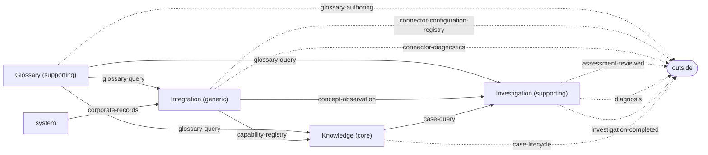
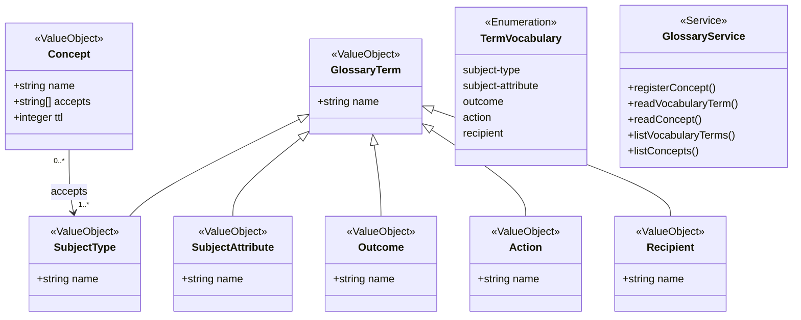
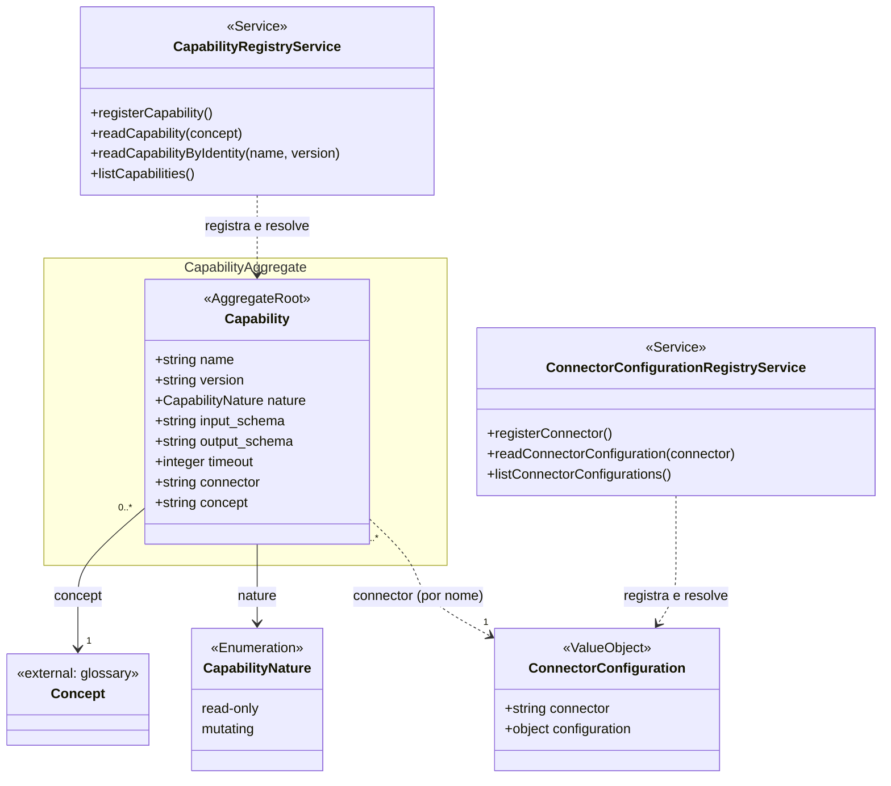
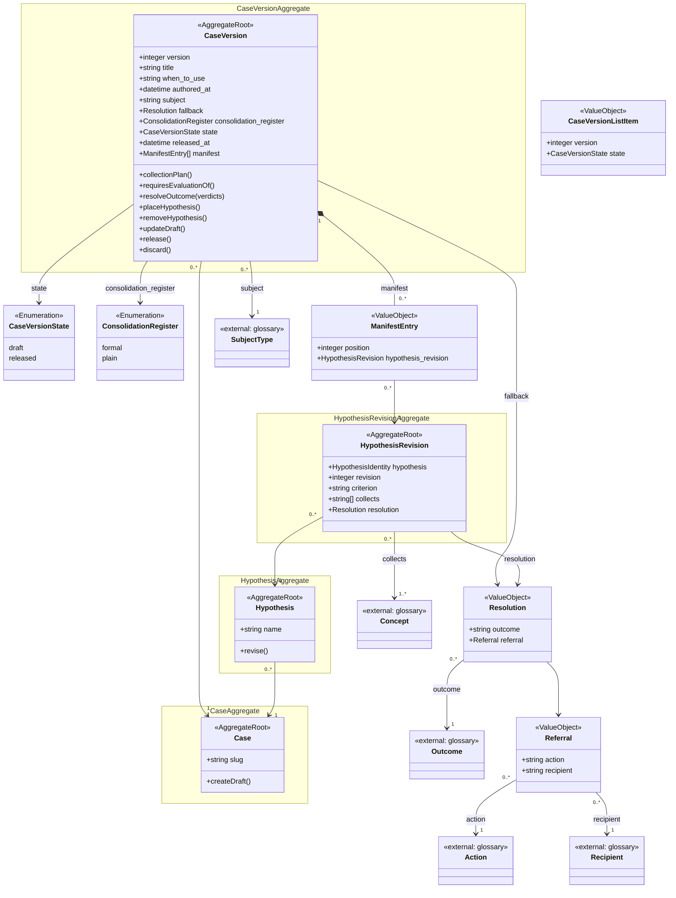
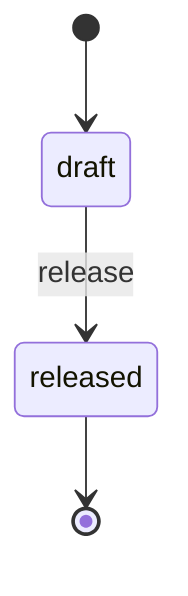
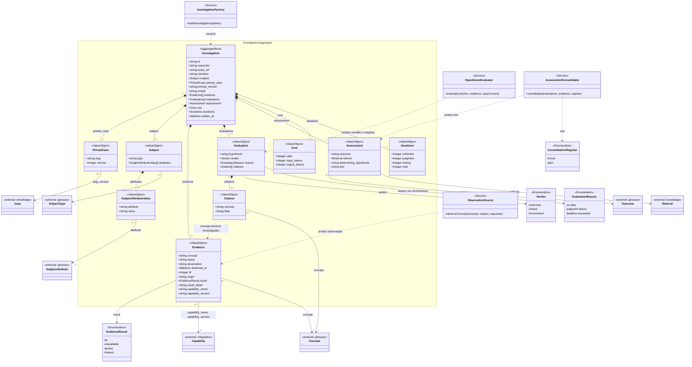
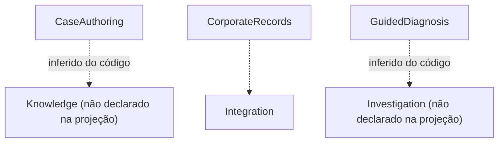

# 9. Diagramas de classes por contexto

Este capítulo reúne um diagrama de classes por contexto delimitado — [Glossário](02-glossario.md), [Integração](03-integracao.md), [Conhecimento](04-conhecimento.md) e [Investigação](05-investigacao.md) — mais o mapa de contextos e o mapa de capacidades de negócio. Os diagramas partem das projeções geradas da especificação (`knowledge/projections/class-diagram-*.mmd`, `context-map.mmd`, `capability-map.mmd`), mas foram **conferidos contra o código em `src/`** e ajustados onde os dois divergem. Cada divergência está anotada logo após o diagrama, para que o leitor saiba o que é modelo declarado e o que é código de fato.

Convenções adotadas em todos os diagramas:

- Nomes de atributos seguem o **código** (`snake_case`: `prompt_version`, `written_at`), e não a projeção (que usa `camelCase`: `promptVersion`). Onde a projeção e o código divergem em nome, o nome do código prevalece e a divergência é anotada.
- Valores de enumerações aparecem como os literais do código (`ok`, `no-data`, `released`), e não como constantes maiúsculas da projeção (`OK`, `NO_DATA`, `RELEASED`).
- Estereótipos: `<<AggregateRoot>>` é a raiz de um agregado (a única entidade pela qual as demais são alcançadas); `<<ValueObject>>` é um valor sem identidade própria; `<<Enumeration>>` é um conjunto fechado de literais; `<<Service>>` é uma operação de domínio ou porta; `<<external: X>>` é uma entidade que pertence a outro contexto e aparece aqui só para mostrar a referência.
- `namespace` agrupa a raiz de um agregado com o que ela contém.

## 9.1 Mapa de contextos

**Como ler.** Cada caixa é um contexto delimitado com sua classificação estratégica (core, supporting, generic). Uma seta sólida `A -->|contrato| B` significa que B **consome** o contrato publicado por A — a informação flui de A para B. Uma seta tracejada para `outside` é um contrato exposto ao mundo externo (rotas HTTP, eventos). `system` representa um fornecedor fora do software (os sistemas corporativos de registro). Fonte: `knowledge/projections/context-map.mmd`.

| Relação | Leitura | Onde está no código |
|---|---|---|
| `glossary -->|glossary-query|` | Os três outros contextos leem termos e conceitos do glossário. | `IGlossaryQuery` (`src/glossary/glossary-query.port.ts`), consumido por `validate-case-coherence.ts`, `capability-registry.service.ts`, `investigation-factory.ts` |
| `integration -->|concept-observation| investigation` | A investigação observa conceitos através das capabilities. | `IObservationSource` (`src/investigation/observation-source.port.ts`) e `ICapabilityQuery` |
| `integration -->|capability-registry| knowledge` | A coerência do caso consulta o registro de capabilities. | `ICapabilityQuery` em `src/case/validate-case-coherence.ts` |
| `knowledge -->|case-query| investigation` | A investigação lê o caso fixado. | `ICaseQuery.readCase` (`src/case/case-query.port.ts`), usado em `src/http/diagnose.controller.ts` |
| `investigation -.->|diagnosis|` | `POST /v1/diagnose`. | `src/http/diagnose.routes.ts` |
| `investigation -.->|assessment-reviewed|`, `|investigation-completed|` | Eventos/contratos declarados na especificação (`knowledge/contracts/investigation/`). | **Não implementados** — nenhum publicador de evento existe em `src/` |
| `knowledge -.->|case-lifecycle|` | Rotas de criação, revisão, liberação e descarte de versões de caso. | `src/http/create-draft.*`, `update-draft.*`, `place-hypothesis.*`, `remove-hypothesis.*`, `revise-hypothesis.*`, `release.*`, `discard.*` |
| `glossary -.->|glossary-authoring|` | Registro e leitura de conceitos e termos. | `src/http/register-concept.*`, `read-concept.*`, `list-concepts.*`, `read-vocabulary-term.*`, `list-vocabulary-terms.*` |
| `integration -.->|connector-configuration-registry|`, `|connector-diagnostics|` | Registro/leitura de conectores e capabilities; teste de conector. | `src/http/register-connector.*`, `register-capability.*`, `read-capability*.*`, `list-*`, `test-connector.*` |

## 9.2 Glossário

**Como ler.** O Glossário é um contexto de vocabulário: seis tipos de termo, todos value objects identificados pelo `name`. Não há relações entre eles no diagrama porque nenhum referencia outro — exceto `Concept.accepts`, que lista os nomes dos SubjectType que o conceito aceita. Os outros contextos apontam para estes termos por nome (string), o que é mostrado nos diagramas seguintes como `<<external: glossary>>`. Fonte: `knowledge/projections/class-diagram-glossary.mmd`, conferida com `src/glossary/terms.ts`.

| Relação | Leitura | Onde está no código |
|---|---|---|
| `GlossaryTerm <|-- SubjectType` (e os demais) | Os cinco termos são aliases do mesmo tipo `{ name }`. | `export type SubjectType = GlossaryTerm;` etc. em `src/glossary/terms.ts` |
| `Concept --> SubjectType : accepts` | Um conceito aceita um ou mais tipos de assunto, por nome. | `Concept.accepts: readonly string[]` (`src/glossary/terms.ts`); regra `knowledge/rules/glossary/*` |
| `TermVocabulary` | Os cinco vocabulários pelos quais um termo é lido. | `TERM_VOCABULARIES` em `src/glossary/terms.ts` |
| `GlossaryService` | Serviço que implementa a porta `IGlossaryQuery`. | `src/glossary/glossary.service.ts`, `src/glossary/glossary-query.port.ts` |

**Divergências anotadas.**

- A projeção não contém `GlossaryTerm`, `TermVocabulary` nem o serviço; foram acrescentados porque o código os declara (`src/glossary/terms.ts`, `src/glossary/glossary.service.ts`) e porque explicam como Investigação e Conhecimento leem os termos (`readVocabularyTerm(vocabulary, name)`).
- A projeção tipa `Concept.accepts` como `SubjectType[]`; no código é `string[]` de nomes. A relação foi mantida como referência por nome.
- `Concept.ttl` tem padrão `DEFAULT_CONCEPT_TTL_SECONDS = 60` quando o registro não o informa (`ConceptRegistration.ttl?`), o que a projeção não mostra.
- O código declara `NON_CONCLUSION_OUTCOMES` (`inconclusive-no-data`, `inconclusive-hypotheses-exhausted`) como Outcomes especiais; a projeção não os distingue.

## 9.3 Integração

**Como ler.** O agregado central é `Capability`: a declaração de que um conector consegue observar um `Concept` do glossário, com contrato (schemas de entrada/saída), natureza e timeout. `ConnectorConfiguration` é a configuração do conector nomeado por `Capability.connector`. Os dois serviços são os registros que publicam/lêem essas entidades. Fonte: `knowledge/projections/class-diagram-integration.mmd`, conferida com `src/capability-registry/capability.ts`, `src/capability-registry/capability-registry.service.ts`, `src/connector-registry/connector-configuration.ts` e `src/connector-registry/connector-configuration-registry.service.ts`.

| Relação | Leitura | Onde está no código |
|---|---|---|
| `Capability --> Concept : concept` | Toda capability responde a exatamente um conceito do glossário, por nome. | `Capability.concept: string`; FK em `src/migrations/0007-capability-concept.sql` |
| `Capability --> CapabilityNature` | Só capabilities `read-only` podem ser usadas na coleta. | `CAPABILITY_NATURES`, `READ_ONLY_NATURE`; erro `CapabilityNotReadOnlyError` |
| `Capability ..> ConnectorConfiguration : connector` | A capability nomeia o conector; a configuração é lida em tempo de observação. | `Capability.connector: string`; `IConnectorConfigurationQuery.readConnectorConfiguration` em `src/investigation/http-declarative-observation-source.adapter.ts` |
| `CapabilityRegistryService` | Implementa `ICapabilityQuery` (`readCapability(concept)`, `listCapabilities`). | `src/capability-registry/capability-registry.service.ts`, `src/capability-registry/capability-query.port.ts` |
| `ConnectorConfigurationRegistryService` | Registro e leitura de configurações de conector. | `src/connector-registry/connector-configuration-registry.service.ts` |

**Divergências anotadas.**

- Nomes: a projeção usa `inputSchema`/`outputSchema`; o código usa `input_schema`/`output_schema`.
- `Capability.concept`: a projeção tipa como `Concept`; no código é `string` (nome do conceito).
- `ConnectorConfiguration.configuration`: a projeção diz `string`; no código é `Readonly<Record<string, unknown>>` (objeto).
- A projeção lista para o registro de capabilities apenas `registerCapability()` e `resolveConcept()`. No código a operação de resolução chama-se `readCapability(concept)` e existem ainda `readCapabilityByIdentity(name, version)`, `readCapabilityByIdentityOrThrow` e `listCapabilities`. Para o registro de conectores, a projeção lista só `registerConnector()`; o código tem também `readConnectorConfiguration`, `readConnectorConfigurationOrThrow` e `listConnectorConfigurations`.
- A relação `Capability ..> ConnectorConfiguration` não consta na projeção; foi acrescentada porque o adaptador de observação a percorre por nome.
- `timeout` tem padrão `DEFAULT_CAPABILITY_TIMEOUT_MS = 60_000` quando omitido no registro.

## 9.4 Conhecimento

**Como ler.** A especificação modela quatro agregados: `Case` (a identidade estável, por `slug`), `CaseVersion` (o conteúdo versionado, com estado `draft`/`released`), `Hypothesis` (identidade estável de uma hipótese dentro do caso) e `HypothesisRevision` (o conteúdo de uma revisão). O `manifest` de uma versão é uma lista ordenada de `ManifestEntry`, cada uma apontando para uma revisão de hipótese; a `position` dita a precedência na resolução do desfecho. `Resolution` e `Referral` são os value objects que dizem o que fazer quando uma hipótese confirma (ou quando nenhuma confirma: `fallback`). Fonte: `knowledge/projections/class-diagram-knowledge.mmd`, conferida com `src/case/case.ts`, `src/case/case-resolution.ts` e `src/case/case-store.port.ts`.

| Relação | Leitura | Onde está no código |
|---|---|---|
| `CaseVersion --> Case` | Muitas versões por caso; a versão é identificada por `(slug, version)`. | `Case.slug` + `Case.version` em `src/case/case.ts`; tabela `case_versions (slug, version)` |
| `Hypothesis --> Case` | Uma hipótese pertence a um caso e é alcançada só por ele. | `Case.hypotheses` (`src/case/case.ts`) |
| `HypothesisRevision --> Hypothesis` | Uma revisão pertence a uma hipótese (`hypothesis.name`, `revision`). | `HypothesisRevision.hypothesis: HypothesisIdentity` |
| `ManifestEntry --> HypothesisRevision` | Cada entrada do manifesto aponta para uma revisão específica. | `ManifestEntry.hypothesis_revision` |
| `CaseVersion *-- ManifestEntry` | O manifesto é composição da versão; `position` dá a precedência. | `Case.manifest`; `resolveOutcome` em `src/case/case-resolution.ts` |
| `CaseVersion --> Resolution : fallback` | O que responder quando nenhuma hipótese confirma. | `Case.fallback` |
| `HypothesisRevision --> Resolution` | O que responder quando esta hipótese confirma. | `HypothesisRevision.resolution`, `Hypothesis.resolution` |
| `Resolution --> Referral` | Encaminhamento (ação + destinatário). | `Referral` em `src/case/case.ts` |
| `CaseVersion --> SubjectType`, `HypothesisRevision --> Concept`, `Resolution --> Outcome`, `Referral --> Action/Recipient` | Referências por nome ao glossário, verificadas por `validate-case-coherence.ts`. | `src/case/validate-case-coherence.ts` |
| `collectionPlan()`, `requiresEvaluationOf()`, `resolveOutcome()` | Os três comportamentos da versão consumidos pela Investigação. | Funções em `src/case/case-resolution.ts` |
| `createDraft()`, `updateDraft()`, `placeHypothesis()`, `removeHypothesis()`, `release()`, `discard()`, `revise()` | Ciclo de vida da versão e revisão da hipótese. | `src/case/create-draft.operation.ts`, `manifest-composition.operations.ts`, `release.operation.ts`, `discard.operation.ts`, `revise-hypothesis.operation.ts`; operações de `ICaseStore` |

**Divergências anotadas.**

- **O código achata `Case` e `CaseVersion` em um único tipo `Case`** (`src/case/case.ts`): `slug`, `title`, `when_to_use`, `version`, `authored_at`, `subject`, `fallback`, `consolidation_register?`, `state`, `released_at?`, `manifest`, `hypotheses`. O diagrama mantém a separação da especificação porque é ela que explica o modelo relacional (`cases` × `case_versions`) e a regra de imutabilidade da versão liberada; mas, em código, uma leitura de `readCase(slug, version)` devolve o valor achatado.
- **`Hypothesis` no código também é achatada**: `Case.hypotheses[]` traz `{ name, criterion, collects, resolution }` — a revisão referenciada pelo manifesto já resolvida para a hipótese. `HypothesisRevision` e `ManifestEntry` existem como tipos separados apenas dentro de `Case.manifest`.
- A projeção declara `Case.nextVersion`; **não existe** no tipo `Case` do código. A próxima versão é derivada pelo repositório ao criar um rascunho (`ICaseStore.createDraft` devolve o número).
- A projeção declara `CaseSummary { currentState, versionCount, lastUpdated }`; **não existe** no código. O que existe é `CaseVersionListItem { version, state }` e `CaseIdentity { slug }` (`src/case/case-store.port.ts`), usados nas listagens paginadas; o diagrama mostra `CaseVersionListItem` em seu lugar.
- Os comportamentos (`collectionPlan`, `resolveOutcome`, `release`, …) não são métodos: são funções puras (`src/case/case-resolution.ts`) e classes/funções de operação (`*.operation.ts`) que recebem o `Case` ou o `ICaseStore`. O diagrama os lista como operações da versão porque é a ela que se aplicam.
- Nomes: `whenToUse` → `when_to_use`, `authoredAt` → `authored_at`, `releasedAt` → `released_at`, `consolidationRegister` → `consolidation_register`. `CaseVersion.subject` é `string` (nome do SubjectType), não o objeto.
- `ConsolidationRegister` é declarado em `src/investigation/consolidation-register.ts` e importado por `src/case/case.ts` — o único import do Conhecimento vindo da Investigação.
- Acrescentadas ao diagrama as relações de composição/valor (`fallback`, `resolution`, `manifest`, referências ao glossário) que a projeção omite; as quatro setas originais foram mantidas.

O diagrama de estados da versão do caso (`knowledge/projections/state-knowledge-case-version.mmd`) confirma-se no código: `CASE_VERSION_STATES = ['draft', 'released']`, transição única por `release`.

## 9.5 Investigação

**Como ler.** A raiz é `Investigation`, um registro imutável escrito de uma vez. Tudo o que ela contém é value object (setas de composição `*--`). As referências a outros contextos são por nome ou por par de chaves: `pinned_case` fixa o caso por `(slug, version)`, `Evidence` fixa a capability por `(capability_name, capability_version)`, e `Concept`, `Outcome`, `SubjectType`, `SubjectAttribute` são nomes do glossário. As três enumerações (`EvidenceResult`, `Verdict`, `EvaluationReason`) são o que a coleta e o julgamento produzem. Os dois serviços são as portas por onde a LLM entra (julgamento e consolidação). Fonte: `knowledge/projections/class-diagram-investigation.mmd`, conferida com `src/investigation/*.ts` e `src/migrations/0005-investigation.sql`. Detalhes de cada entidade no capítulo [Investigação](05-investigacao.md).

| Relação | Leitura | Onde está no código |
|---|---|---|
| `Investigation *-- PinnedCase` / `PinnedCase --> Case` | A investigação fixa o caso por slug e versão (pino de replay). | `PinnedCase` em `src/investigation/investigation.ts`; FK `(pinned_case_slug, pinned_case_version) → case_versions` em `src/migrations/0005-investigation.sql`; regra `replay-is-pinned` |
| `Investigation *-- Subject *-- SubjectAttributeValue` | Um assunto com ao menos um par atributo/valor. | `src/investigation/subject.ts`, `subject-attribute-value.ts`; tabela `investigation_subject_attribute_values` |
| `Investigation *-- Evidence` (1..\*) | Exatamente uma evidência por conceito do plano de coleta. | `evidenceTotalityViolations` em `investigation-factory.ts`; PK `(investigation_id, concept)` |
| `Investigation *-- Evaluation` (1..\*) | Exatamente uma avaliação por hipótese exigida. | `evaluationTotalityViolations`; PK `(investigation_id, hypothesis)` |
| `Evaluation *-- Citation` | ≥ 1 quando `confirmed`/`refuted`; 0..n quando `inconclusive`. | União discriminada `Evaluation` em `src/investigation/evaluation.ts`; tabela `investigation_evaluation_citations` |
| `Evidence --> EvidenceResult` | Como a coleta terminou. | `src/investigation/evidence-result.ts`; `CHECK` na coluna `result` |
| `Evaluation --> Verdict`, `--> EvaluationReason` | Conclusão e, se inconclusiva, a razão. | `verdict.ts`, `evaluation-reason.ts`; `CHECK` nas colunas |
| `Citation ..> Evidence : concept` | A citação aponta para a evidência do mesmo conceito, dentro da mesma investigação. | `citesADeclaredField` em `src/investigation/citation-validation.ts` |
| `Evidence --> Capability` | Qual capability, em qual versão, produziu a observação. | `capability_name`/`capability_version`; FK para `capabilities (name, version)` |
| `Evidence --> Concept`, `Citation --> Concept`, `Subject --> SubjectType`, `SubjectAttributeValue --> SubjectAttribute`, `Assessment --> Outcome` | Referências por nome ao glossário. | Strings nos tipos; FKs `concepts(name)`, `subject_types(name)`, `subject_attributes(name)`, `outcomes(name)` |
| `Assessment --> Referral` | O encaminhamento resolvido pelo caso. | `Referral` de `src/case/case.ts`; colunas `assessment_action`, `assessment_recipient` |
| `InvestigationFactory ..> Investigation` | A única forma de construir uma investigação válida. | `buildInvestigation` em `src/investigation/investigation-factory.ts` |
| `HypothesisEvaluator ..> Evaluation` | Porta de julgamento (LLM em produção, fake em teste). | `IHypothesisEvaluator` em `src/investigation/hypothesis-evaluator.port.ts`; adaptadores `anthropic-*`/`fake-*` |
| `AssessmentConsolidator ..> Assessment` | Porta de redação; produz só o `text`. | `IAssessmentConsolidator` em `src/investigation/assessment-consolidator.port.ts` |
| `ObservationSource ..> Evidence` | Porta de observação de conceitos. | `IObservationSource` em `src/investigation/observation-source.port.ts`; `http-declarative-observation-source.adapter.ts` |

**Divergências anotadas.**

- A projeção não mostra `pinned_case` como atributo, só a seta `Investigation --> Case : pinnedCase`. O código materializa a relação no value object `PinnedCase { slug, version }` (`src/investigation/investigation.ts`), e o diagrama o exibe.
- A projeção não mostra `Evidence.capability_name`/`capability_version`, só a seta `Evidence --> Capability`. O código materializa a relação nesses dois campos; quando nenhuma capability responde ao conceito, ambos ficam como string vazia — o que **não satisfaz a FK** `investigation_evidence_capability_fkey` do banco (ver lacuna em [8.3](05-investigacao.md)).
- Nomes: `ticketRef` → `ticket_ref`, `promptVersion` → `prompt_version`, `writtenAt` → `written_at`, `observedAt` → `observed_at`, `resultDetail` → `result_detail`, `determiningHypothesis` → `determining_hypothesis`, `inputTokens` → `input_tokens`, `outputTokens` → `output_tokens`.
- Tipos das referências ao glossário: a projeção usa `Concept`, `Outcome`, `SubjectType`, `SubjectAttribute` como tipos de atributo; no código são todos `string` (nomes).
- `Evaluation` no código é uma **união discriminada** por `verdict`: nos ramos `confirmed`/`refuted` o atributo `reason` não existe e `citations` é tupla não vazia; no ramo `inconclusive`, `reason` é obrigatório. A projeção mostra uma única classe com `reason` opcional.
- A projeção não inclui `ObservationSource`, `InvestigationFactory` nem `ConsolidationRegister`; foram acrescentados porque o código os declara (`observation-source.port.ts`, `investigation-factory.ts`, `consolidation-register.ts`) e são necessários para ler o pipeline. `ConsolidationRegister` está declarado neste contexto, embora a projeção o coloque no Conhecimento (`CaseVersion.consolidationRegister`).
- `Investigation.evidence` e `evaluations` aparecem com cardinalidade `1..*` porque um caso liberado sempre tem ao menos uma hipótese no manifesto (`ManifestWouldHoldNoHypothesisError`) e cada revisão coleta ao menos um conceito (`HypothesisRevisionCollectsNoConceptError`); a projeção usa `Evidence[]`/`Evaluation[]` sem cardinalidade.

## 9.6 Mapa de capacidades de negócio

**Como ler.** Cada caixa é uma capacidade de negócio que a especificação nomeia; uma seta tracejada liga a capacidade ao contexto que a realiza. Fonte: `knowledge/projections/capability-map.mmd` e `knowledge/projections/overview.md`. O mapa é incluído por completude, mas a própria projeção observa que duas das três capacidades estão **sem mapeamento**: nenhum cenário as nomeia e nenhum contrato as consome, então qual contexto as realiza não está declarado.

| Capacidade | Estado na projeção | Leitura a partir do código |
|---|---|---|
| `CorporateRecords` | Consumida por Integration (contrato `corporate-records`). | Os sistemas corporativos observados via `http-declarative-observation-source.adapter.ts` |
| `CaseAuthoring` | Sem mapeamento. | As rotas de ciclo de vida do caso (`src/http/create-draft.*` … `release.*`) realizam a autoria de casos no contexto Conhecimento — inferência a partir do código, não declaração da especificação |
| `GuidedDiagnosis` | Sem mapeamento. | `POST /v1/diagnose` e `src/investigation/run-diagnosis.ts` realizam o diagnóstico guiado no contexto Investigação — mesma ressalva |

## 9.7 Legenda geral das relações

| Notação Mermaid | Nome | Significado neste documento |
|---|---|---|
| `A "1" *-- "0..*" B` | Composição | B existe apenas dentro de A; é gravado nas tabelas-filho de A e nunca é referenciado de fora (ex.: `Investigation *-- Evidence`). |
| `A "0..*" --> "1" B` | Associação dirigida (referência) | A guarda a identidade de B — um nome do glossário, um par `(slug, version)` ou `(name, version)` — sem conter B. No banco costuma ser uma FK. |
| `A ..> B : rótulo` | Dependência | A usa/produz/constrói B sem guardá-lo (portas e fábricas), ou a referência se dá por convenção sem FK (ex.: `Citation ..> Evidence`). |
| `A <|-- B` | Generalização | B é um alias/especialização de A (só no Glossário: `GlossaryTerm <|-- SubjectType`). |
| `"1"`, `"0..*"`, `"1..*"` | Multiplicidade | Quantas instâncias participam de cada lado. `1..*` indica "pelo menos uma", garantido por regra da fábrica ou por validação de entrada. |
| `<<AggregateRoot>>`, `<<ValueObject>>`, `<<Enumeration>>`, `<<Service>>`, `<<external: X>>` | Estereótipo | Papel da classe no modelo; `external` marca entidade de outro contexto. |
| `namespace` | Agrupamento | Raiz de agregado com os valores que ela contém. |
| `-->|contrato|` (flowchart) | Consumo de contrato | O contexto de destino consome o contrato publicado pelo de origem. |
| `-.->` (flowchart) | Exposição externa / mapeamento | Contrato exposto ao exterior, ou capacidade mapeada a um contexto. |
