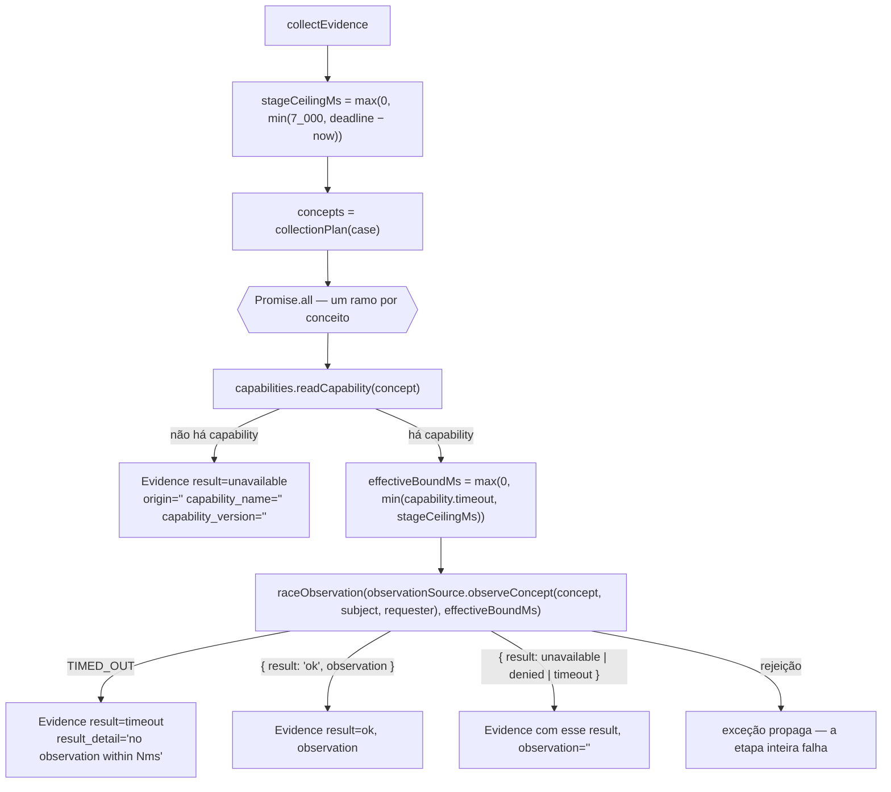
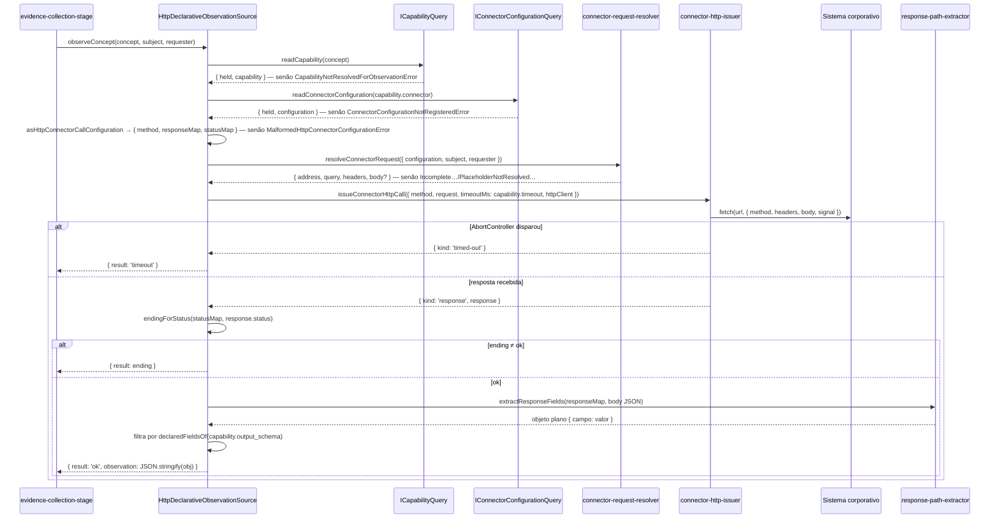

# Coleta de evidências

## 12. Etapa 2 — coleta de evidências

### 12.1 O que a coleta faz

A coleta transforma o plano de coleta do caso — a lista de conceitos que suas hipóteses precisam observar — em **exatamente uma Evidence por conceito** (`knowledge/rules/investigation/one-evidence-per-collected-concept.md`). Para cada conceito ela descobre qual capability o responde hoje, chama o conector dessa capability através da porta `IObservationSource` e grava o que voltou — ou grava o fato de que nada voltou. Uma ausência de dado é um **fato registrado**, nunca uma exceção (`domain/investigation/evidence`).

Arquivo de orquestração: `src/investigation/evidence-collection-stage.ts`, função `collectEvidence`. Ela é chamada por `runDiagnosis` (`src/investigation/run-diagnosis.ts`) com `{ case, subject, requester, capabilities, observationSource, now, deadline }` e devolve `Evidence[]`.



### 12.2 Paralelismo por conceito

`collectEvidence` dispara `collectOneEvidence` para cada conceito do plano **ao mesmo tempo**, com `Promise.all`. Não há pool nem fila: se o plano tem oito conceitos, oito chamadas a `observeConcept` estão em voo simultaneamente. Isso é o que a especificação pede — "one call per concept in the plan, in parallel" (`knowledge/contracts/investigation/observation-source.md`) — e o que torna aceitável reexecutar tudo em caso de falha antes da gravação: a coleta é somente-leitura e paralela (`rules/investigation/an-investigation-is-written-once`).

Uma chamada lenta ou travada nunca bloqueia outra: cada ramo tem sua própria corrida contra o tempo (`raceObservation`) e resolve por conta própria. O `Promise.all` só espera o ramo mais lento — que, por construção, nunca passa do teto da etapa.

### 12.3 Orçamento de tempo próprio

A coleta tem seu próprio orçamento nominal de **sete segundos** dentro do prazo total (`knowledge/rules/investigation/collection-has-its-own-budget-within-the-total.md`), constante `COLLECTION_STAGE_BUDGET_MS = 7_000` no próprio arquivo da etapa. A regra pede duas cifras, não uma: o `timeout` da capability limita **uma chamada**; o orçamento da etapa é o teto que a etapa inteira nunca ultrapassa, seja qual for a capability mais lenta.

O cálculo, em duas camadas:

1. **Teto da etapa** — `stageCeilingMs = max(0, min(COLLECTION_STAGE_BUDGET_MS, deadline − now))`. O `deadline` é o instante absoluto propagado desde a entrada da requisição (`knowledge/constraints/the-deadline-is-an-absolute-propagated-instant.md`); se restar menos de sete segundos, a coleta recebe só o que resta.
2. **Limite efetivo de cada chamada** — `effectiveBoundMs = max(0, min(capability.timeout, stageCeilingMs))` (`effectiveBoundMsFor`). O timeout que a capability declarou (em milissegundos, `src/capability-registry/capability.ts`; padrão de registro `DEFAULT_CAPABILITY_TIMEOUT_MS = 60_000`) vale só até onde o teto da etapa permite.

O cenário `knowledge/scenarios/investigation/a-slow-capability-yields-to-the-collection-budget.md` descreve exatamente este caso: capability com timeout de dez segundos, etapa com sete disponíveis → a evidência registra `timeout` aos sete segundos, e os três segundos que o timeout da capability ainda tinha não importam.

A corrida em si (`raceObservation`) é um `setTimeout` de `effectiveBoundMs` contra a promise de `observeConcept`. Se o timer vence, a função resolve com o marcador interno `TIMED_OUT` (um `Symbol`, nunca um valor de domínio) e **não espera mais** pela observação — a promise original continua viva em segundo plano, mas ninguém lê seu resultado. Se a observação rejeita (lança), a rejeição propaga: é uma falha que a etapa não tem como representar em nenhum dos quatro `result` (ver 12.9).

O módulo nunca lê `Date.now()`: `now` e `deadline` chegam como parâmetros, o que permite exercitar a corrida deterministicamente em testes.

### 12.4 O registro Evidence

Cada ramo termina em `evidenceOf(base, ending)` montando um `Evidence` (`src/investigation/evidence.ts`; ver [Investigação](05-investigacao.md) para a entidade completa):

| Atributo | De onde vem nesta etapa |
|---|---|
| `concept` | O conceito do plano |
| `inputs` | `JSON.stringify({ concept, subject, requester })` — os três argumentos exatos de `observeConcept`, pinados para replay como bytes gravados (`serializeInputs`) |
| `observation` | A observação normalizada, só quando `result === 'ok'`; string vazia nos demais |
| `observed_at` | `new Date(now).toISOString()` — o instante de **início da etapa**, não o instante em que a chamada resolveu |
| `ttl` | `DEFAULT_EVIDENCE_TTL_SECONDS = 60`, uniforme para toda evidência. **Não implementado**: a regra `rules/knowledge/a-collected-concept-declares-a-ttl` prevê o ttl do próprio conceito, mas a etapa não tem caminho até esse valor (comentário em `evidence.ts`) |
| `origin` | `capability.connector`, ou `''` quando nenhuma capability foi resolvida |
| `result` | Um dos quatro: `ok`, `unavailable`, `denied`, `timeout` (`src/investigation/evidence-result.ts`) |
| `result_detail` | Texto livre quando há algo a dizer: `no capability is currently registered for concept "X"` ou `no observation within Nms`; ausente nos demais casos |
| `capability_name`, `capability_version` | Da capability resolvida, ou `''` quando nenhuma — a relação "exatamente uma capability" não pode ser honrada quando nada foi resolvido |

### 12.5 A porta `IObservationSource`

Arquivo: `src/investigation/observation-source.port.ts`. É o contrato consumido `knowledge/contracts/investigation/observation-source.md`, que por sua vez consome o serviço publicado do contexto de integração `knowledge/contracts/integration/concept-observation.md` ("observar um conceito para um subject, somente-leitura, no escopo do requisitante, respondendo no vocabulário do glossário dentro do timeout da capability").

```ts
export type ObservationOutcome =
  | { readonly result: 'ok'; readonly observation: string }
  | { readonly result: Exclude<EvidenceResult, 'ok'> };

export interface IObservationSource {
  observeConcept(concept: string, subject: Subject, requester: string): Promise<ObservationOutcome>;
}
```

Três decisões estão embutidas nessa assinatura:

- **O requester é obrigatório em toda chamada** e viaja sem substituição — a coleta roda no escopo de autorização do requisitante, nunca do serviço (`knowledge/rules/investigation/collection-runs-in-the-requester-scope.md`). Nada na assinatura permite omiti-lo ou trocá-lo por uma identidade de serviço.
- **O Subject viaja inteiro** — o tipo `Subject` é reexportado de `src/investigation/subject.ts`; não existe parâmetro mais estreito para um subconjunto de atributos, então nenhuma implementação recebe um Subject já filtrado. É o conector quem escolhe quais atributos usar.
- **Nenhum dos quatro endings é lançado** — a implementação responde `unavailable`, `denied` e `timeout` como dados. Só `ok` carrega observação, porque só `ok` tem dado utilizável; os outros três são fatos sobre a tentativa (`domain/investigation/evidence-result`).

O tipo `ObservationOutcome` deriva de `EvidenceResult`: um quinto ending acrescentado em `evidence-result.ts` aparece aqui sem alterar este arquivo.

Há duas implementações no repositório:

| Adaptador | Arquivo | Uso |
|---|---|---|
| `HttpDeclarativeObservationSource` | `src/investigation/http-declarative-observation-source.adapter.ts` | Produção — construído em `src/factories/diagnose-server.factory.ts` |
| `FakeObservationSource` | `src/investigation/fake-observation-source.adapter.ts` | Testes — responde o que `seed(concept, subject, outcome)` semeou |

### 12.6 O adaptador HTTP declarativo

`HttpDeclarativeObservationSource` é um adaptador **genérico, dirigido por dados**: nenhum nome, host ou formato de sistema externo aparece no arquivo. Tudo o que distingue um conector de outro vive na configuração registrada (`ConnectorConfiguration.configuration`, um objeto opaco para o registro) — ver [Integração](03-integracao.md) para as entidades Capability e ConnectorConfiguration.

Construção (`HttpDeclarativeObservationSourceOptions`): `capabilities: ICapabilityQuery`, `connectorConfigurations: IConnectorConfigurationQuery` (interface local com `readConnectorConfiguration(connector)`, satisfeita estruturalmente por `ConnectorConfigurationRegistryService`) e `httpClient?: typeof fetch` (padrão: o `fetch` global do Node — nenhum pacote cliente HTTP é autorizado no projeto).

O `observeConcept` faz, em ordem:



#### 12.6.1 Formato da configuração do conector

A configuração opaca precisa declarar, juntas, duas camadas que módulos distintos leem:

**Camada de requisição** — lida por `asConnectorCallDescriptor` em `src/http-connector/connector-request-resolver.ts` (tipo `ConnectorCallDescriptor`, `src/http-connector/connector-call-descriptor.ts`):

| Campo | Tipo | Obrigatório | Descrição |
|---|---|---|---|
| `address` | string não vazia | sim | URL-base, pode conter placeholders |
| `query` | objeto string→string | não | Parâmetros de query, valores podem conter placeholders |
| `headers` | objeto string→string | não | Cabeçalhos, valores podem conter placeholders |
| `body` | qualquer JSON | não | Corpo; strings em qualquer profundidade são substituídas, números/booleanos/null passam intactos |

**Camada HTTP** — lida por `asHttpConnectorCallConfiguration` no adaptador (tipo `HttpConnectorCallConfiguration`, `src/http-connector/http-connector-call-configuration.ts`):

| Campo | Tipo | Obrigatório | Descrição |
|---|---|---|---|
| `method` | um de `GET`, `POST`, `PUT`, `PATCH`, `DELETE` (`HTTP_METHODS`) | sim | Verbo da chamada; conjunto fechado |
| `responseMap` | objeto string→string | sim | Nome de campo **no vocabulário do glossário** → caminho dentro do corpo da resposta |
| `statusMap` | objeto string→`EvidenceResult` | sim | Status HTTP (como string, ex.: `"200"`) → um dos quatro endings |

Uma configuração que falta ou deforma qualquer campo obrigatório lança `MalformedHttpConnectorConfigurationError(connector, problems)` (camada HTTP) ou `IncompleteConnectorCallDescriptorError(problems)` (camada de requisição) — antes de qualquer requisição ser montada.

#### 12.6.2 Placeholders e credenciais

`resolveConnectorRequest` substitui todo token `${kind[:argumento]}` encontrado em qualquer string de `address`, `query`, `headers` ou `body` — como texto, nunca avaliado como código (sem `eval`, sem `Function`). Três tipos:

| Placeholder | Resolve para | Refusa com |
|---|---|---|
| `${subject:<atributo>}` | O `value` do par do Subject cujo `attribute` é `<atributo>` | `ConnectorPlaceholderNotResolvedError('subject-attribute', nome)` se o Subject não carrega o atributo ou o carrega vazio |
| `${requester}` | O `requester` da chamada, literalmente | — |
| `${credential:<VAR>}` | `process.env[<VAR>]` lido **no momento da resolução** — nunca um segredo em texto claro na linha de configuração | `ConnectorPlaceholderNotResolvedError('credential', VAR)` se a variável não existe ou está vazia |

Um tipo desconhecido, ou `subject`/`credential` sem argumento, lança `IncompleteConnectorCallDescriptorError`. É por esse mecanismo que a regra do escopo do requisitante alcança o conector: dar a um conector um parâmetro escopado por requisitante é uma mudança na configuração daquele conector (`"headers": { "X-On-Behalf-Of": "${requester}" }`, por exemplo), nunca no código.

#### 12.6.3 A chamada e o timeout do adaptador

`issueConnectorHttpCall` (`src/http-connector/connector-http-issuer.ts`) monta a URL (`address` + `query` via `URL.searchParams`), o `RequestInit` (`method`, `headers`, `body` serializado como JSON salvo se já for string) e um `AbortController` com `setTimeout(timeoutMs)` onde `timeoutMs = capability.timeout`. Se o `fetch` rejeita e `controller.signal.aborted` é verdadeiro, responde `{ kind: 'timed-out' }`; qualquer outra rejeição (falha de rede, DNS) propaga.

Há portanto **dois timeouts em camadas**: o do adaptador (timeout da capability, que de fato aborta a conexão) e o da etapa (`effectiveBoundMs`, que para de esperar). Quando o teto da etapa é menor que o timeout da capability, é a etapa que registra `timeout` — enquanto a requisição HTTP continua até o abort do adaptador, sem que ninguém leia o resultado.

### 12.7 Normalização como camada anticorrupção

A restrição `knowledge/constraints/evidence-normalization-is-an-anticorruption-layer.md` diz: observações são traduzidas para o vocabulário do glossário **na borda da integração**, e nenhum nome de campo de sistema-fonte cruza para elementos do domínio. O nó avisa que o normalizador "parece boilerplate e é a única coisa que impede o vocabulário dos sistemas-fonte de se tornar o do domínio" — não é simplificado.

Essa tradução acontece em dois passos dentro de `outcomeFromResponse` (adaptador):

1. **Extração por caminho** — `extractResponseFields(responseMap, body)` em `src/http-connector/response-path-extractor.ts`. Para cada `campo → caminho` do `responseMap`, percorre o corpo JSON parseado e devolve um objeto plano cujas chaves são **exatamente os nomes de campo do `responseMap`** — nunca um nome vindo da estrutura da resposta. Sintaxe do caminho: segmentos separados por ponto, cada um uma chave de objeto opcionalmente seguida de índices `[n]` (`readings[0].value`, `matrix[0][1]`, `[0].id` para corpo cujo topo é um array). Um caminho que não resolve (chave ausente, índice fora do limite, tipo inesperado) é **omitido** do resultado, nunca incluído como `undefined` nem lançado.
2. **Filtro pelo contrato da capability** — `observationOf` mantém só as chaves que `declaredFieldsOf(capability.output_schema)` lista (as chaves de `properties` do JSON Schema de saída; função reutilizada de `src/investigation/citation-validation.ts`). Um campo que o `responseMap` declara mas o `output_schema` não é descartado. Resultado: `observation = JSON.stringify(objetoFiltrado)`.

O efeito para o restante do sistema: a `observation` gravada é um JSON cujas chaves são termos do glossário, exatamente o vocabulário que o `output_schema` da capability declara — e exatamente o vocabulário que uma citação do julgamento pode nomear (`rules/investigation/a-cited-field-exists-in-the-capability-output-schema`, ver [Julgamento](09-julgamento.md)). Se o sistema-fonte renomeia um campo, muda-se o `responseMap` do conector; nenhum domínio, regra ou registro precisa saber.

Um corpo que não é JSON válido vira `undefined` em `parsedBodyOrUndefined`, e a extração então não encontra nenhum caminho: a observação `ok` fica `"{}"`.

### 12.8 O cache de evidências

`knowledge/constraints/the-evidence-cache-admits-only-ok-results.md` estabelece, **para quando um cache existir**: a chave é (conceito, subject-type, o conjunto inteiro de atributos-valores do subject, `inputs`); o ttl vem do conceito; e só evidência com `result === 'ok'` entra. A razão: cachear indisponibilidade faz a próxima investigação herdar uma falha já resolvida, e o subject-type pertence à chave porque os mesmos atributos-valores de tipos diferentes colidiriam. O nó o chama de "alavanca de segundo dia": encurta a cauda, nunca o caminho frio em que o deadline aperta.

**Estado atual: não implementado.** Nenhum módulo em `src/investigation/` ou `src/persistence/` lê ou escreve um cache de evidências; a única referência no código é o comentário de `src/investigation/evidence-result.ts` ("only ok may ever enter a cache"). Toda chamada de diagnóstico observa cada conceito de novo. O que já está preparado para um cache futuro: `Evidence.inputs` serializa exatamente (conceito, subject inteiro, requester), `Evidence.ttl` existe (ainda com valor padrão), e `EvidenceResult` distingue `ok` dos outros três por tipo.

### 12.9 Mapeamento de falhas para `EvidenceResult`

Reunindo as duas camadas (etapa + adaptador HTTP), o que cada situação produz:

| Situação | Onde é decidida | `result` | `observation` | `result_detail` | Outros efeitos |
|---|---|---|---|---|---|
| Nenhuma capability responde o conceito (na leitura da etapa) | `evidence-collection-stage.ts` (`unavailableEvidence`) | `unavailable` | `''` | `no capability is currently registered for concept "X"` | `origin`, `capability_name`, `capability_version` = `''`; `observeConcept` nem é chamado |
| Chamada não resolveu em `effectiveBoundMs` | `evidence-collection-stage.ts` (`settledEvidence`, `TIMED_OUT`) | `timeout` | `''` | `no observation within Nms` | A promise do adaptador segue viva sem leitor |
| Adaptador abortou por `capability.timeout` | `connector-http-issuer.ts` → adaptador | `timeout` | `''` | ausente | — |
| Status HTTP mapeado em `statusMap` para `unavailable`/`denied`/`timeout` | adaptador (`endingForStatus`) | o mapeado | `''` | ausente | — |
| Status HTTP **não** mapeado, ou mapeado para valor desconhecido | adaptador (`DEFAULT_STATUS_ENDING`) | `unavailable` | `''` | ausente | Escolha técnica do implementador: "a chamada alcançou o sistema mas nada utilizável voltou" |
| Status mapeado para `ok` | adaptador (`outcomeFromResponse`) | `ok` | JSON normalizado | ausente | — |
| Status `ok` mas corpo não é JSON | adaptador (`parsedBodyOrUndefined`) | `ok` | `"{}"` | ausente | Nenhum caminho resolve |
| Capability sumiu do registro entre a leitura da etapa e a do adaptador | adaptador (`resolveCapability`) | — | — | — | **Lança** `CapabilityNotResolvedForObservationError` |
| Conector sem configuração registrada | adaptador (`resolveConnectorConfiguration`) | — | — | — | **Lança** `ConnectorConfigurationNotRegisteredError` |
| Configuração malformada (`method`/`responseMap`/`statusMap`) | adaptador (`asHttpConnectorCallConfiguration`) | — | — | — | **Lança** `MalformedHttpConnectorConfigurationError` |
| Descritor malformado (`address` vazio, `query`/`headers` não string→string, placeholder de tipo desconhecido ou sem argumento) | `connector-request-resolver.ts` | — | — | — | **Lança** `IncompleteConnectorCallDescriptorError` |
| Atributo do subject ausente/vazio, ou variável de credencial ausente/vazia | `connector-request-resolver.ts` | — | — | — | **Lança** `ConnectorPlaceholderNotResolvedError` |
| Falha de rede que não é o abort do timeout | `connector-http-issuer.ts` | — | — | — | **Lança** o erro original do `fetch` |

As linhas marcadas "Lança" não produzem Evidence: `raceObservation` repassa a rejeição, `Promise.all` rejeita, `runDiagnosis` não a captura, e a requisição termina em `500 INTERNAL_ERROR` (nenhuma dessas classes consta em `src/errors/status-map.ts`). O comentário de cabeçalho do adaptador justifica: são falhas de registro ou configuração ("a registration bug"), não um dos quatro endings que o porto declara. Vale notar que `denied` só é produzido por um `statusMap` que o declare (por exemplo `"403": "denied"`); nenhuma camada infere `denied` sozinha.

### 12.10 O adaptador fake

`FakeObservationSource` (`src/investigation/fake-observation-source.adapter.ts`) responde exatamente o `ObservationOutcome` semeado por `seed(concept, subject, outcome)`, chaveado por `concept::type::attr1::valor1::attr2::valor2…` (`fixtureKey` — conceito, tipo do subject e **todos** os pares, na ordem em que vieram). Pedir um par não semeado lança `Error` — é falha de setup de teste, não um dos quatro endings. O `requester` é aceito, como a porta exige, mas nada é computado a partir dele. Este fake já não é usado em produção: `src/factories/diagnose-server.factory.ts` constrói `HttpDeclarativeObservationSource`, e a variável `OBSERVATIONS_FIXTURE_FILE` foi removida de `src/config/env.ts`.

### 12.11 Erros desta etapa

| Classe (`src/errors/`) | Quem lança | Status HTTP hoje |
|---|---|---|
| `CapabilityNotResolvedForObservationError` | `http-declarative-observation-source.adapter.ts` | 500 — não mapeado |
| `ConnectorConfigurationNotRegisteredError` | `http-declarative-observation-source.adapter.ts` | 500 — não mapeado |
| `MalformedHttpConnectorConfigurationError` | `http-declarative-observation-source.adapter.ts` | 500 — não mapeado |
| `IncompleteConnectorCallDescriptorError` | `http-connector/connector-request-resolver.ts` | 500 — não mapeado |
| `ConnectorPlaceholderNotResolvedError` | `http-connector/connector-request-resolver.ts` | 500 — não mapeado |

Nenhum erro é lançado pela orquestração `evidence-collection-stage.ts` em si; ela só degrada ou repassa.

### 12.12 Nós da especificação que governam esta etapa

- `knowledge/contracts/investigation/observation-source.md`, `knowledge/contracts/integration/concept-observation.md` — a porta e o serviço que ela consome.
- `knowledge/rules/investigation/one-evidence-per-collected-concept.md` — uma Evidence por conceito do plano.
- `knowledge/rules/investigation/collection-has-its-own-budget-within-the-total.md` — os sete segundos.
- `knowledge/rules/investigation/collection-runs-in-the-requester-scope.md` — o requester obrigatório.
- `knowledge/rules/investigation/no-stage-aborts-on-its-deadline.md` — coleta registra `timeout`, não aborta.
- `knowledge/constraints/the-deadline-is-an-absolute-propagated-instant.md` — `min(orçamento nominal, restante)`.
- `knowledge/constraints/evidence-normalization-is-an-anticorruption-layer.md` — a normalização na borda.
- `knowledge/constraints/the-evidence-cache-admits-only-ok-results.md` — o cache, quando existir.
- `knowledge/constraints/the-domain-depends-on-no-infrastructure.md` — o domínio importa a porta, nunca o adaptador ou o `fetch`.
- `knowledge/scenarios/investigation/a-collection-timeout-degrades-to-no-data.md`, `knowledge/scenarios/investigation/a-slow-capability-yields-to-the-collection-budget.md` — os dois cenários de tempo.
