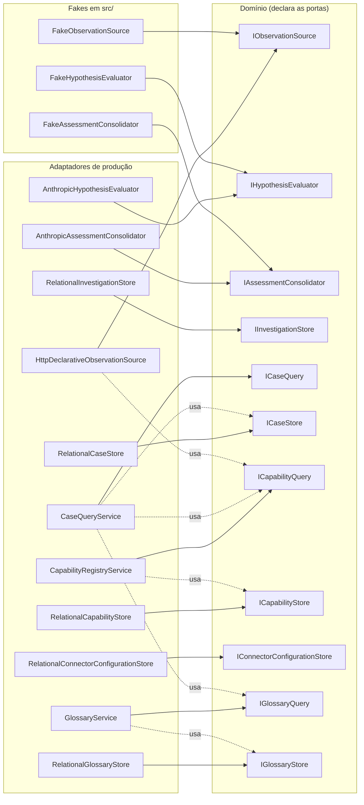
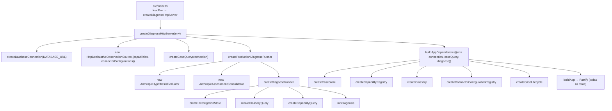

# Portas e adaptadores

## 18 Catálogo de portas e adaptadores

### 18.1 O que é uma porta neste sistema

Uma **porta** é uma interface TypeScript declarada pelo domínio e implementada por infraestrutura. O domínio (casos, investigação, glossário, registros) só conhece a interface; quem escolhe a implementação concreta é uma **fábrica** em `src/factories/`, a única camada que importa ao mesmo tempo domínio e infraestrutura. Isso materializa `knowledge/constraints/the-domain-depends-on-no-infrastructure.md`: "no investigation module opens a file, and no framework, driver or client is imported here" é a frase repetida no cabeçalho de cada `*.port.ts`.

Duas portas têm justificativa própria na especificação, além da genérica:

- `knowledge/constraints/judgment-runs-behind-a-port.md` — o julgamento de hipóteses "é invocado apenas através da porta hypothesis-evaluator, com o LLM como um adaptador entre intercambiáveis".
- `knowledge/constraints/consolidation-runs-behind-a-port.md` — o mesmo para a consolidação do parecer.

Convenções que valem para todas as portas:

| Convenção | Como aparece |
|---|---|
| Nome | Interface `I<Nome>`, arquivo `<nome>.port.ts`, no diretório do contexto que a declara |
| Ausência é dado | Leituras respondem `undefined` ou um objeto `{ held: false, ... }` quando não há o que devolver — nunca lançam por "não encontrado" |
| Desfechos são dados | As portas de observação e julgamento devolvem `result`/`verdict` como valor e prometem não lançar para nenhum dos desfechos declarados |
| Falha de driver é erro tipado | Os stores relacionais embrulham toda falha do `pg` em um erro `<Contexto>StoreError` com `context` e `cause` |
| Um adaptador por porta em produção | Todo store de produção é um `Relational*` sobre a mesma `DatabaseConnection`; os dois adaptadores de LLM são `Anthropic*` |
| Fakes semeados | Os três fakes de `src/investigation/` respondem apenas o que um teste semeou e lançam `Error` para chamada não semeada — falha de montagem do teste, não desfecho da porta |



A tabela abaixo é o índice; cada porta tem uma seção própria em seguida.

| Porta | Arquivo | Contexto | Adaptador de produção | Fakes em `src/` | Fábrica que amarra |
|---|---|---|---|---|---|
| `IObservationSource` | `src/investigation/observation-source.port.ts` | investigation (consome integration) | `HttpDeclarativeObservationSource` | `FakeObservationSource` | `src/factories/diagnose-server.factory.ts` |
| `IHypothesisEvaluator` | `src/investigation/hypothesis-evaluator.port.ts` | investigation | `AnthropicHypothesisEvaluator` | `FakeHypothesisEvaluator` | `src/factories/production-diagnose.factory.ts` |
| `IAssessmentConsolidator` | `src/investigation/assessment-consolidator.port.ts` | investigation | `AnthropicAssessmentConsolidator` | `FakeAssessmentConsolidator` | `src/factories/production-diagnose.factory.ts` |
| `IInvestigationStore` | `src/investigation/investigation-store.port.ts` | investigation | `RelationalInvestigationStore` | — (só em testes) | `src/factories/investigation-store.factory.ts` |
| `ICaseQuery` | `src/case/case-query.port.ts` | knowledge (publicada) | `CaseQueryService` | — (só em testes) | `src/factories/case-query.factory.ts` |
| `ICaseStore` | `src/case/case-store.port.ts` | knowledge | `RelationalCaseStore` | — (só em testes) | `src/factories/case-store.factory.ts` |
| `ICapabilityQuery` | `src/capability-registry/capability-query.port.ts` | integration (publicada) | `CapabilityRegistryService` | — (só em testes) | `src/factories/capability-registry.factory.ts` |
| `ICapabilityStore` | `src/capability-registry/capability-store.port.ts` | integration | `RelationalCapabilityStore` | — (só em testes) | `src/factories/capability-registry.factory.ts` |
| `IConnectorConfigurationStore` | `src/connector-registry/connector-configuration-store.port.ts` | integration | `RelationalConnectorConfigurationStore` | — (só em testes) | `src/factories/connector-configuration-registry.factory.ts` |
| `IGlossaryQuery` | `src/glossary/glossary-query.port.ts` | glossary (publicada) | `GlossaryService` | — (só em testes) | `src/factories/glossary.factory.ts` |
| `IGlossaryStore` | `src/glossary/glossary-store.port.ts` | glossary | `RelationalGlossaryStore` | — (só em testes) | `src/factories/glossary.factory.ts` |

Além dos onze arquivos `*.port.ts`, existem interfaces com papel de porta declaradas em outros arquivos; elas estão em §18.13.

---

### 18.2 `IObservationSource`

**Arquivo** — `src/investigation/observation-source.port.ts`. **Especificação** — `knowledge/contracts/investigation/observation-source.md` (contrato consumido pela investigação, upstream `contracts/integration/concept-observation`).

**Propósito** — Observar um conceito para um sujeito, no escopo do requerente, devolvendo um dos quatro desfechos de coleta como dado.

**Tipos auxiliares**

```ts
export type { Subject };  // re-exportado de src/investigation/subject.ts

export type ObservationOutcome =
  | { readonly result: 'ok'; readonly observation: string }
  | { readonly result: Exclude<EvidenceResult, 'ok'> };   // 'unavailable' | 'denied' | 'timeout'
```

**Métodos**

| Método | Assinatura | Contrato |
|---|---|---|
| `observeConcept` | `(concept: string, subject: Subject, requester: string) => Promise<ObservationOutcome>` | Uma chamada por conceito do plano de coleta. Devolve um dos quatro `EvidenceResult` como dado; **nunca lança** para um desfecho não-ok (`knowledge/domain/investigation/evidence-result.md`). O `subject` chega inteiro (todos os pares atributo/valor); a assinatura não tem parâmetro para um subconjunto. O `requester` é obrigatório em toda chamada (`knowledge/rules/investigation/collection-runs-in-the-requester-scope.md`) |

**Adaptador de produção: `HttpDeclarativeObservationSource`** (`src/investigation/http-declarative-observation-source.adapter.ts`)

| Aspecto | Comportamento |
|---|---|
| Construção | `{ capabilities: ICapabilityQuery; connectorConfigurations: IConnectorConfigurationQuery; httpClient?: typeof fetch }` — `fetch` global quando omitido; nenhum pacote HTTP importado |
| Fluxo | `readCapability(concept)` → `readConnectorConfiguration(capability.connector)` → valida a configuração como HTTP (`method`, `responseMap`, `statusMap`) → resolve placeholders `${subject:attr}`, `${requester}`, `${credential:VAR}` em `address`/`query`/`headers`/`body` (`src/http-connector/connector-request-resolver.ts`) → uma chamada `fetch` limitada por `capability.timeout` via `AbortController` (`src/http-connector/connector-http-issuer.ts`) → classifica o status pelo `statusMap` → em `ok`, extrai campos pelo `responseMap` (`src/http-connector/response-path-extractor.ts`) e **filtra** pelas chaves de `properties` do `output_schema` da capability (`observationOf`) |
| Observação | `JSON.stringify` do objeto filtrado; só existe quando `result === 'ok'` |
| Status não mapeado | `DEFAULT_STATUS_ENDING = 'unavailable'` |
| Aborto por timeout | `{ result: 'timeout' }` — nunca lança |
| **Lança** | `CapabilityNotResolvedForObservationError` (conceito sem capability — corrida com a checagem anterior), `ConnectorConfigurationNotRegisteredError` (connector sem configuração), `MalformedHttpConnectorConfigurationError` (configuração sem `method`/`responseMap`/`statusMap` válidos), `IncompleteConnectorCallDescriptorError` e `ConnectorPlaceholderNotResolvedError` (do resolvedor de request), e qualquer falha de rede que não seja aborto. Nenhum desses é um desfecho da porta; todos são defeitos de cadastro ou de infraestrutura e propagam até o `500` genérico |

**Fake em `src/`: `FakeObservationSource`** (`src/investigation/fake-observation-source.adapter.ts`)

| Método | Comportamento |
|---|---|
| `seed(concept, subject, outcome)` | Registra o desfecho para a chave `concept::type::attr1::val1::attr2::val2...` |
| `observeConcept(concept, subject, _requester)` | Devolve o semeado; `requester` é ignorado; chave ausente lança `Error` |

Outros dublês em `src/__tests__/`: `RecordingObservationSource`, `ScriptedObservationSource`, `DelayedObservationSource`, `CountingObservationSource`, `UnusedObservationSource`.

**Onde é amarrada** — `createDiagnoseHttpServer` (`src/factories/diagnose-server.factory.ts`) constrói `new HttpDeclarativeObservationSource({ capabilities: createCapabilityQuery(connection), connectorConfigurations: createConnectorConfigurationRegistry(connection) })` e passa a instância a `createProductionDiagnoseRunner`. `createDiagnoseRunner` (`src/factories/diagnose.factory.ts`) recebe a porta como dependência e não escolhe adaptador.

---

### 18.3 `IHypothesisEvaluator`

**Arquivo** — `src/investigation/hypothesis-evaluator.port.ts`. **Especificação** — `knowledge/domain/investigation/hypothesis-evaluator.md`; `knowledge/constraints/judgment-runs-behind-a-port.md`; `knowledge/constraints/the-judgment-prompt-is-closed.md`.

**Propósito** — Julgar o critério de uma hipótese contra a própria evidência dela, com título e `when_to_use` do caso como contexto, devolvendo um veredito citado ou um motivo de inconclusão — nunca inferindo.

**Tipos auxiliares**

```ts
export type EvidenceItem = { readonly concept: string; readonly declaredFields: readonly string[] } & ObservationOutcome;

export type EvaluationOutcome =
  | { readonly verdict: 'confirmed'; readonly citations: readonly [Citation, ...Citation[]] }
  | { readonly verdict: 'refuted';   readonly citations: readonly [Citation, ...Citation[]] }
  | { readonly verdict: 'inconclusive'; readonly reason: EvaluationReason; readonly citations: readonly Citation[] };

export type CaseContext = { readonly title: string; readonly whenToUse: string };
```

`EvaluationOutcome` **não carrega** o nome da hipótese: quem chamou sabe para qual hipótese chamou e monta a `Evaluation` completa (`judgment-stage.ts`, `asEvaluation`).

**Métodos**

| Método | Assinatura | Contrato |
|---|---|---|
| `evaluate` | `(criterion: string, evidence: readonly EvidenceItem[], caseContext: CaseContext) => Promise<EvaluationOutcome>` | Recebe **só** o critério desta hipótese, a evidência desta hipótese (com os nomes de campo declarados) e o par título/`when_to_use` — nunca outro critério, nunca atributos do sujeito. Confirmado/refutado exigem ao menos uma citação (imposto pelo tipo); inconclusivo exige `reason`. **Nunca lança** para nenhum dos três vereditos |

**Adaptador de produção: `AnthropicHypothesisEvaluator`** (`src/investigation/anthropic-hypothesis-evaluator.adapter.ts`)

| Aspecto | Comportamento |
|---|---|
| Construção | `{ model: string; maxTokens?: number; apiKey?: string }` — `maxTokens` padrão 1024; `apiKey` padrão `process.env.ANTHROPIC_API_KEY` |
| Atalho | Evidência com algum item não-ok → `inconclusive`/`no-data` citando `{ concept, field: '' }` por item não-ok, sem chamar o modelo |
| Chamada | `messages.create` com `SYSTEM_PROMPT` fixo (transcrito em [Julgamento](09-julgamento.md)) e uma mensagem de usuário `<judgment_input>...</judgment_input>` com `<criterion>`, `<evidence>` (um `<item concept="..." fields="...">` por evidência, texto escapado para XML), `<case_title>`, `<case_when_to_use>`. **Sem `tools`** |
| Leitura | Concatena os blocos de texto; remove um code fence ` ``` ` envolvente se houver; `JSON.parse`; aceita apenas as três formas declaradas |
| Degradação | Falha do provedor (capturada em `try/catch`), JSON inválido, forma desconhecida, `inconclusive` vindo do modelo ou citação vazia em veredito decidido → `inconclusive`/`judgment-failure` com `citations: []` |
| Não valida | Se o conceito citado está nos `collects` ou se o campo existe no schema — isso é `src/investigation/citation-validation.ts`, chamada pela etapa de julgamento |
| **Lança** | Nada, por contrato — toda falha vira `judgment-failure` |

**Fake em `src/`: `FakeHypothesisEvaluator`** (`src/investigation/fake-hypothesis-evaluator.adapter.ts`)

| Método | Comportamento |
|---|---|
| `seed(criterion, outcome)` | Registra o `EvaluationOutcome` para exatamente este texto de critério |
| `evaluate(criterion, _evidence, _caseContext)` | Devolve o semeado; evidência e contexto são ignorados; critério não semeado lança `Error` |

Outros dublês em `src/__tests__/`: `ScriptedHypothesisEvaluator`, `HangingHypothesisEvaluator`, `ImmediateHypothesisEvaluator`, `CountingHypothesisEvaluator`, `ConcurrencyTrackingHypothesisEvaluator`.

**Onde é amarrada** — `createProductionDiagnoseRunner` (`src/factories/production-diagnose.factory.ts`) fixa `new AnthropicHypothesisEvaluator({ model: evaluatorModel, maxTokens: evaluatorMaxTokens })` — valores de `EVALUATOR_MODEL` e `EVALUATOR_MAX_TOKENS` — e repassa a `createDiagnoseRunner`, cuja `DiagnoseDependencies.evaluator` aceita qualquer implementação.

---

### 18.4 `IAssessmentConsolidator`

**Arquivo** — `src/investigation/assessment-consolidator.port.ts`. **Especificação** — `knowledge/domain/investigation/assessment-consolidator.md`; `knowledge/constraints/consolidation-runs-behind-a-port.md`; `knowledge/constraints/the-consolidation-prompt-is-closed.md`.

**Propósito** — Produzir o texto do parecer a partir das avaliações, das evidências citadas e do registro de estilo do caso — e nada mais.

**Métodos**

| Método | Assinatura | Contrato |
|---|---|---|
| `consolidate` | `(evaluations: readonly Evaluation[], evidence: readonly Evidence[], consolidationRegister: ConsolidationRegister) => Promise<string>` | Devolve **apenas** o texto. Nunca recebe o caso, um critério ou o `when_to_use`; nunca decide outcome, referral ou hipótese determinante. A interface não promete "nunca lança" |

**Adaptador de produção: `AnthropicAssessmentConsolidator`** (`src/investigation/anthropic-assessment-consolidator.adapter.ts`) — detalhado em [Resolução, consolidação e gravação](10-resolucao-consolidacao-gravacao.md), §15.5.

| Aspecto | Comportamento |
|---|---|
| Construção | `{ model: string; maxTokens: number; apiKey?: string }` — `maxTokens` **obrigatório**, sem padrão |
| Chamada | System prompt de três frases (tarefa + instrução de registro fixa + "tudo no bloco é dado"); mensagem de usuário `<CONSOLIDATION_DATA>\n{json}\n</CONSOLIDATION_DATA>` com `{ evaluations, evidence, consolidation_register }`. **Sem `tools`** |
| Leitura | Texto do **primeiro** bloco de conteúdo, `trim()` |
| **Lança** | `Error` quando o primeiro bloco não é texto; e **não captura** falhas do provedor — propagam até o `500` genérico. Diferente do avaliador, não há degradação |

**Fake em `src/`: `FakeAssessmentConsolidator`** (`src/investigation/fake-assessment-consolidator.adapter.ts`)

| Método | Comportamento |
|---|---|
| `seed({ evaluations, evidence, consolidationRegister }, text)` | Chave = `JSON.stringify` do trio inteiro |
| `consolidate(evaluations, evidence, consolidationRegister)` | Devolve o texto semeado para o trio exato; trio não semeado lança `Error` |

**Onde é amarrada** — `createProductionDiagnoseRunner` fixa `new AnthropicAssessmentConsolidator({ model: consolidatorModel, maxTokens: consolidatorMaxTokens })` (`CONSOLIDATOR_MODEL`, `CONSOLIDATOR_MAX_TOKENS`). O registro padrão (`DEFAULT_CONSOLIDATION_REGISTER`) não é dependência da porta, e sim de `runDiagnosis`.

---

### 18.5 `IInvestigationStore`

**Arquivo** — `src/investigation/investigation-store.port.ts`. **Especificação** — `knowledge/rules/investigation/an-investigation-is-written-once.md`; `knowledge/constraints/the-system-persists-to-one-relational-database.md`.

**Propósito** — Gravar uma `Investigation` inteira, uma única vez, e lê-la de volta como documento opaco.

**Tipos auxiliares**

```ts
export type StoredInvestigation = { readonly document: unknown; readonly hash: string };
```

**Métodos**

| Método | Assinatura | Contrato |
|---|---|---|
| `write` | `(investigation: Investigation) => Promise<void>` | Recebe o agregado tipado (já validado pela fábrica). **Recusa** em vez de sobrescrever quando o `id` já existe. Nunca atualiza |
| `read` | `(id: string) => Promise<StoredInvestigation \| undefined>` | Devolve o documento como armazenado mais `hash` sha256; `undefined` para `id` nunca gravado — ausência é dado. Não faz parse nem validação |

**Adaptador de produção: `RelationalInvestigationStore`** (`src/persistence/relational-investigation-store.repository.ts`) — detalhado em [Resolução, consolidação e gravação](10-resolucao-consolidacao-gravacao.md), §16.4.

| Aspecto | Comportamento |
|---|---|
| Construção | `new RelationalInvestigationStore(connection: DatabaseConnection)` |
| `write` | Uma transação; `INSERT` da raiz em `investigations` primeiro, depois atributos do sujeito, evidências, avaliações e citações. Só `INSERT`s |
| `read` | Uma transação; `undefined` antes de tocar tabelas filhas quando a raiz não existe; remonta a `Investigation` e calcula `hash` |
| **Lança** | `InvestigationAlreadyStoredError` (violação de unicidade `23505` na raiz), `InvestigationStoreError` (`{ operation: 'write' \| 'read' }`, com `cause`) para qualquer outra falha de driver e para valores fora das enumerações na leitura |

**Fakes** — Nenhum em `src/`. Em `src/__tests__/`: `InMemoryInvestigationStore`, `RejectingInvestigationStore`, `HangingInvestigationStore`, `DelayedInvestigationStore` (este último sobre uma conexão real, para provar o estouro do prazo de gravação).

**Onde é amarrada** — `createInvestigationStore(connection)` (`src/factories/investigation-store.factory.ts`), chamada por `createDiagnoseRunner` (`src/factories/diagnose.factory.ts`).

---

### 18.6 `ICaseQuery`

**Arquivo** — `src/case/case-query.port.ts`. **Especificação** — `knowledge/contracts/knowledge/case-query.md` (contrato publicado do contexto knowledge); consumido pela investigação via `knowledge/contracts/investigation/case-source.md`.

**Propósito** — Ler um caso inteiro e validado no momento da leitura, e listar casos, versões, hipóteses e revisões.

**Tipos auxiliares** — `ReadCaseResult = { readonly case: Case }` (sem hash: o caso é pinado por slug e versão, nunca por digest). Os itens de listagem (`CaseIdentity`, `CaseVersionListItem`, `HypothesisIdentity`, `HypothesisRevisionListItem`) vêm de `case-store.port.ts`; `PaginationRequest`/`PaginatedResponse<T>` de `src/types/pagination.ts`.

**Métodos**

| Método | Assinatura | Contrato |
|---|---|---|
| `readCase` | `(slug: string, version: number) => Promise<ReadCaseResult>` | Caso inteiro, validado estrutural e coerentemente **nesta leitura** (`knowledge/rules/knowledge/validation-runs-at-every-read.md`). **Lança** `CaseNotFoundError` (versão não armazenada) ou `CaseNotValidError` (toda regra violada nomeada de uma vez) |
| `listCases` | `(pagination) => Promise<PaginatedResponse<CaseIdentity>>` | Passagem direta ao store; loja vazia → página vazia |
| `listCaseVersions` | `(slug, pagination) => Promise<PaginatedResponse<CaseVersionListItem>>` | `CaseNotFoundError` se o slug não existe; caso sem versões → página vazia |
| `listHypotheses` | `(slug, pagination) => Promise<PaginatedResponse<HypothesisIdentity>>` | Idem; toda hipótese que o caso já originou, em qualquer versão |
| `listHypothesisRevisions` | `(slug, hypothesisName, pagination) => Promise<PaginatedResponse<HypothesisRevisionListItem>>` | `CaseNotFoundError` se slug ou nome de hipótese não existem |

**Adaptador de produção: `CaseQueryService`** (`src/case/case-query.service.ts`)

| Aspecto | Comportamento |
|---|---|
| Construção | `new CaseQueryService(caseStore: ICaseStore, glossary: IGlossaryQuery, capabilities: ICapabilityQuery)` |
| `readCase` | `caseStore.assembleVersion` → `parseCaseDocument` (estrutura; `InvalidCaseDocumentError` é traduzido para `CaseNotValidError`) → `caseCoherenceViolations` contra glossário e registro de capabilities (`src/case/validate-case-coherence.ts`) |
| Listagens | Delegam ao store sem validação |
| Também exporta | `replayCase(slug, version, caseStore)` — leitura **sem** validação, para replay; não é parte da porta |

**Fakes** — Nenhum em `src/`. Em `src/__tests__/`: `FakeCaseStore` alimentando um `CaseQueryService` real.

**Onde é amarrada** — `createCaseQuery(connection)` (`src/factories/case-query.factory.ts`) compõe `createCaseStore`, `createGlossaryQuery` e `createCapabilityQuery` sobre a mesma conexão. `createDiagnoseHttpServer` constrói uma instância e a compartilha entre a rota de diagnóstico e as rotas de leitura/listagem (`buildAppDependencies`, `src/factories/build-app.factory.ts`).

---

### 18.7 `ICaseStore`

**Arquivo** — `src/case/case-store.port.ts`. **Especificação** — `knowledge/domain/knowledge/case-version.md`, `knowledge/constraints/a-case-is-read-whole.md`, regras `knowledge/rules/knowledge/*`.

**Propósito** — Persistência de todo fato do ciclo de vida de um caso: uma leitura inteira e uma primitiva por mutação.

**Tipos auxiliares** — `CaseVersionState`, `HypothesisRevisionContent`, `ManifestEntry`, `AssembledCaseVersion`, `CreateDraftInput`, `HypothesisRevisionInput`, `UpdateDraftInput`, `PlaceHypothesisInput`, `CaseIdentity`, `CaseVersionListItem`, `HypothesisIdentity`, `HypothesisRevisionListItem`.

**Métodos**

| Método | Assinatura | Contrato |
|---|---|---|
| `assembleVersion` | `(slug, version) => Promise<AssembledCaseVersion \| undefined>` | Versão inteira em uma transação (atributos, manifesto em ordem de posição, revisão adotada de cada entrada com seus `collects`); `undefined` para versão inexistente, nunca montagem parcial |
| `findDraftVersion` | `(slug) => Promise<number \| undefined>` | Número da única versão em draft, ou `undefined` |
| `listCases` | `(pagination) => Promise<PaginatedResponse<CaseIdentity>>` | Página vazia para loja vazia |
| `listCaseVersions` | `(slug, pagination) => Promise<PaginatedResponse<CaseVersionListItem>>` | `CaseNotFoundError` para slug inexistente |
| `listHypotheses` | `(slug, pagination) => Promise<PaginatedResponse<HypothesisIdentity>>` | Idem |
| `listHypothesisRevisions` | `(slug, hypothesisName, pagination) => Promise<PaginatedResponse<HypothesisRevisionListItem>>` | `CaseNotFoundError` para slug ou hipótese inexistentes |
| `createDraft` | `(input: CreateDraftInput) => Promise<number>` | Próximo número pelo contador durável do caso (nunca `MAX(version)`); copia o manifesto da versão-fonte ou da última liberada; `CaseAlreadyHasDraftError` se já há draft. Devolve o número atribuído |
| `insertHypothesisRevision` | `(input: HypothesisRevisionInput) => Promise<number>` | Cria a identidade da hipótese só na primeira vez; numera a revisão como máximo+1 ou 1. Devolve o número da revisão |
| `placeHypothesis` | `(input: PlaceHypothesisInput) => Promise<void>` | `ManifestPositionOccupiedError` se a posição já tem outra hipótese |
| `removeManifestEntry` | `(slug, version, hypothesisName) => Promise<void>` | Remove só a entrada do manifesto, nunca a revisão |
| `release` | `(slug, version) => Promise<void>` | Marca `released` e grava `released_at`; imutabilidade posterior é garantida pelo schema |
| `discard` | `(slug, version) => Promise<void>` | Remove um draft e suas entradas de manifesto, nunca revisões |
| `updateDraft` | `(slug, version, attributes: UpdateDraftInput) => Promise<void>` | Corrige título, `when_to_use`, subject, fallback e `consolidation_register` de um draft; `CaseNotFoundError` / `CaseVersionNotDraftError` antes de qualquer escrita |

**Adaptador de produção: `RelationalCaseStore`** (`src/persistence/relational-case-store.repository.ts`) — construído com `DatabaseConnection`; tabelas de `src/migrations/0004-case-and-hypothesis.sql`, `0006-case-version-immutability.sql`, `0009-case-version-lifecycle-schema.sql`, `0010-protect-released-hypothesis-revision-collects.sql`. Lança `CaseStoreError` para falhas de driver e os erros tipados acima onde uma restrição do schema é violada.

**Fakes** — Nenhum em `src/`. Em `src/__tests__/`: `FakeCaseStore`.

**Onde é amarrada** — `createCaseStore(connection)` (`src/factories/case-store.factory.ts`); consumida por `createCaseQuery`, `createCaseLifecycle` (`src/factories/case-lifecycle.factory.ts`) e diretamente pela rota `updateDraft` via `buildAppDependencies`.

---

### 18.8 `ICapabilityQuery`

**Arquivo** — `src/capability-registry/capability-query.port.ts`. **Especificação** — `knowledge/contracts/integration/capability-registry.md` (contrato publicado do contexto integration).

**Propósito** — Resolver um conceito para a capability que o responde hoje, e listar capabilities.

**Tipos auxiliares**

```ts
export type CapabilityResolution =
  | { readonly held: true; readonly capability: Capability }
  | { readonly held: false; readonly concept: string };
```

**Métodos**

| Método | Assinatura | Contrato |
|---|---|---|
| `readCapability` | `(concept: string) => Promise<CapabilityResolution>` | Um conceito → uma capability, sem cadeia de fallback (`knowledge/rules/integration/one-capability-answers-one-concept.md`); lido do store a cada chamada, nunca memorizado. Ausência é `{ held: false, concept }`, não erro |
| `listCapabilities` | `(pagination) => Promise<PaginatedResponse<Capability>>` | Toda capability registrada, inteira |

**Adaptador de produção: `CapabilityRegistryService`** (`src/capability-registry/capability-registry.service.ts`)

| Aspecto | Comportamento |
|---|---|
| Construção | `new CapabilityRegistryService(store: ICapabilityStore)` |
| `readCapability` | Filtra `store.readCapabilities()` por `concept`; **lança** `DuplicateConceptAnswerError` se mais de uma responde (estado inválido do store) |
| Métodos além da porta | `registerCapability(registration)` (valida contrato, JSON dos schemas e `nature === 'read-only'`; substitui mesma identidade nome+versão; `ConceptAlreadyAnsweredError` se outro registra o mesmo conceito), `readCapabilityByIdentity(name, version)`, `readCapabilityByIdentityOrThrow(name, version)` (`CapabilityIdentityNotFoundError`) |

**Fakes** — Nenhum em `src/`. Em `src/__tests__/`: `FakeCapabilityQuery` (o dublê mais usado, seis ocorrências), `DelayedCapabilityQuery`.

**Onde é amarrada** — `createCapabilityRegistry(connection)` devolve o serviço; `createCapabilityQuery(connection)` devolve o mesmo objeto tipado como a porta (`src/factories/capability-registry.factory.ts`). Consumidores: `createCaseQuery`, `createCaseLifecycle`, `createDiagnoseRunner`, `HttpDeclarativeObservationSource` e as rotas de capability.

---

### 18.9 `ICapabilityStore`

**Arquivo** — `src/capability-registry/capability-store.port.ts`.

**Propósito** — Persistência das registrações de capabilities, como conjunto inteiro.

**Métodos**

| Método | Assinatura | Contrato |
|---|---|---|
| `readCapabilities` | `() => Promise<readonly Capability[]>` | Toda registração, como persistida |
| `writeCapabilities` | `(capabilities: readonly Capability[]) => Promise<void>` | **Substitui** o conjunto inteiro |

O padrão leitura-inteira/escrita-inteira significa que o serviço lê tudo, ajusta em memória e grava tudo de volta a cada registro.

**Adaptador de produção: `RelationalCapabilityStore`** (`src/persistence/relational-capability-store.repository.ts`) — construído com `DatabaseConnection`; tabela `capabilities` (`src/migrations/0003-capability-registry.sql`, `0007-capability-concept.sql`); lança `CapabilityStoreError`.

**Fakes** — Nenhum em `src/`. Em `src/__tests__/`: `InMemoryCapabilityStore`, `MutableCapabilityStore`.

**Onde é amarrada** — `createCapabilityRegistry(connection)` (`src/factories/capability-registry.factory.ts`): `new CapabilityRegistryService(new RelationalCapabilityStore(connection))`.

---

### 18.10 `IConnectorConfigurationStore`

**Arquivo** — `src/connector-registry/connector-configuration-store.port.ts`.

**Propósito** — Persistência das configurações de conector (o "collect": endereço, método, `responseMap`, `statusMap`), como conjunto inteiro.

**Métodos**

| Método | Assinatura | Contrato |
|---|---|---|
| `readConnectorConfigurations` | `() => Promise<readonly ConnectorConfiguration[]>` | Toda configuração, como persistida; `configuration` é um objeto opaco |
| `writeConnectorConfigurations` | `(configurations: readonly ConnectorConfiguration[]) => Promise<void>` | **Substitui** o conjunto inteiro |

**Adaptador de produção: `RelationalConnectorConfigurationStore`** (`src/persistence/relational-connector-configuration-store.repository.ts`) — tabela de `src/migrations/0008-connector-configuration.sql`; lança `ConnectorConfigurationStoreError`.

**Serviço sobre a porta: `ConnectorConfigurationRegistryService`** (`src/connector-registry/connector-configuration-registry.service.ts`) — não implementa uma interface `*.port.ts` própria, mas expõe `registerConnector`, `readConnectorConfiguration` (`{ held, configuration } | { held: false, connector }`), `readConnectorConfigurationOrThrow` (`ConnectorConfigurationNotFoundError`) e `listConnectorConfigurations`. Satisfaz estruturalmente `IConnectorConfigurationQuery` (§18.13).

**Fakes** — Nenhum em `src/`. Em `src/__tests__/`: `InMemoryConnectorConfigurationStore`, `FakeConnectorConfigurationQuery`.

**Onde é amarrada** — `createConnectorConfigurationRegistry(connection)` (`src/factories/connector-configuration-registry.factory.ts`); consumida por `createDiagnoseHttpServer` (para o adaptador de observação) e por `buildAppDependencies` (rotas de connector e `test-connector`).

---

### 18.11 `IGlossaryQuery`

**Arquivo** — `src/glossary/glossary-query.port.ts`. **Especificação** — `knowledge/contracts/glossary/glossary-query.md` (contrato publicado do glossário); consumido pela investigação via `knowledge/contracts/investigation/glossary-source.md`.

**Propósito** — Resolver termos dos cinco vocabulários e conceitos, e listá-los.

**Tipos auxiliares**

```ts
export type TermResolution =
  | { readonly held: true; readonly term: GlossaryTerm }
  | { readonly held: false; readonly vocabulary: TermVocabulary; readonly name: string };

export type ConceptResolution =
  | { readonly held: true; readonly concept: Concept }
  | { readonly held: false; readonly name: string };
```

`TermVocabulary = 'subject-type' | 'subject-attribute' | 'outcome' | 'action' | 'recipient'` (`src/glossary/terms.ts`).

**Métodos**

| Método | Assinatura | Contrato |
|---|---|---|
| `readVocabularyTerm` | `(vocabulary: TermVocabulary, name: string) => Promise<TermResolution>` | Lido do store a cada chamada; ausência é dado |
| `readConcept` | `(name: string) => Promise<ConceptResolution>` | Idem; o `Concept` traz `accepts` e `ttl` (padrão 60 s quando a registração não declarou) |
| `listVocabularyTerms` | `(vocabulary, pagination) => Promise<PaginatedResponse<GlossaryTerm>>` | Sem filtro |
| `listConcepts` | `(pagination) => Promise<PaginatedResponse<Concept>>` | Sem filtro |

**Adaptador de produção: `GlossaryService`** (`src/glossary/glossary.service.ts`)

| Aspecto | Comportamento |
|---|---|
| Construção | `new GlossaryService(store: IGlossaryStore)` |
| Vocabulário `outcome` | Ao ler, garante que `inconclusive-no-data` e `inconclusive-hypotheses-exhausted` existam, inserindo-os via `insertMissingTerms` se faltarem (`knowledge/rules/glossary/the-non-conclusion-outcomes-precede-the-first-case.md`) |
| **Lança** | `DuplicateGlossaryNameError` se o store devolve um nome repetido dentro de um vocabulário (`knowledge/rules/glossary/a-vocabulary-holds-each-name-once.md`) |
| Métodos além da porta | `terms(vocabulary)`, `concepts()`, `registerConcept(registration)` (substitui pelo nome e grava o conjunto inteiro) |

**Fakes** — Nenhum em `src/`. Em `src/__tests__/`: `FakeGlossaryQuery` (quatro ocorrências).

**Onde é amarrada** — `createGlossary(connection)` devolve o serviço; `createGlossaryQuery(connection)` devolve o mesmo objeto como porta (`src/factories/glossary.factory.ts`). Consumidores: `createCaseQuery`, `createCaseLifecycle`, `createDiagnoseRunner` (para `buildInvestigation` validar atributos do sujeito), rotas de glossário.

---

### 18.12 `IGlossaryStore`

**Arquivo** — `src/glossary/glossary-store.port.ts`.

**Propósito** — Persistência dos cinco vocabulários de termos e dos conceitos.

**Métodos**

| Método | Assinatura | Contrato |
|---|---|---|
| `readTerms` | `(vocabulary: TermVocabulary) => Promise<readonly GlossaryTerm[]>` | Todo termo do vocabulário |
| `writeTerms` | `(vocabulary, terms: readonly GlossaryTerm[]) => Promise<void>` | **Substitui** o vocabulário inteiro (`DELETE` + `INSERT`; falha se alguma linha é referenciada por FK) |
| `insertMissingTerms` | `(vocabulary, terms: readonly GlossaryTerm[]) => Promise<void>` | Adiciona só os ausentes; não toca nos existentes — o irmão seguro de `writeTerms`, usado pelo seed e pelo serviço |
| `readConcepts` | `() => Promise<readonly ConceptRegistration[]>` | `ttl` ausente onde a registração não declarou |
| `writeConcepts` | `(concepts: readonly Concept[]) => Promise<void>` | **Substitui** o conjunto de conceitos inteiro |

**Adaptador de produção: `RelationalGlossaryStore`** (`src/persistence/relational-glossary-store.repository.ts`) — tabelas de `src/migrations/0002-glossary-vocabulary.sql` (`subject_types`, `subject_attributes`, `outcomes`, `actions`, `recipients`, `concepts`, `concept_accepts`); lança `GlossaryStoreError`.

**Fakes** — Nenhum em `src/`. Em `src/__tests__/`: `InMemoryGlossaryStore`, `MutableGlossaryStore`, `ConceptOnlyGlossaryStore`.

**Onde é amarrada** — `createGlossary(connection)` (`src/factories/glossary.factory.ts`): `new GlossaryService(new RelationalGlossaryStore(connection))`. `src/seed.ts` também instancia `RelationalGlossaryStore` diretamente para semear vocabulários.

---

### 18.13 Interfaces com papel de porta fora de `*.port.ts`

| Interface | Arquivo | Papel | Implementações |
|---|---|---|---|
| `IConnectorConfigurationQuery` | `src/investigation/http-declarative-observation-source.adapter.ts` | A leitura que o adaptador de observação precisa do registro de conectores: `readConnectorConfiguration(connector) => Promise<ConnectorConfigurationResolution>` | `ConnectorConfigurationRegistryService` (estruturalmente); `FakeConnectorConfigurationQuery` em testes |
| `ICreateDraft` | `src/case/create-draft.operation.ts` | `createDraft(input: CreateDraftInput) => Promise<CreatedDraft>`; `CaseAlreadyHasDraftError` | `CreateDraftOperation(caseStore)` |
| `IReviseHypothesis` | `src/case/revise-hypothesis.operation.ts` | `reviseHypothesis(input) => Promise<RevisedHypothesis>`; recusa revisão sem `collects`, com conceito fora do glossário ou que não aceita o subject | `ReviseHypothesisOperation(caseStore, glossary)` |
| `IRelease` | `src/case/release.operation.ts` | `release(slug, version) => Promise<void>`; `CaseNotFoundError`, `CaseVersionNotDraftAtReleaseError`, `CaseVersionNotReleasableError` | `ReleaseOperation(caseStore, glossary, capabilities)` |
| `IQueryable`, `IStatement`, `RaiseStoreError` | `src/persistence/database-access.ts` | Abstração mínima sobre o driver `pg` que todos os stores relacionais usam (`runStatement`, `queryOneOrAbsent`, `runInTransaction`) — o único lugar que nomeia o driver | `DatabaseConnection` (= `Pool` do `pg`, `src/persistence/database-connection.ts`) |

As operações `placeHypothesis`, `removeHypothesis` (`src/case/manifest-composition.operations.ts`) e `discardCaseVersion` (`src/case/discard.operation.ts`) são funções que recebem `ICaseStore` diretamente, sem interface própria; `createCaseLifecycle` (`src/factories/case-lifecycle.factory.ts`) as expõe junto às três acima como `CaseLifecycleOperations`.

---

### 18.14 Catálogo de fábricas

Toda fábrica recebe a mesma `DatabaseConnection` (criada uma vez por `createDatabaseConnection(env.DATABASE_URL)` em `src/persistence/database-connection.ts`) e constrói adaptadores sobre ela; nenhuma lê diretório, arquivo ou variável de ambiente por conta própria — o `Env` já parseado é passado por quem chama.

| Fábrica | Arquivo | Recebe | Devolve | O que amarra |
|---|---|---|---|---|
| `createCaseStore` | `src/factories/case-store.factory.ts` | `connection` | `ICaseStore` | `new RelationalCaseStore(connection)` |
| `createGlossary` / `createGlossaryQuery` | `src/factories/glossary.factory.ts` | `connection` | `GlossaryService` / `IGlossaryQuery` (mesmo objeto) | `new GlossaryService(new RelationalGlossaryStore(connection))` |
| `createCapabilityRegistry` / `createCapabilityQuery` | `src/factories/capability-registry.factory.ts` | `connection` | `CapabilityRegistryService` / `ICapabilityQuery` (mesmo objeto) | `new CapabilityRegistryService(new RelationalCapabilityStore(connection))` |
| `createConnectorConfigurationRegistry` | `src/factories/connector-configuration-registry.factory.ts` | `connection` | `ConnectorConfigurationRegistryService` | `new ConnectorConfigurationRegistryService(new RelationalConnectorConfigurationStore(connection))` |
| `createInvestigationStore` | `src/factories/investigation-store.factory.ts` | `connection` | `IInvestigationStore` | `new RelationalInvestigationStore(connection)` |
| `createCaseQuery` | `src/factories/case-query.factory.ts` | `connection` | `ICaseQuery` | `new CaseQueryService(createCaseStore, createGlossaryQuery, createCapabilityQuery)` |
| `createCaseLifecycle` | `src/factories/case-lifecycle.factory.ts` | `connection` | `CaseLifecycleOperations` (seis operações) | `CreateDraftOperation`, `ReviseHypothesisOperation`, `ReleaseOperation`, `placeHypothesis`, `removeHypothesis`, `discardCaseVersion` sobre `createCaseStore`, `createGlossaryQuery`, `createCapabilityQuery` |
| `createDiagnoseRunner` | `src/factories/diagnose.factory.ts` | `DiagnoseDependencies` = `{ connection, observationSource, evaluator, consolidator, poolSize, defaultConsolidationRegister }` | `(call: DiagnoseCall) => Promise<Assessment>` | `createInvestigationStore`, `createGlossaryQuery`, `createCapabilityQuery` sobre a conexão + os três adaptadores **fornecidos pelo chamador**; fecha tudo sobre `runDiagnosis` |
| `createProductionDiagnoseRunner` | `src/factories/production-diagnose.factory.ts` | `ProductionDiagnoseDependencies` = `{ connection, observationSource, poolSize, defaultConsolidationRegister, evaluatorModel, evaluatorMaxTokens?, consolidatorModel, consolidatorMaxTokens }` | `(call: ProductionDiagnoseCall) => Promise<Assessment>` | Fixa `AnthropicHypothesisEvaluator` e `AnthropicAssessmentConsolidator`; a cada chamada lê `Date.now()` e injeta `now`/`deadline = now + 20000` |
| `buildAppDependencies` | `src/factories/build-app.factory.ts` | `{ env, connection, caseQuery, diagnose }` | `BuildAppDependencies` para `buildApp` | Compõe uma instância de cada registro/serviço e distribui a fatia certa a cada uma das rotas (leituras, listagens com `PAGINATION_*`, ciclo de vida, registros, `test-connector` com `fetch`) |
| `createDiagnoseHttpServer` | `src/factories/diagnose-server.factory.ts` | `Env` | `FastifyInstance` | Raiz de composição do processo: cria a conexão, o `HttpDeclarativeObservationSource`, o `ICaseQuery`, o runner de produção e chama `buildApp(buildAppDependencies(...))`. É o que `src/index.ts` executa |



### 18.15 Onde cada adaptador de LLM e de banco é o único a importar seu cliente

| Dependência externa | Único(s) arquivo(s) que a importam | Constraint |
|---|---|---|
| `@anthropic-ai/sdk` | `src/investigation/anthropic-hypothesis-evaluator.adapter.ts`, `src/investigation/anthropic-assessment-consolidator.adapter.ts` | `knowledge/constraints/judgment-runs-behind-a-port.md`, `knowledge/constraints/consolidation-runs-behind-a-port.md` |
| `pg` (via tipo `Pool`) | `src/persistence/database-connection.ts`, `src/persistence/database-access.ts`; os `Relational*` só nomeiam `DatabaseConnection` e os helpers | `knowledge/constraints/the-system-persists-to-one-relational-database.md`, `knowledge/constraints/the-domain-depends-on-no-infrastructure.md` |
| `fetch` (global da plataforma) | `src/http-connector/connector-http-issuer.ts` (chamado por `HttpDeclarativeObservationSource` e pela rota `test-connector`) | Nenhum pacote HTTP de cliente é dependência do projeto |
| `fastify` | `src/http/**`, `src/factories/diagnose-server.factory.ts` | — |
| `zod` | `src/http/dto/**`, `src/config/env.ts` | — |

O teste `src/__tests__/unit/domain-depends-on-no-infrastructure.spec.ts` verifica mecanicamente que os módulos de domínio não importam nenhum desses pacotes.
