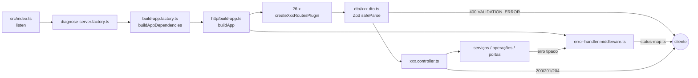
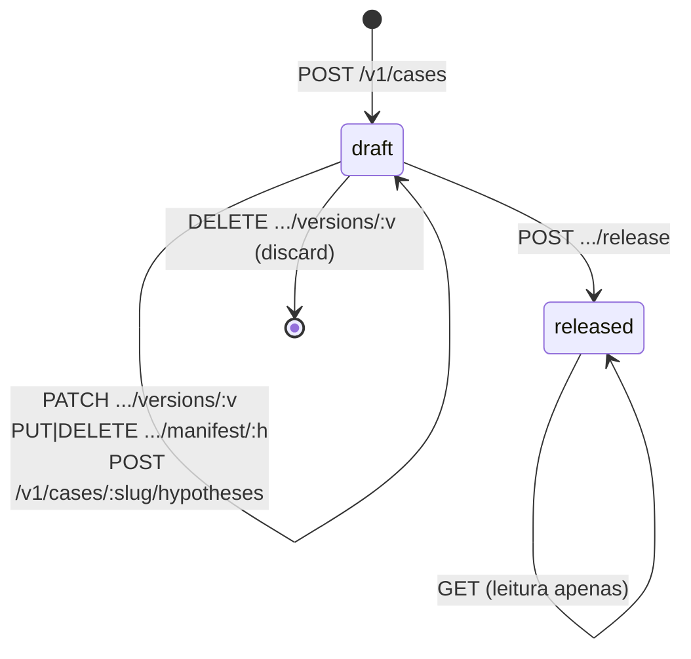

# 20. API HTTP

Este capítulo cataloga a superfície HTTP do ServiceDeskN1: as 26 rotas que `src/http/build-app.ts` registra, agrupadas por contexto de domínio, com método, caminho, propósito, forma do corpo/consulta, forma da resposta, códigos de erro possíveis, paginação, limite de taxa e o fato de que nenhuma rota exige autenticação. Quem não conhece o código deve conseguir chamar qualquer rota só com o que está aqui; cada afirmação aponta o arquivo que a implementa e, quando houver, o nó da especificação em `knowledge/`.

Convenções deste capítulo:

- Todas as rotas vivem sob o prefixo `/v1` (constante `API_PREFIX` em cada `src/http/*.routes.ts`).
- Todo corpo e toda resposta são JSON. Um `Content-Type` ausente ou um JSON quebrado é recusado pelo próprio Fastify com um status da faixa 4xx, que o tratador de erro repassa como `BAD_REQUEST` (ver [20.3](#203-envelope-de-erro-e-tratador-único)).
- Os nomes de campos são os do código (`when_to_use`, `hypothesis_name`, `consolidation_register`) e nunca são traduzidos.
- Os exemplos usam o caso semeado por `src/seed.ts` (`intermittent-connection-outage`, versão 1) e o glossário de `src/fixtures/glossary/*.json`.

## 20.1 Como a aplicação HTTP é montada

A aplicação é um único `FastifyInstance` construído por `buildApp(dependencies)` em `src/http/build-app.ts`. Esse arquivo não constrói nenhuma dependência: recebe um objeto `BuildAppDependencies` com um campo por rota, cada um já tipado pelas dependências do controlador correspondente (`...ControllerDependencies`), e faz apenas duas coisas:

1. `app.setErrorHandler(handleUnexpectedError)` — registra o tratador de erro único de `src/http/error-handler.middleware.ts`.
2. Para cada plugin devolvido por `routePlugins(dependencies)`, `app.register(plugin)`.

Cada rota é um plugin Fastify próprio (`createXxxRoutesPlugin` em `src/http/xxx.routes.ts`) que registra exatamente um caminho e delega ao controlador (`src/http/xxx.controller.ts`). O padrão de cada handler é sempre o mesmo:

1. valida `request.params`, depois `request.query` ou `request.body` com o schema Zod do DTO (`src/http/dto/xxx.dto.ts`) via `safeParse`;
2. se a validação falha, responde `400` com `{ error: { code: 'VALIDATION_ERROR', message, details } }`, onde `message` diz qual das três partes falhou ("the request path/query/body failed validation") e `details` lista `caminho: mensagem` para cada problema — a forma exigida por `knowledge/constraints/a-malformed-request-is-refused-with-a-validation-error.md`;
3. chama `handleXxxRequest(dependencies, ...)` do controlador e responde com o status de sucesso fixo da rota (`200`, `201` ou `204`).

Quem compõe `BuildAppDependencies` em produção é `src/factories/build-app.factory.ts` (`buildAppDependencies`), chamado por `src/factories/diagnose-server.factory.ts`; o único arquivo que chama `.listen()` é `src/index.ts`. Ver [Configuração](16-configuracao.md) para essa cadeia.



## 20.2 Ausência de autenticação

Nenhuma rota tem guarda, middleware ou verificação de identidade. `knowledge/constraints/no-route-enforces-authentication.md` declara isso como estado deliberado desta build: toda requisição é aceita com a identidade que afirma, sem verificação. Na prática:

- O campo `requester` de `POST /v1/diagnose` e de `POST /v1/test-connector` é uma afirmação do chamador, repassada tal como veio para a investigação (`src/http/diagnose.controller.ts`) e para os placeholders `${requester}` do conector (`src/http-connector/connector-request-resolver.ts`), em conformidade com `knowledge/rules/investigation/collection-runs-in-the-requester-scope.md`.
- O único mecanismo que identifica um chamador é o limite de taxa de [20.4](#204-limite-de-taxa-read-capability-by-identity), que conta por IP de origem (`request.ip`), justamente porque não há identidade verificada a contar.
- Não há CORS, HTTPS ou cabeçalho de API key configurados em `src/http/build-app.ts`.

## 20.3 Envelope de erro e tratador único

Todo erro que escapa de um controlador chega a `handleUnexpectedError` em `src/http/error-handler.middleware.ts`, o único lugar que converte um erro em status HTTP. A decisão segue três degraus:

| Degrau | Condição | Resposta |
|---|---|---|
| 1 | O erro já carrega `statusCode < 500` e `message` (recusas do próprio Fastify: JSON malformado, corpo grande demais, rota inexistente) | O status do erro, com `{ error: { code: 'BAD_REQUEST', message } }` |
| 2 | O erro é `instanceof` de uma classe listada em `src/errors/status-map.ts` | O status da tabela, com `{ error: { code: <error.name>, message: <error.message>, details: <error.context> } }` |
| 3 | Qualquer outro valor lançado | `500` com `{ error: { code: 'INTERNAL_ERROR', message: 'an unexpected error occurred' } }` — sem stack trace nem texto original |

O envelope é sempre `{ error: { code, message, details? } }`; `details` é o objeto `context` que toda classe de `src/errors/*.error.ts` declara (ver [Erros](17-erros.md)). A tabela de status é esta, copiada de `STATUS_BY_ERROR_CLASS`:

| Status | Classes de erro |
|---|---|
| 404 | `CaseNotFoundError`, `ConceptNotAnsweredError`, `ConceptNotHeldError`, `VocabularyTermNotHeldError`, `ConnectorConfigurationNotFoundError`, `CapabilityNotRegisteredForTestError`, `CapabilityIdentityNotFoundError` |
| 409 | `CaseAlreadyHasDraftError`, `ManifestPositionOccupiedError`, `CaseVersionNotDraftError`, `CaseVersionNotDraftAtReleaseError`, `ConceptAlreadyAnsweredError`, `CapabilityConnectorMismatchError` |
| 422 | `CaseVersionNotReleasableError`, `ManifestWouldHoldNoHypothesisError`, `IncompleteCapabilityContractError`, `CapabilityNotReadOnlyError`, `CapabilitySchemaNotWellFormedError`, `ConnectorConfigurationNotWellFormedError` |

Qualquer erro tipado fora dessa tabela — por exemplo `CaseNotValidError`, `CaseHoldsNoDraftError`, `ConceptNotInGlossaryError`, `IncompleteConnectorConfigurationError`, `DuplicateGlossaryNameError`, `InvestigationWriteDeadlineExceededError`, os `*StoreError` — cai no degrau 3 e responde `500 INTERNAL_ERROR`. Isso está anotado como "código de erro possível" em cada rota abaixo.

Exemplo de erro do degrau 2:

```json
{
  "error": {
    "code": "CaseNotFoundError",
    "message": "no version 7 of the case \"intermittent-connection-outage\" is stored",
    "details": { "slug": "intermittent-connection-outage", "version": 7 }
  }
}
```

Exemplo de erro de validação (degrau próprio de cada rota, antes do controlador):

```json
{
  "error": {
    "code": "VALIDATION_ERROR",
    "message": "the request body failed validation",
    "details": ["subject.attributes: Too small: expected array to have >=1 items", "requester: Invalid input: expected string, received undefined"]
  }
}
```

## 20.4 Limite de taxa (read-capability-by-identity)

Uma única rota tem limite de taxa: `GET /v1/capabilities/:name/:version`. `knowledge/constraints/the-capability-identity-read-is-rate-limited.md` fixa 60 requisições por minuto por chamador, sendo o chamador o IP de origem. A implementação é `createReadCapabilityByIdentityRateLimitHook()` em `src/http/read-capability-by-identity-rate-limit.middleware.ts`, registrada como hook `onRequest` dentro do plugin da rota (`src/http/read-capability-by-identity.routes.ts`), de modo que o encapsulamento do Fastify a confina a essa rota.

| Aspecto | Valor | Onde |
|---|---|---|
| Janela | fixa, 60 000 ms (`RATE_LIMIT_WINDOW_MS`) | middleware |
| Máximo por janela | 60 (`RATE_LIMIT_MAX_REQUESTS_PER_WINDOW`) | middleware |
| Chave | `request.ip` | middleware |
| Estado | `Map` em memória, um por chamada da fábrica (por instância de app); janelas expiradas são removidas em toda requisição | middleware |
| Resposta ao exceder | `429`, cabeçalho `Retry-After: <segundos inteiros, mínimo 1>`, corpo `{ error: { code: 'RATE_LIMIT_EXCEEDED', message, details: { retryAfterSeconds } } }` | `refuseOverLimit` |

Nenhum pacote externo de rate limiting é usado. O contador não sobrevive a um reinício do processo nem é compartilhado entre instâncias.

## 20.5 Paginação

Toda rota de listagem (oito ao todo) segue `knowledge/constraints/listings-are-paged.md` e o tipo compartilhado de `src/types/pagination.ts`:

**Consulta (query string)** — `src/http/dto/list-*.dto.ts`:

| Parâmetro | Tipo | Obrigatório | Validação | Padrão |
|---|---|---|---|---|
| `offset` | inteiro (coerção de string) | não | `>= 0` | `0` |
| `limit` | inteiro (coerção de string) | não | `>= 1` | `PAGINATION_DEFAULT_LIMIT` |

O controlador (`resolvePagination` em cada `src/http/list-*.controller.ts`) aplica `offset ?? 0` e `min(limit ?? defaultLimit, maxLimit)`. `defaultLimit` e `maxLimit` chegam já resolvidos das variáveis `PAGINATION_DEFAULT_LIMIT` e `PAGINATION_MAX_LIMIT` (`src/factories/build-app.factory.ts`, função `listDependencies`); nenhum número é escrito no código. Um `limit` acima do máximo é reduzido silenciosamente ao máximo, nunca recusado; um `limit` zero ou negativo e um `offset` negativo são recusados com `400 VALIDATION_ERROR`.

**Resposta** — `PaginatedResponse<T>`:

```json
{
  "data": [ "...itens do tipo T..." ],
  "total": 42,
  "limit": 20,
  "offset": 0,
  "pageCount": 3
}
```

`pageCount = ceil(total / limit)` (ou `0` se `limit` for 0), computado por quem monta a página: `RelationalCaseStore` (`src/persistence/relational-case-store.repository.ts`), `CapabilityRegistryService`, `GlossaryService`, `ConnectorConfigurationRegistryService`. Um total zero produz `data: []` e `pageCount: 0`.

## 20.6 Catálogo por contexto — Investigação

### 20.6.1 POST /v1/diagnose — executar um diagnóstico

| Item | Valor |
|---|---|
| Arquivos | `src/http/diagnose.routes.ts`, `src/http/diagnose.controller.ts`, `src/http/dto/diagnose.dto.ts` |
| Propósito | Executar o pipeline inteiro ([Pipeline](07-pipeline.md)) sobre uma versão liberada de caso e um sujeito, devolvendo o `Assessment` de forma síncrona (`knowledge/constraints/diagnosis-answers-synchronously.md`) |
| Sucesso | `200` com `DiagnoseResponseDto` |
| Contrato | `knowledge/contracts/investigation/diagnosis.md` |

**Corpo** (`diagnoseRequestSchema`):

| Campo | Tipo | Obrigatório | Validação |
|---|---|---|---|
| `case.slug` | string | sim | não vazio |
| `case.version` | inteiro | sim | `> 0` |
| `subject.type` | string | sim | não vazio |
| `subject.attributes[]` | array de `{ attribute: string, value: string }` | sim | pelo menos 1 item, strings não vazias (`knowledge/rules/investigation/a-subject-carries-at-least-one-attribute.md`) |
| `narrative` | string | sim | não vazio |
| `requester` | string | sim | não vazio; nunca verificado ([20.2](#202-ausência-de-autenticação)) |
| `ticket_ref` | string | não | não vazio se presente |

**O que o controlador faz** (`handleDiagnoseRequest`): lê o caso pinado com `caseQuery.readCase(slug, version)` (validação estrutural e de coerência a cada leitura, `knowledge/rules/knowledge/validation-runs-at-every-read.md`); gera um `id` com `randomUUID()`; monta a chamada com `prompt_version` e `model` vindos de `PROMPT_VERSION` e `EVALUATOR_MODEL`; passa `cost` e `durations` zerados (`UNMEASURED_COST`, `UNMEASURED_DURATIONS` — nenhuma porta reporta custo ou tempo hoje); e chama `runDiagnose`, que `src/factories/production-diagnose.factory.ts` fecha sobre `now = Date.now()` e `deadline = now + 20_000`.

**Resposta** (`diagnoseResponseSchema`):

| Campo | Tipo | Presença |
|---|---|---|
| `outcome` | string | sempre |
| `referral.action` | string | sempre |
| `referral.recipient` | string | sempre |
| `determining_hypothesis` | string | só quando alguma hipótese confirmou (`knowledge/rules/investigation/the-outcome-comes-from-the-case.md`) |
| `text` | string | sempre — o único campo destinado ao cliente final (`knowledge/rules/investigation/the-customer-sees-only-the-text.md`) |

Exemplo:

```http
POST /v1/diagnose
Content-Type: application/json

{
  "case": { "slug": "intermittent-connection-outage", "version": 1 },
  "subject": {
    "type": "contract",
    "attributes": [{ "attribute": "contract-number", "value": "CT-000123" }]
  },
  "narrative": "Cliente relata quedas intermitentes desde ontem à noite.",
  "requester": "attendant.maria",
  "ticket_ref": "INC-4471"
}
```

```json
{
  "outcome": "issue-area-outage",
  "referral": { "action": "notify-customer-of-outage", "recipient": "customer-communications-queue" },
  "determining_hypothesis": "area-network-outage",
  "text": "Há um incidente de rede ativo registrado para a área do contrato ..."
}
```

**Erros possíveis:**

| Status | Código | Quando |
|---|---|---|
| 400 | `VALIDATION_ERROR` | corpo fora da forma acima |
| 404 | `CaseNotFoundError` | slug/versão sem linha em `case_versions` (`src/case/case-query.service.ts`) |
| 500 | `INTERNAL_ERROR` | `CaseNotValidError` (caso estruturalmente inválido ou incoerente — não mapeado no status-map), `SubjectAttributeNotInGlossaryError` (atributo do sujeito fora do glossário, `src/investigation/investigation-factory.ts`), `InvestigationWriteDeadlineExceededError` (gravação não concluída dentro do prazo, `src/investigation/run-diagnosis.ts`, `knowledge/rules/investigation/the-response-follows-the-record.md`), `InvestigationNotBuildableError`, `InvestigationAlreadyStoredError`, `InvestigationStoreError`, falhas do provedor LLM |

Observação: nada no caminho `POST /v1/diagnose` recusa uma versão em estado `draft`; `caseQuery.readCase` devolve qualquer estado. A regra `knowledge/rules/investigation/only-a-released-case-version-is-diagnosed.md` não está implementada nesta rota.

### 20.6.2 POST /v1/test-connector — testar um conector através de uma capacidade

| Item | Valor |
|---|---|
| Arquivos | `src/http/test-connector.routes.ts`, `src/http/test-connector.controller.ts`, `src/http/dto/test-connector.dto.ts` |
| Propósito | Disparar uma chamada HTTP real ao sistema externo de um conector, usando a configuração registrada e o timeout da capacidade, e devolver eco da requisição (com credenciais redigidas) e o resultado bruto — ferramenta de diagnóstico de conector (`knowledge/contracts/integration/connector-diagnostics.md`) |
| Sucesso | `200` com `TestConnectorResponseDto` |
| Regra | `knowledge/rules/integration/a-connector-configuration-is-tested-through-a-registered-capability.md` |

**Corpo** (`testConnectorRequestSchema`):

| Campo | Tipo | Obrigatório | Validação |
|---|---|---|---|
| `capability.name` | string | sim | não vazio |
| `capability.version` | string | sim | não vazio |
| `connector` | string | sim | não vazio; deve ser igual ao `connector` da capacidade |
| `subject.type` | string | sim | não vazio |
| `subject.attributes[]` | `{ attribute, value }` | sim | pelo menos 1 |
| `requester` | string | sim | não vazio |
| `input` | qualquer | não | aceito e ignorado pelo controlador |

**Fluxo do controlador** (`handleTestConnectorRequest`): resolve a capacidade por identidade (`readCapabilityByIdentity`); se ausente lança `CapabilityNotRegisteredForTestError`; se `capability.connector !== body.connector` lança `CapabilityConnectorMismatchError`; resolve a configuração do conector (`readConnectorConfiguration`), lançando `ConnectorConfigurationNotFoundError` se ausente; valida-a como configuração HTTP (`asHttpConnectorCallConfiguration` de `src/investigation/http-declarative-observation-source.adapter.ts`); monta o sujeito (`buildSubject`); resolve os placeholders duas vezes — uma com `process.env` real para emitir, outra com um `Proxy` que devolve `***REDACTED***` para o eco; emite a chamada (`issueConnectorHttpCall` de `src/http-connector/connector-http-issuer.ts`) com `timeoutMs = capability.timeout`.

**Resposta** (`testConnectorResponseSchema`):

```json
{
  "request": {
    "method": "GET",
    "address": "https://records.example/equipment/CT-000123",
    "headers": { "Authorization": "Bearer ***REDACTED***" },
    "body": null
  },
  "response": { "kind": "response", "status": 200, "headers": { "content-type": "application/json" }, "body": { "status": "ok" }, "elapsedMs": 143 }
}
```

`response` é uma união discriminada por `kind`: `response` (`status`, `headers`, `body` opcional — JSON parseado se possível, senão texto, ausente se vazio —, `elapsedMs`), `timed-out` (`elapsedMs`) ou `error` (`message`, `elapsedMs`). Uma falha de rede não vira 500: vira `kind: 'error'`.

**Erros possíveis:**

| Status | Código | Quando |
|---|---|---|
| 400 | `VALIDATION_ERROR` | corpo fora da forma |
| 404 | `CapabilityNotRegisteredForTestError` | identidade `name`/`version` não registrada |
| 404 | `ConnectorConfigurationNotFoundError` | conector sem configuração registrada |
| 409 | `CapabilityConnectorMismatchError` | `connector` do corpo diferente do da capacidade |
| 500 | `INTERNAL_ERROR` | `MalformedHttpConnectorConfigurationError` (configuração sem `method`/`responseMap`/`statusMap` válidos), `ConnectorPlaceholderNotResolvedError` (placeholder de atributo ou credencial não resolvido, `src/http-connector/connector-request-resolver.ts`), `IncompleteConnectorCallDescriptorError`, `SubjectCarriesNoAttributeError` |

## 20.7 Catálogo por contexto — Integração (registro de capacidades e conectores)

### 20.7.1 PUT /v1/capabilities/:name/:version — registrar ou substituir uma capacidade

| Item | Valor |
|---|---|
| Arquivos | `src/http/register-capability.routes.ts`, `src/http/register-capability.controller.ts`, `src/http/dto/register-capability.dto.ts` |
| Serviço | `CapabilityRegistryService.registerCapability` (`src/capability-registry/capability-registry.service.ts`) |
| Sucesso | `200` com a `Capability` gravada |
| Contrato | `knowledge/contracts/integration/capability-registry.md` |

**Path:** `name` (string não vazia), `version` (string não vazia).

**Corpo** (`registerCapabilityBodySchema`):

| Campo | Tipo | Obrigatório | Validação / regra |
|---|---|---|---|
| `nature` | `'read-only' \| 'mutating'` | sim | enum `CAPABILITY_NATURES`; o serviço recusa tudo que não for `read-only` (`knowledge/rules/integration/a-capability-is-read-only.md`) |
| `input_schema` | string | sim | JSON sintaticamente válido (`knowledge/rules/integration/a-capability-declares-well-formed-schemas.md`) |
| `output_schema` | string | sim | idem |
| `timeout` | inteiro | não | `> 0`; padrão `60000` ms (`DEFAULT_CAPABILITY_TIMEOUT_MS`, `knowledge/rules/integration/a-capability-declares-its-contract.md`) |
| `connector` | string | sim | não vazio |
| `concept` | string | sim | não vazio; nenhuma outra capacidade pode já responder por ele (`knowledge/rules/integration/one-capability-answers-one-concept.md`) |

Semântica: mesma identidade (`name`+`version`) substitui a registrada; o serviço reescreve a tabela inteira (`RelationalCapabilityStore.writeCapabilities`).

Exemplo:

```http
PUT /v1/capabilities/equipment-status-reader/1.0.0
{
  "nature": "read-only",
  "input_schema": "{\"type\":\"object\",\"properties\":{\"contract_id\":{\"type\":\"string\"}}}",
  "output_schema": "{\"type\":\"object\",\"properties\":{\"status\":{\"type\":\"string\"}}}",
  "timeout": 5000,
  "connector": "corporate-records-equipment-status-connector",
  "concept": "equipment-status"
}
```

Resposta `200`: o mesmo objeto, acrescido de `name` e `version` do path.

**Erros:** 400 `VALIDATION_ERROR`; 409 `ConceptAlreadyAnsweredError`; 422 `IncompleteCapabilityContractError`, `CapabilityNotReadOnlyError`, `CapabilitySchemaNotWellFormedError`; 500 `CapabilityStoreError`. Note que `concept` não é validado contra o glossário no serviço, mas a coluna `capabilities.concept` tem `REFERENCES concepts (name)` (migração `0007`), então um conceito inexistente falha no banco e chega como `CapabilityStoreError` → `500`.

### 20.7.2 GET /v1/capabilities/:concept — ler a capacidade que responde por um conceito

| Item | Valor |
|---|---|
| Arquivos | `src/http/read-capability.routes.ts`, `src/http/read-capability.controller.ts`, `src/http/dto/read-capability.dto.ts` |
| Sucesso | `200` com `ReadCapabilityResponseDto` (`name`, `version`, `nature`, `input_schema`, `output_schema`, `timeout`, `connector`, `concept`) |
| Restrição | `knowledge/constraints/the-concept-read-refuses-an-unanswered-concept.md` |

**Erros:** 400; 404 `ConceptNotAnsweredError` (lançado pelo controlador quando `readCapability` devolve `held: false`); 500 `DuplicateConceptAnswerError` (mais de uma capacidade responde ao conceito — `knowledge/rules/integration/one-capability-answers-one-concept.md` pede exatamente 500), `CapabilityStoreError`.

### 20.7.3 GET /v1/capabilities/:name/:version — ler uma capacidade por identidade (limitada por taxa)

| Item | Valor |
|---|---|
| Arquivos | `src/http/read-capability-by-identity.routes.ts`, `src/http/read-capability-by-identity.controller.ts`, `src/http/dto/read-capability-by-identity.dto.ts`, `src/http/read-capability-by-identity-rate-limit.middleware.ts` |
| Serviço | `CapabilityRegistryService.readCapabilityByIdentityOrThrow` |
| Sucesso | `200` com a mesma forma de 20.7.2 |
| Restrições | `knowledge/constraints/the-capability-identity-read-refuses-an-unregistered-identity.md`, `knowledge/constraints/the-capability-identity-read-is-rate-limited.md` |

**Erros:** 400; 404 `CapabilityIdentityNotFoundError`; **429 `RATE_LIMIT_EXCEEDED`** com `Retry-After` ([20.4](#204-limite-de-taxa-read-capability-by-identity)); 500 `CapabilityStoreError`.

Exemplo de 429:

```http
HTTP/1.1 429 Too Many Requests
Retry-After: 37

{ "error": { "code": "RATE_LIMIT_EXCEEDED", "message": "too many requests from this source; retry after the given number of seconds", "details": { "retryAfterSeconds": 37 } } }
```

### 20.7.4 GET /v1/capabilities — listar capacidades

| Item | Valor |
|---|---|
| Arquivos | `src/http/list-capabilities.routes.ts`, `src/http/list-capabilities.controller.ts`, `src/http/dto/list-capabilities.dto.ts` |
| Consulta | `offset`, `limit` ([20.5](#205-paginação)) |
| Sucesso | `200` com `PaginatedResponse<Capability>` |
| Ordem | a ordem em que `SELECT ... FROM public.capabilities` devolve (sem `ORDER BY`) |

**Erros:** 400; 500 `CapabilityStoreError`.

### 20.7.5 PUT /v1/connectors/:connector — registrar ou substituir a configuração de um conector

| Item | Valor |
|---|---|
| Arquivos | `src/http/register-connector.routes.ts`, `src/http/register-connector.controller.ts`, `src/http/dto/register-connector.dto.ts` |
| Serviço | `ConnectorConfigurationRegistryService.registerConnector` (`src/connector-registry/connector-configuration-registry.service.ts`) |
| Sucesso | `200` com `{ connector, configuration }` — aqui `configuration` é devolvida **como objeto** (o serviço devolve `ConnectorConfiguration` cru; só as rotas de leitura serializam para texto) |
| Contrato | `knowledge/contracts/integration/connector-configuration-registry.md` |

**Corpo:** `configuration` — string não vazia contendo JSON de um objeto (`knowledge/rules/integration/a-connector-configuration-holds-a-well-formed-object.md`). O texto é parseado; se não for JSON ou não for objeto plano, `ConnectorConfigurationNotWellFormedError`. O conteúdo é opaco para o registro; só o adaptador HTTP o interpreta (`method`, `address`, `headers`, `responseMap`, `statusMap` — `knowledge/rules/integration/an-http-connector-configuration-declares-its-call.md`).

Exemplo:

```http
PUT /v1/connectors/corporate-records-equipment-status-connector
{ "configuration": "{\"method\":\"GET\",\"address\":\"https://records.example/equipment/${subject:contract-number}\",\"headers\":{\"Authorization\":\"Bearer ${credential:RECORDS_TOKEN}\"},\"responseMap\":{\"status\":\"$.data.status\"},\"statusMap\":{\"200\":\"ok\",\"403\":\"denied\"}}" }
```

**Erros:** 400; 422 `ConnectorConfigurationNotWellFormedError`; 500 `IncompleteConnectorConfigurationError` (nome vazio — a regra `knowledge/rules/integration/a-connector-configuration-names-its-connector.md` pede 422, mas a classe não está no status-map; na prática o DTO já recusa `connector` vazio com 400), `ConnectorConfigurationStoreError`.

### 20.7.6 GET /v1/connectors/:connector — ler a configuração de um conector

| Item | Valor |
|---|---|
| Arquivos | `src/http/read-connector-configuration.routes.ts`, `src/http/read-connector-configuration.controller.ts`, `src/http/dto/read-connector-configuration.dto.ts` |
| Serviço | `ConnectorConfigurationRegistryService.readConnectorConfigurationOrThrow` |
| Sucesso | `200` com `{ connector: string, configuration: string }` — `configuration` é `JSON.stringify` do objeto armazenado (`toReadConnectorConfigurationResponse`) |
| Regra | `knowledge/rules/integration/a-connector-configuration-read-by-an-unregistered-name-is-refused.md` |

**Erros:** 400; 404 `ConnectorConfigurationNotFoundError`; 500 `ConnectorConfigurationStoreError`.

### 20.7.7 GET /v1/connectors — listar configurações de conectores

Arquivos `src/http/list-connector-configurations.*`, `src/http/dto/list-connector-configurations.dto.ts`. Paginada; cada item tem a forma de 20.7.6 (texto). Erros: 400; 500 `ConnectorConfigurationStoreError`.

## 20.8 Catálogo por contexto — Conhecimento (ciclo de vida do caso)

As sete rotas de ciclo de vida são servidas por `CaseLifecycleOperations` (`src/factories/case-lifecycle.factory.ts`) sobre `RelationalCaseStore`. O contrato é `knowledge/contracts/knowledge/case-lifecycle.md`; o estado da versão segue `knowledge/rules/knowledge/a-case-version-moves-through-its-declared-lifecycle.md` (`draft` → `released`, único gatilho `release`).



### 20.8.1 POST /v1/cases — abrir um rascunho (create-draft)

| Item | Valor |
|---|---|
| Arquivos | `src/http/create-draft.routes.ts`, `src/http/create-draft.controller.ts`, `src/http/dto/create-draft.dto.ts`, `src/case/create-draft.operation.ts` |
| Sucesso | `201` com `{ slug, version }` (`CreatedDraft`) |

**Corpo** (`createDraftBodySchema`):

| Campo | Tipo | Obrigatório | Validação / regra |
|---|---|---|---|
| `slug` | string | sim | não vazio; cria a linha em `cases` se não existir (`knowledge/rules/knowledge/a-slug-identifies-one-case.md`) |
| `title` | string | sim | não vazio |
| `when_to_use` | string | sim | não vazio |
| `authored_at` | string | sim | não vazio; gravado em `TIMESTAMPTZ` (texto não-data falha no banco → 500) |
| `subject` | string | sim | não vazio; FK para `subject_types` |
| `fallback.outcome`, `fallback.referral.action`, `fallback.referral.recipient` | string | sim | não vazios; FKs para `outcomes`, `actions`, `recipients` |
| `consolidation_register` | `'formal' \| 'plain'` | não | enum `CONSOLIDATION_REGISTERS` |
| `source_version` | inteiro | não | `> 0`; versão de onde copiar o manifesto; ausente copia a última liberada (`knowledge/rules/knowledge/a-new-drafts-manifest-is-copied-from-an-existing-version.md`) |

O número da versão vem de `cases.next_version`, incrementado atomicamente e nunca reutilizado (`knowledge/rules/knowledge/a-case-version-number-is-never-reused.md`).

Exemplo:

```http
POST /v1/cases
{
  "slug": "intermittent-connection-outage",
  "title": "Intermittent internet connection outage",
  "when_to_use": "When an attendant needs to troubleshoot a customer contract reporting an intermittent connection.",
  "authored_at": "2026-08-25T12:00:00.000Z",
  "subject": "contract",
  "fallback": { "outcome": "inconclusive-hypotheses-exhausted", "referral": { "action": "escalate-to-specialist", "recipient": "tier-two-support-queue" } },
  "consolidation_register": "formal"
}
```

```json
{ "slug": "intermittent-connection-outage", "version": 2 }
```

**Erros:** 400; 409 `CaseAlreadyHasDraftError` (índice único parcial `case_versions_one_draft_per_case`, traduzido em `raiseCreateDraftFailure`; `knowledge/rules/knowledge/a-case-has-at-most-one-draft.md`); 500 `CaseStoreError` (termos fora do glossário — as FKs recusam; `authored_at` inválido).

### 20.8.2 PATCH /v1/cases/:slug/versions/:version — atualizar atributos do rascunho (update-draft)

| Item | Valor |
|---|---|
| Arquivos | `src/http/update-draft.routes.ts`, `src/http/update-draft.controller.ts`, `src/http/dto/update-draft.dto.ts` |
| Sucesso | `200` com a versão relida (`ReadCaseResponseDto`, ver 20.9.1) |

**Path:** `slug` (string), `version` (inteiro positivo, coerção). **Corpo:** `title`, `when_to_use`, `subject`, `fallback`, `consolidation_register?` — todos como em 20.8.1, todos obrigatórios exceto o último (substituição completa, não parcial). O controlador chama `caseStore.updateDraft` e em seguida `caseQuery.readCase`, o que significa que a resposta só sai se o rascunho atualizado for válido e coerente (`knowledge/rules/knowledge/validation-runs-at-every-read.md`).

**Erros:** 400; 404 `CaseNotFoundError`; 409 `CaseVersionNotDraftError` (a versão não é `draft`; uma versão liberada também é protegida pela regra `case_versions_no_update` do banco); 500 `CaseNotValidError` (o rascunho atualizado não lê como caso válido), `CaseStoreError`.

### 20.8.3 POST /v1/cases/:slug/versions/:version/release — liberar um rascunho

| Item | Valor |
|---|---|
| Arquivos | `src/http/release.routes.ts`, `src/http/release.controller.ts`, `src/http/dto/release.dto.ts`, `src/case/release.operation.ts` |
| Sucesso | `200` com a versão relida (`state: 'released'`, `released_at` preenchido) |

`ReleaseOperation.release` monta a versão, recusa se não for `draft`, roda o parser estrutural (`parseCaseDocument`) e a coerência (`caseCoherenceViolations`) e, havendo qualquer violação, lança `CaseVersionNotReleasableError` com todas juntas (`knowledge/rules/knowledge/a-release-refusal-with-no-named-violation-says-so.md` — a agregação existe; a mensagem explícita para lista vazia não foi encontrada no código). Sem violações, `UPDATE case_versions SET state='released', released_at=NOW()`.

**Erros:** 400; 404 `CaseNotFoundError`; 409 `CaseVersionNotDraftAtReleaseError`; 422 `CaseVersionNotReleasableError` (`details.violations` lista cada regra violada); 500 `CaseStoreError`.

### 20.8.4 DELETE /v1/cases/:slug/versions/:version — descartar um rascunho

Arquivos `src/http/discard.*`, `src/http/dto/discard.dto.ts`, `src/case/discard.operation.ts`. Sucesso `204` sem corpo. Remove as entradas do manifesto e a linha da versão numa transação; as `hypothesis_revisions` ficam (`knowledge/rules/knowledge/only-a-draft-case-version-may-be-discarded.md`). Erros: 400; 404 `CaseNotFoundError`; 409 `CaseVersionNotDraftError`; 500 `CaseStoreError`.

### 20.8.5 POST /v1/cases/:slug/hypotheses — criar uma revisão de hipótese (revise-hypothesis)

| Item | Valor |
|---|---|
| Arquivos | `src/http/revise-hypothesis.routes.ts`, `src/http/revise-hypothesis.controller.ts`, `src/http/dto/revise-hypothesis.dto.ts`, `src/case/revise-hypothesis.operation.ts` |
| Sucesso | `201` com `{ hypothesis_name, revision }` |

**Corpo** (`reviseHypothesisBodySchema`):

| Campo | Tipo | Obrigatório | Validação / regra |
|---|---|---|---|
| `hypothesis_name` | string | sim | não vazio; cria a identidade em `hypotheses` se nova (`knowledge/rules/knowledge/a-hypothesis-name-is-unique-within-its-case.md`) |
| `criterion` | string | sim | não vazio (`knowledge/rules/knowledge/a-hypothesis-declares-a-criterion.md`) |
| `collects[]` | string[] | sim | o DTO aceita vazio; a operação recusa vazio (`knowledge/rules/knowledge/a-hypothesis-collects-at-least-one-concept.md`); cada nome deve existir no glossário e aceitar `subject` |
| `resolution.outcome`, `resolution.referral.action`, `resolution.referral.recipient` | string | sim | não vazios; FKs |
| `subject` | string | sim | o tipo de sujeito do rascunho, usado na checagem de aceitação (`knowledge/rules/knowledge/a-hypothesis-is-revised-only-against-its-cases-draft.md`) |

A revisão recebe `COALESCE(MAX(revision),0)+1` (`knowledge/rules/knowledge/a-hypothesis-revision-number-is-never-reused.md`). Criar a revisão **não** a coloca no manifesto; ver 20.8.6.

Exemplo:

```http
POST /v1/cases/intermittent-connection-outage/hypotheses
{
  "hypothesis_name": "customer-equipment-fault",
  "criterion": "The customer's registered equipment reports a fault status in the corporate systems.",
  "collects": ["equipment-status"],
  "resolution": { "outcome": "issue-equipment-fault", "referral": { "action": "schedule-technician-visit", "recipient": "field-service-queue" } },
  "subject": "contract"
}
```

```json
{ "hypothesis_name": "customer-equipment-fault", "revision": 2 }
```

**Erros:** 400; 500 `INTERNAL_ERROR` para `CaseHoldsNoDraftError` (nenhum rascunho aberto), `HypothesisRevisionCollectsNoConceptError`, `ConceptNotInGlossaryError`, `ConceptRefusesSubjectTypeError`, `CaseStoreError` — nenhuma dessas quatro classes está no status-map.

### 20.8.6 PUT /v1/cases/:slug/versions/:version/manifest/:hypothesis_name — posicionar uma revisão no manifesto (place-hypothesis)

| Item | Valor |
|---|---|
| Arquivos | `src/http/place-hypothesis.routes.ts`, `src/http/place-hypothesis.controller.ts`, `src/http/dto/place-hypothesis.dto.ts`, `src/case/manifest-composition.operations.ts` |
| Sucesso | `204` |

**Path:** `slug`, `version` (inteiro positivo), `hypothesis_name`. **Corpo:** `revision` (inteiro > 0), `position` (inteiro > 0). Se a hipótese já está no manifesto, sua entrada anterior é removida antes de inserir a nova (reposicionar ou trocar de revisão é idempotente); se a posição está ocupada por **outra** hipótese, `ManifestPositionOccupiedError` (`knowledge/rules/knowledge/a-hypothesis-position-is-unique-within-its-case.md`).

**Erros:** 400; 404 `CaseNotFoundError`; 409 `CaseVersionNotDraftError`, `ManifestPositionOccupiedError`; 500 `CaseStoreError` (revisão inexistente — FK `case_version_hypotheses_revision_fkey`).

### 20.8.7 DELETE /v1/cases/:slug/versions/:version/manifest/:hypothesis_name — remover do manifesto (remove-hypothesis)

Arquivos `src/http/remove-hypothesis.*`, `src/http/dto/remove-hypothesis.dto.ts`. Sucesso `204`. Recusa deixar o manifesto vazio (`knowledge/rules/knowledge/a-case-has-at-least-one-hypothesis.md`). Erros: 400; 404 `CaseNotFoundError`; 409 `CaseVersionNotDraftError`; 422 `ManifestWouldHoldNoHypothesisError`; 500 `CaseStoreError`.

## 20.9 Catálogo por contexto — Conhecimento (consulta de casos)

Servidas por `CaseQueryService` (`src/case/case-query.service.ts`) — contrato `knowledge/contracts/knowledge/case-query.md`.

### 20.9.1 GET /v1/cases/:slug/versions/:version — ler uma versão inteira

| Item | Valor |
|---|---|
| Arquivos | `src/http/read-case.routes.ts`, `src/http/read-case.controller.ts`, `src/http/dto/read-case.dto.ts` |
| Sucesso | `200` com `ReadCaseResponseDto` |
| Restrição | `knowledge/constraints/a-case-is-read-whole.md` — raiz, manifesto, revisões e `collects` numa única transação (`RelationalCaseStore.assembleVersion`) |

**Resposta** (`readCaseResponseSchema`, produzida por `toReadCaseResponse`):

| Campo | Tipo | Presença |
|---|---|---|
| `slug`, `title`, `when_to_use`, `subject`, `authored_at` | string | sempre |
| `version` | inteiro | sempre |
| `fallback` | `{ outcome, referral: { action, recipient } }` | sempre |
| `consolidation_register` | `'formal' \| 'plain'` | se declarado |
| `state` | `'draft' \| 'released'` | sempre |
| `released_at` | string ISO | se liberada |
| `manifest[]` | `{ position, hypothesis_revision: { hypothesis: { name }, revision, criterion, collects[], resolution } }` | sempre, pelo menos 1, ordenado por `position` |

O campo interno `hypotheses` do tipo `Case` não é exposto. Exemplo (o caso semeado):

```json
{
  "slug": "intermittent-connection-outage",
  "title": "Intermittent internet connection outage",
  "when_to_use": "When an attendant needs to troubleshoot a customer contract reporting an intermittent or unstable internet connection.",
  "version": 1,
  "authored_at": "2024-01-01T00:00:00.000Z",
  "subject": "contract",
  "fallback": { "outcome": "inconclusive-hypotheses-exhausted", "referral": { "action": "escalate-to-specialist", "recipient": "tier-two-support-queue" } },
  "consolidation_register": "formal",
  "state": "released",
  "released_at": "2026-08-25T12:34:56.000Z",
  "manifest": [
    { "position": 1, "hypothesis_revision": { "hypothesis": { "name": "customer-equipment-fault" }, "revision": 1, "criterion": "The customer's registered equipment reports a fault status in the corporate systems.", "collects": ["equipment-status"], "resolution": { "outcome": "issue-equipment-fault", "referral": { "action": "schedule-technician-visit", "recipient": "field-service-queue" } } } },
    { "position": 2, "hypothesis_revision": { "hypothesis": { "name": "area-network-outage" }, "revision": 1, "criterion": "An active network outage is currently registered for the contract's service area.", "collects": ["network-outage-flag"], "resolution": { "outcome": "issue-area-outage", "referral": { "action": "notify-customer-of-outage", "recipient": "customer-communications-queue" } } } }
  ]
}
```

**Erros:** 400; 404 `CaseNotFoundError` (`knowledge/rules/knowledge/a-case-read-by-an-unknown-slug-or-version-is-refused.md`); 500 `CaseNotValidError` (a versão existe mas não lê como caso válido — estrutura ou coerência; `details.violations` estaria disponível, mas a classe não está no status-map), `CaseStoreError`.

### 20.9.2 GET /v1/cases — listar casos

Arquivos `src/http/list-cases.*`, `src/http/dto/list-cases.dto.ts`. Paginada; itens `{ slug }` (`CaseIdentity`), ordem `ORDER BY slug`. Erros: 400; 500 `CaseStoreError`.

### 20.9.3 GET /v1/cases/:slug/versions — listar versões de um caso

Arquivos `src/http/list-case-versions.*`, `src/http/dto/list-case-versions.dto.ts`. Paginada; itens `{ version, state }` (`CaseVersionListItem`), ordem `ORDER BY version`. Se o slug não existe em `cases`, `requireCaseIdentity` lança `CaseNotFoundError` com `version: 0` → 404; se existe mas não tem versões (única versão descartada), responde `200` com `data: []`, `total: 0` — o cenário `knowledge/scenarios/knowledge/a-case-holding-no-versions-is-told-explicitly.md` é distinguido do slug inexistente pelo status, não por uma mensagem explícita. Erros: 400; 404; 500.

### 20.9.4 GET /v1/cases/:slug/hypotheses — listar hipóteses de um caso

Arquivos `src/http/list-hypotheses.*`. Paginada; itens `{ name }` (`HypothesisIdentity`), `ORDER BY name`, sobre `hypotheses` (todas as identidades já criadas para o slug, manifestadas ou não). Erros: 400; 404 `CaseNotFoundError` (slug desconhecido); 500.

### 20.9.5 GET /v1/cases/:slug/hypotheses/:name/revisions — listar revisões de uma hipótese

Arquivos `src/http/list-hypothesis-revisions.*`. Paginada; itens `{ revision, criterion, collects[], resolution }` (`HypothesisRevisionListItem`), `ORDER BY revision`. Erros: 400; 404 `CaseNotFoundError` (hipótese desconhecida para o slug — `requireHypothesisIdentity`, com `version: 0`); 500.

Exemplo de resposta:

```json
{
  "data": [
    { "revision": 1, "criterion": "The customer's registered equipment reports a fault status in the corporate systems.", "collects": ["equipment-status"], "resolution": { "outcome": "issue-equipment-fault", "referral": { "action": "schedule-technician-visit", "recipient": "field-service-queue" } } }
  ],
  "total": 1, "limit": 20, "offset": 0, "pageCount": 1
}
```

## 20.10 Catálogo por contexto — Glossário

Servidas por `GlossaryService` (`src/glossary/glossary.service.ts`) — contratos `knowledge/contracts/glossary/glossary-query.md` e `knowledge/contracts/glossary/glossary-authoring.md`. O parâmetro `:vocabulary` é o enum `TERM_VOCABULARIES` de `src/glossary/terms.ts`: `subject-type`, `subject-attribute`, `outcome`, `action`, `recipient`. Qualquer outro valor é `400 VALIDATION_ERROR`. Como `concepts` é um segmento literal em rotas próprias, o Fastify o resolve antes do parâmetro `:vocabulary`, e `concept`/`concepts` nunca são vocabulários válidos.

### 20.10.1 GET /v1/glossary/:vocabulary/:name — ler um termo

Arquivos `src/http/read-vocabulary-term.*`, `src/http/dto/read-vocabulary-term.dto.ts`. Sucesso `200` com `{ name }`. Para `outcome`, a leitura garante antes os dois desfechos de não-conclusão (`inconclusive-no-data`, `inconclusive-hypotheses-exhausted`), inserindo-os se faltarem (`GlossaryService.withNonConclusionOutcomes`, `knowledge/rules/glossary/the-non-conclusion-outcomes-precede-the-first-case.md`). Erros: 400; 404 `VocabularyTermNotHeldError` (`knowledge/rules/glossary/a-glossary-read-by-an-unheld-name-is-refused.md`); 500 `DuplicateGlossaryNameError` (nome repetido no vocabulário — `knowledge/rules/glossary/a-vocabulary-holds-each-name-once.md` pede 500), `GlossaryStoreError`.

### 20.10.2 GET /v1/glossary/:vocabulary — listar termos de um vocabulário

Arquivos `src/http/list-vocabulary-terms.*`. Paginada; itens `{ name }`; ordem a do `SELECT` sem `ORDER BY`. Erros: 400; 500 `DuplicateGlossaryNameError`, `GlossaryStoreError`.

Exemplo: `GET /v1/glossary/outcome?limit=2`

```json
{ "data": [{ "name": "issue-equipment-fault" }, { "name": "issue-area-outage" }], "total": 4, "limit": 2, "offset": 0, "pageCount": 2 }
```

### 20.10.3 GET /v1/glossary/concepts/:name — ler um conceito

Arquivos `src/http/read-concept.*`, `src/http/dto/read-concept.dto.ts`. Sucesso `200` com `{ name, accepts: string[], ttl: number }`. Erros: 400; 404 `ConceptNotHeldError`; 500 `DuplicateGlossaryNameError`, `GlossaryStoreError`.

```json
{ "name": "equipment-status", "accepts": ["contract"], "ttl": 300 }
```

### 20.10.4 GET /v1/glossary/concepts — listar conceitos

Arquivos `src/http/list-concepts.*`. Paginada; itens como em 20.10.3. Erros: 400; 500.

### 20.10.5 PUT /v1/glossary/concepts/:name — registrar ou substituir um conceito

| Item | Valor |
|---|---|
| Arquivos | `src/http/register-concept.routes.ts`, `src/http/register-concept.controller.ts`, `src/http/dto/register-concept.dto.ts` |
| Serviço | `GlossaryService.registerConcept` |
| Sucesso | `200` com `{ name, accepts, ttl }` |

**Corpo:** `accepts` (array de strings não vazias; pode ser vazio pelo DTO; cada nome deve existir em `subject_types` — FK), `ttl` (inteiro > 0, opcional; padrão `60` s, `DEFAULT_CONCEPT_TTL_SECONDS`, `knowledge/rules/knowledge/a-collected-concept-declares-a-ttl.md`). O serviço reescreve `concepts` e `concept_accepts` inteiras numa transação (`RelationalGlossaryStore.writeConcepts`); se algum conceito já for referenciado por `capabilities.concept`, `hypothesis_revision_collects` ou `investigation_evidence`, o `DELETE` falha e a resposta é `500 GlossaryStoreError`.

**Erros:** 400; 500 `DuplicateGlossaryNameError`, `GlossaryStoreError`.

Não existe rota para registrar termos dos cinco vocabulários (`subject-type`, `subject-attribute`, `outcome`, `action`, `recipient`); eles entram por `src/seed.ts` (`insertMissingTerms`) ou diretamente no banco.

## 20.11 Tabela-resumo das 26 rotas

| # | Método | Caminho | Sucesso | Paginada | Erros de domínio mapeados | Plugin |
|---|---|---|---|---|---|---|
| 1 | POST | `/v1/diagnose` | 200 | — | 404 | `diagnose.routes.ts` |
| 2 | POST | `/v1/test-connector` | 200 | — | 404, 409 | `test-connector.routes.ts` |
| 3 | GET | `/v1/capabilities/:concept` | 200 | — | 404 | `read-capability.routes.ts` |
| 4 | GET | `/v1/capabilities/:name/:version` | 200 | — | 404, **429** | `read-capability-by-identity.routes.ts` |
| 5 | GET | `/v1/capabilities` | 200 | sim | — | `list-capabilities.routes.ts` |
| 6 | PUT | `/v1/capabilities/:name/:version` | 200 | — | 409, 422 | `register-capability.routes.ts` |
| 7 | GET | `/v1/connectors/:connector` | 200 | — | 404 | `read-connector-configuration.routes.ts` |
| 8 | GET | `/v1/connectors` | 200 | sim | — | `list-connector-configurations.routes.ts` |
| 9 | PUT | `/v1/connectors/:connector` | 200 | — | 422 | `register-connector.routes.ts` |
| 10 | POST | `/v1/cases` | 201 | — | 409 | `create-draft.routes.ts` |
| 11 | PATCH | `/v1/cases/:slug/versions/:version` | 200 | — | 404, 409 | `update-draft.routes.ts` |
| 12 | POST | `/v1/cases/:slug/versions/:version/release` | 200 | — | 404, 409, 422 | `release.routes.ts` |
| 13 | DELETE | `/v1/cases/:slug/versions/:version` | 204 | — | 404, 409 | `discard.routes.ts` |
| 14 | POST | `/v1/cases/:slug/hypotheses` | 201 | — | — (todos 500) | `revise-hypothesis.routes.ts` |
| 15 | PUT | `/v1/cases/:slug/versions/:version/manifest/:hypothesis_name` | 204 | — | 404, 409 | `place-hypothesis.routes.ts` |
| 16 | DELETE | `/v1/cases/:slug/versions/:version/manifest/:hypothesis_name` | 204 | — | 404, 409, 422 | `remove-hypothesis.routes.ts` |
| 17 | GET | `/v1/cases/:slug/versions/:version` | 200 | — | 404 | `read-case.routes.ts` |
| 18 | GET | `/v1/cases` | 200 | sim | — | `list-cases.routes.ts` |
| 19 | GET | `/v1/cases/:slug/versions` | 200 | sim | 404 | `list-case-versions.routes.ts` |
| 20 | GET | `/v1/cases/:slug/hypotheses` | 200 | sim | 404 | `list-hypotheses.routes.ts` |
| 21 | GET | `/v1/cases/:slug/hypotheses/:name/revisions` | 200 | sim | 404 | `list-hypothesis-revisions.routes.ts` |
| 22 | GET | `/v1/glossary/:vocabulary/:name` | 200 | — | 404 | `read-vocabulary-term.routes.ts` |
| 23 | GET | `/v1/glossary/:vocabulary` | 200 | sim | — | `list-vocabulary-terms.routes.ts` |
| 24 | GET | `/v1/glossary/concepts/:name` | 200 | — | 404 | `read-concept.routes.ts` |
| 25 | GET | `/v1/glossary/concepts` | 200 | sim | — | `list-concepts.routes.ts` |
| 26 | PUT | `/v1/glossary/concepts/:name` | 200 | — | — | `register-concept.routes.ts` |

Toda rota pode responder `400 VALIDATION_ERROR` (forma inválida), `4xx BAD_REQUEST` (recusa do próprio Fastify) e `500 INTERNAL_ERROR` (erro não mapeado). Nenhuma exige autenticação.

## 20.12 Testes que cobrem a superfície

Cada rota tem um spec unitário em `src/__tests__/unit/http/<rota>.routes.spec.ts` (injeção com `app.inject`, dependências dubladas); o tratador de erro tem `src/__tests__/unit/http/error-handler.middleware.spec.ts`; o status-map, `src/__tests__/unit/errors/status-map.spec.ts`; o limite de taxa, `src/__tests__/unit/http/read-capability-by-identity-rate-limit.middleware.spec.ts` (61ª requisição → 429, `Retry-After` ≥ 1, isolamento por IP e por rota, janela nova após expirar); a montagem, `src/__tests__/unit/http/build-app.spec.ts`. Ponta a ponta contra o banco real: `src/__tests__/integration/http/diagnose-e2e.spec.ts` e `src/__tests__/integration/http/diagnose-persistence-deadline-e2e.spec.ts`.
