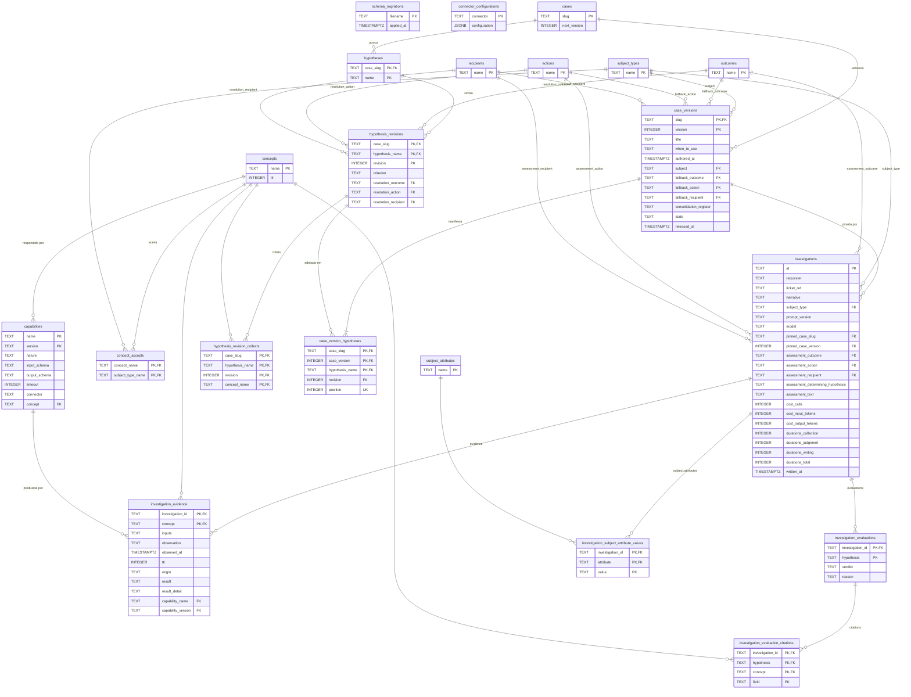

# 21. Modelo relacional

Este capítulo descreve o banco de dados do ServiceDeskN1: as 21 tabelas que as dez migrações SQL de `src/migrations/` criam, suas colunas, tipos, chaves, índices e regras; como cada tabela espelha um elemento do modelo declarado em `knowledge/domain/`; como o runner de migrações reconstrói o schema; e como cada repositório de `src/persistence/` mapeia entidade em tabela. O leitor não precisa conhecer o código — basta saber ler uma tabela e um diagrama ER.

Caminhos: as migrações vivem em `src/migrations/NNNN-nome.sql` (o diretório `migrations/` ao lado de `package.json`, resolvido por `src/migrate.ts` como `new URL('../migrations', import.meta.url)`). Os repositórios vivem em `src/persistence/relational-*.repository.ts`. Todo nome de tabela no código é qualificado como `public.<tabela>`.

## 21.1 Princípios que governam o schema

Quatro restrições arquiteturais de `knowledge/constraints/` decidem o desenho, e cada uma tem um ponto concreto onde se materializa:

| Restrição | O que exige | Onde se materializa |
|---|---|---|
| `the-system-persists-to-one-relational-database.md` | Tudo que o sistema guarda (casos, vocabulários, capacidades, investigações) fica num único store relacional transacional; nenhum registro vive em arquivo | Um único `Pool` do `pg` criado por `createDatabaseConnection(DATABASE_URL)` em `src/persistence/database-connection.ts`, recebido por todos os cinco repositórios; `src/__tests__/unit/capability-registry/no-network-persistence.spec.ts` |
| `the-database-is-externally-provisioned.md` | O banco é provisionado fora do deploy e alcançado só por uma URL de configuração | `DATABASE_URL` em `src/config/env.ts`; nenhum `docker-compose` ou serviço de banco no repositório (`src/__tests__/unit/deployment-provisions-no-database-service.spec.ts`) |
| `the-schema-replays-from-its-scripts.md` | O schema é reconstruível num banco vazio aplicando os scripts na ordem numerada, sem passo manual | `applyPendingMigrations` em `src/persistence/migration-runner.ts`, chamado por `src/migrate.ts` e por `src/vitest-global-setup.ts` (ver [21.4](#214-o-runner-de-migrações)) |
| `the-stored-schema-mirrors-the-declared-model.md` | Toda coluna de toda relação que guarda um registro pareia com um atributo declarado por um elemento de `knowledge/domain/`; a única exceção é a contabilidade das migrações | Tabela de pareamento em [21.3](#213-como-cada-tabela-espelha-o-modelo-declarado); `schema_migrations` é a exceção |

Duas decisões de implementação recorrem em todas as tabelas:

- **Chaves naturais, não surrogates.** Não há coluna `id` serial em lugar nenhum: o slug identifica o caso, `(slug, version)` a versão, `(name, version)` a capacidade, `name` o termo. A única exceção é `investigations.id`, um UUID gerado pela rota de diagnóstico (`randomUUID()` em `src/http/diagnose.controller.ts`), que ainda assim é a identidade que o domínio declara para `Investigation`.
- **Imutabilidade por regra do banco, não por checagem em código.** `CREATE RULE ... DO INSTEAD NOTHING` transforma `UPDATE` e `DELETE` sobre versões liberadas e revisões em no-ops silenciosos (migrações `0006`, `0009`, `0010`). É isso que sustenta `knowledge/rules/knowledge/a-case-version-is-written-once.md` e `knowledge/rules/knowledge/a-released-hypothesis-revision-is-never-altered.md` mesmo contra um `UPDATE` direto no banco.

## 21.2 Catálogo de tabelas

Todas as colunas são `NOT NULL` salvo indicação. Tipos são os do PostgreSQL.

### 21.2.1 Contabilidade do schema

#### `schema_migrations` — migração `0001-schema-migrations.sql`

| Coluna | Tipo | Chave / regra | Descrição |
|---|---|---|---|
| `filename` | TEXT | PK `schema_migrations_pkey` | Nome do arquivo `.sql` aplicado |
| `applied_at` | TIMESTAMPTZ, default `now()` | | Instante da aplicação |

Única tabela que não espelha o modelo declarado (exceção explícita de `the-stored-schema-mirrors-the-declared-model.md`). Lida e escrita apenas por `src/persistence/migration-runner.ts`.

### 21.2.2 Contexto Glossário

#### `subject_types`, `subject_attributes`, `actions`, `outcomes`, `recipients` — migração `0002-glossary-vocabulary.sql`

Cinco tabelas com a mesma forma, uma por vocabulário de `TERM_VOCABULARIES` (`src/glossary/terms.ts`):

| Coluna | Tipo | Chave | Descrição |
|---|---|---|---|
| `name` | TEXT | PK `<tabela>_pkey` | O nome publicado do termo — nunca um valor |

A PK é o que faz `knowledge/rules/glossary/a-vocabulary-holds-each-name-once.md` valer no banco; `GlossaryService.assertUniqueNames` ainda verifica na leitura. O mapeamento vocabulário → tabela é `VOCABULARY_TABLES` em `src/persistence/relational-glossary-store.repository.ts`.

#### `concepts` — migração `0002`

| Coluna | Tipo | Chave | Descrição |
|---|---|---|---|
| `name` | TEXT | PK `concepts_pkey` | Nome do conceito observável |
| `ttl` | INTEGER | | Tolerância de frescor em segundos (`knowledge/rules/knowledge/a-collected-concept-declares-a-ttl.md`) |

#### `concept_accepts` — migração `0002`

| Coluna | Tipo | Chave | Descrição |
|---|---|---|---|
| `concept_name` | TEXT | PK (parte), FK → `concepts(name)` | Conceito |
| `subject_type_name` | TEXT | PK (parte), FK → `subject_types(name)` | Tipo de sujeito que o conceito aceita |

Encoda o atributo `accepts` de `Concept` como relação N:N (`knowledge/domain/glossary/concept.md`).

### 21.2.3 Contexto Integração

#### `capabilities` — migrações `0003-capability-registry.sql` e `0007-capability-concept.sql`

| Coluna | Tipo | Chave / regra | Descrição |
|---|---|---|---|
| `name` | TEXT | PK (parte) `capabilities_pkey` | Nome da capacidade |
| `version` | TEXT | PK (parte) | Versão da capacidade (texto livre, ex.: `1.0.0`) |
| `nature` | TEXT | CHECK `capabilities_nature_check IN ('read-only','mutating')` | `CapabilityNature`; o serviço só grava `read-only` |
| `input_schema` | TEXT | | JSON Schema de entrada, como texto |
| `output_schema` | TEXT | | JSON Schema de saída, como texto — o que limita as citações |
| `timeout` | INTEGER | | Timeout de uma chamada, em ms |
| `connector` | TEXT | | Nome do conector que executa a capacidade |
| `concept` | TEXT | FK → `concepts(name)` (adicionada em `0007`) | Conceito que a capacidade responde |

Não há índice único sobre `concept`; a regra "um conceito, uma capacidade" (`knowledge/rules/integration/one-capability-answers-one-concept.md`) é imposta por `CapabilityRegistryService.registerCapability` e detectada na leitura por `DuplicateConceptAnswerError`.

#### `connector_configurations` — migração `0008-connector-configuration.sql`

| Coluna | Tipo | Chave | Descrição |
|---|---|---|---|
| `connector` | TEXT | PK `connector_configurations_pkey` | Nome do conector |
| `configuration` | JSONB | | O objeto de configuração, opaco para o domínio (`knowledge/domain/integration/connector-configuration.md`) |

O repositório grava `JSON.stringify(configuration)` e lê o JSONB já como objeto (`src/persistence/relational-connector-configuration-store.repository.ts`).

### 21.2.4 Contexto Conhecimento

#### `cases` — migrações `0004-case-and-hypothesis.sql` e `0009-case-version-lifecycle-schema.sql`

| Coluna | Tipo | Chave / regra | Descrição |
|---|---|---|---|
| `slug` | TEXT | PK `cases_pkey` | Identidade do caso (`knowledge/rules/knowledge/a-slug-identifies-one-case.md`) |
| `next_version` | INTEGER, default `1` | (adicionada em `0009`) | Contador durável do próximo número de versão; incrementado com `UPDATE ... RETURNING next_version - 1` em `createDraftVersion` (`knowledge/rules/knowledge/a-case-version-number-is-never-reused.md`) |

#### `case_versions` — migrações `0004`, `0006-case-version-immutability.sql`, `0009`

| Coluna | Tipo | Chave / regra | Descrição |
|---|---|---|---|
| `slug` | TEXT | PK (parte) `case_versions_pkey`, FK → `cases(slug)` | Caso |
| `version` | INTEGER | PK (parte) | Número da versão |
| `title` | TEXT | | Título |
| `when_to_use` | TEXT | | Quando usar |
| `authored_at` | TIMESTAMPTZ | | Autoria; devolvido como ISO 8601 |
| `subject` | TEXT | FK → `subject_types(name)` | Tipo de sujeito declarado |
| `fallback_outcome` | TEXT | FK → `outcomes(name)` | `fallback.outcome` |
| `fallback_action` | TEXT | FK → `actions(name)` | `fallback.referral.action` |
| `fallback_recipient` | TEXT | FK → `recipients(name)` | `fallback.referral.recipient` |
| `consolidation_register` | TEXT, **nullable** | CHECK `IN ('formal','plain')` | Registro do consolidador; `NULL` = não declarado |
| `state` | TEXT, default `'released'` | CHECK `case_versions_state_check IN ('draft','released')` (em `0009`) | `CaseVersionState` |
| `released_at` | TIMESTAMPTZ, **nullable** | (em `0009`) | Instante da liberação; preenchido por `releaseStatement` com `NOW()` |

Índices e regras:

| Objeto | Tipo | Definição | Regra que sustenta |
|---|---|---|---|
| `case_versions_one_draft_per_case` | índice único **parcial** | `ON case_versions (slug) WHERE state = 'draft'` | `knowledge/rules/knowledge/a-case-has-at-most-one-draft.md`; violação (`23505`) vira `CaseAlreadyHasDraftError` em `raiseCreateDraftFailure` |
| `case_versions_no_update` | RULE ON UPDATE | `WHERE OLD.state = 'released' DO INSTEAD NOTHING` (criada em `0006` sem condição, redefinida em `0009` com a condição) | `knowledge/rules/knowledge/a-case-version-is-written-once.md` |
| `case_versions_no_delete_when_released` | RULE ON DELETE | `WHERE OLD.state = 'released' DO INSTEAD NOTHING` | `knowledge/rules/knowledge/only-a-draft-case-version-may-be-discarded.md` |

A `Resolution` do domínio (`outcome` + `referral{action, recipient}`) é achatada em três colunas; `referralColumns`/`resolutionOf` em `src/persistence/relational-case-store.repository.ts` fazem a ida e a volta.

#### `hypotheses` — migração `0009` (a versão de `0004` foi derrubada e recriada)

| Coluna | Tipo | Chave | Descrição |
|---|---|---|---|
| `case_slug` | TEXT | PK (parte) `hypotheses_pkey`, FK → `cases(slug)` | Caso dono |
| `name` | TEXT | PK (parte) | Nome da hipótese, único dentro do caso em todas as versões (`knowledge/rules/knowledge/a-hypothesis-name-is-unique-within-its-case.md`) |

Só identidade, sem conteúdo (`knowledge/domain/knowledge/hypothesis.md`). Inserida com `ON CONFLICT DO NOTHING` em `hypothesisIdentityStatement`.

#### `hypothesis_revisions` — migração `0009`

| Coluna | Tipo | Chave / regra | Descrição |
|---|---|---|---|
| `case_slug` | TEXT | PK (parte), FK composta → `hypotheses(case_slug, name)` | |
| `hypothesis_name` | TEXT | PK (parte), FK composta | |
| `revision` | INTEGER | PK (parte) `hypothesis_revisions_pkey` | `COALESCE(MAX(revision),0)+1` em `revisionInsertStatement` (`knowledge/rules/knowledge/a-hypothesis-revision-number-is-never-reused.md`) |
| `criterion` | TEXT | | O critério em prosa |
| `resolution_outcome` | TEXT | FK → `outcomes(name)` | |
| `resolution_action` | TEXT | FK → `actions(name)` | |
| `resolution_recipient` | TEXT | FK → `recipients(name)` | |

Regra `hypothesis_revisions_no_update`: `ON UPDATE DO INSTEAD NOTHING` (incondicional — nenhuma revisão é jamais alterada).

#### `hypothesis_revision_collects` — migrações `0009` e `0010-protect-released-hypothesis-revision-collects.sql`

| Coluna | Tipo | Chave | Descrição |
|---|---|---|---|
| `case_slug`, `hypothesis_name`, `revision` | TEXT, TEXT, INTEGER | PK (parte), FK composta → `hypothesis_revisions` | Revisão dona |
| `concept_name` | TEXT | PK (parte), FK → `concepts(name)` | Conceito coletado |

Encoda `collects` de `HypothesisRevision`. Regras (`0010`): `hypothesis_revision_collects_no_update` (incondicional) e `hypothesis_revision_collects_no_delete_when_released` (bloqueia `DELETE` quando alguma versão liberada manifesta a revisão). Coberta por `src/__tests__/integration/persistence/protect-released-hypothesis-revision-collects-schema.spec.ts` e `src/__tests__/integration/case/manifest-collects-survive-release.spec.ts`.

#### `case_version_hypotheses` (o manifesto) — migração `0009`

| Coluna | Tipo | Chave / regra | Descrição |
|---|---|---|---|
| `case_slug` | TEXT | PK (parte) | |
| `case_version` | INTEGER | PK (parte); FK composta `case_version_hypotheses_case_version_fkey` → `case_versions(slug, version)` | Versão dona |
| `hypothesis_name` | TEXT | PK (parte) `case_version_hypotheses_pkey`; FK composta `case_version_hypotheses_revision_fkey` (com `case_slug`, `revision`) → `hypothesis_revisions` | Uma entrada por hipótese por versão |
| `revision` | INTEGER | | Revisão adotada |
| `position` | INTEGER | UNIQUE `case_version_hypotheses_position_unique (case_slug, case_version, position)` | Precedência (`knowledge/rules/knowledge/a-hypothesis-position-is-unique-within-its-case.md`); violação vira `ManifestPositionOccupiedError` em `raisePlaceHypothesisFailure` |

Regras: `case_version_hypotheses_no_update_when_released` e `case_version_hypotheses_no_delete_when_released` — ambas com `WHERE EXISTS (SELECT 1 FROM case_versions cv WHERE ... cv.state = 'released') DO INSTEAD NOTHING`. É a materialização de `ManifestEntry` (`knowledge/domain/knowledge/manifest-entry.md`).

### 21.2.5 Contexto Investigação — migração `0005-investigation.sql`

#### `investigations`

| Coluna | Tipo | Chave / regra | Atributo do domínio |
|---|---|---|---|
| `id` | TEXT | PK `investigations_pkey` | `Investigation.id` |
| `requester` | TEXT | | `requester` |
| `ticket_ref` | TEXT, **nullable** | | `ticket_ref?` (lido de volta como `''` quando `NULL` — `investigationOf`) |
| `narrative` | TEXT | | `narrative` |
| `subject_type` | TEXT | FK → `subject_types(name)` | `subject.type` |
| `prompt_version` | TEXT | | `prompt_version` (pin) |
| `model` | TEXT | | `model` (pin) |
| `pinned_case_slug` | TEXT | FK composta `investigations_pinned_case_fkey` → `case_versions(slug, version)` | `pinned_case.slug` |
| `pinned_case_version` | INTEGER | idem | `pinned_case.version` |
| `assessment_outcome` | TEXT | FK → `outcomes(name)` | `assessment.outcome` |
| `assessment_action` | TEXT | FK → `actions(name)` | `assessment.referral.action` |
| `assessment_recipient` | TEXT | FK → `recipients(name)` | `assessment.referral.recipient` |
| `assessment_determining_hypothesis` | TEXT, **nullable** | | `assessment.determining_hypothesis?` |
| `assessment_text` | TEXT | | `assessment.text` |
| `cost_calls`, `cost_input_tokens`, `cost_output_tokens` | INTEGER | | `Cost` (hoje sempre 0 — `UNMEASURED_COST`) |
| `durations_collection`, `durations_judgment`, `durations_writing`, `durations_total` | INTEGER | | `Durations` (hoje sempre 0) |
| `written_at` | TIMESTAMPTZ | | `written_at` |

Uma violação de PK no `INSERT` (`23505`) vira `InvestigationAlreadyStoredError` (`knowledge/rules/investigation/an-investigation-is-written-once.md`). A FK para `case_versions` é o que impede descartar ou apagar uma versão que alguma investigação já pinou — e é o motivo de `vitest.config.ts` ter `testTimeout: 40000` (limpeza de investigações antes de apagar versões).

#### `investigation_evidence`

| Coluna | Tipo | Chave / regra | Atributo |
|---|---|---|---|
| `investigation_id` | TEXT | PK (parte), FK → `investigations(id)` | |
| `concept` | TEXT | PK (parte) `investigation_evidence_pkey`, FK → `concepts(name)` | `Evidence.concept` — uma evidência por conceito (`knowledge/rules/investigation/one-evidence-per-collected-concept.md`) |
| `inputs` | TEXT | | `inputs` |
| `observation` | TEXT | | `observation` (já no vocabulário do glossário) |
| `observed_at` | TIMESTAMPTZ | | `observed_at` |
| `ttl` | INTEGER | | `ttl` |
| `origin` | TEXT | | `origin` |
| `result` | TEXT | CHECK `IN ('ok','unavailable','denied','timeout')` | `EvidenceResult` |
| `result_detail` | TEXT, **nullable** | | `result_detail?` |
| `capability_name`, `capability_version` | TEXT | FK composta `investigation_evidence_capability_fkey` → `capabilities(name, version)` | Capacidade produtora (pin) |

#### `investigation_evaluations`

| Coluna | Tipo | Chave / regra | Atributo |
|---|---|---|---|
| `investigation_id` | TEXT | PK (parte), FK → `investigations(id)` | |
| `hypothesis` | TEXT | PK (parte) `investigation_evaluations_pkey` | `Evaluation.hypothesis` — uma por hipótese exigida (`knowledge/rules/investigation/one-evaluation-per-required-hypothesis.md`) |
| `verdict` | TEXT | CHECK `IN ('confirmed','refuted','inconclusive')` | `Verdict` |
| `reason` | TEXT, **nullable** | CHECK `IN ('no-data','judgment-failure','deadline-exceeded')` | `EvaluationReason` — gravado só quando `inconclusive` (`evaluationStatement`); na leitura, `inconclusive` sem `reason` é falha de leitura (`reasonOf`) |

#### `investigation_evaluation_citations`

| Coluna | Tipo | Chave | Atributo |
|---|---|---|---|
| `investigation_id`, `hypothesis` | TEXT | PK (parte), FK composta → `investigation_evaluations` | Avaliação dona |
| `concept` | TEXT | PK (parte), FK → `concepts(name)` | `Citation.concept` |
| `field` | TEXT | PK (parte) `investigation_evaluation_citations_pkey` | `Citation.field` |

Na leitura, uma avaliação `confirmed`/`refuted` sem citação é recusada por `nonEmptyCitations` (`knowledge/rules/investigation/a-decided-evaluation-cites-evidence.md`).

#### `investigation_subject_attribute_values`

| Coluna | Tipo | Chave | Atributo |
|---|---|---|---|
| `investigation_id` | TEXT | PK (parte), FK → `investigations(id)` | |
| `attribute` | TEXT | PK (parte), FK → `subject_attributes(name)` | `SubjectAttributeValue.attribute` (`knowledge/rules/investigation/a-subject-attribute-is-drawn-from-the-glossary.md`) |
| `value` | TEXT | PK (parte) | `SubjectAttributeValue.value` |

### 21.2.6 Tabelas que existiram e foram removidas

A migração `0004` criou `hypotheses` (com `case_version`, `position`, `criterion`, resolução) e `hypothesis_collects`, ambas por versão de caso. A migração `0009` as derruba (`DROP TABLE hypothesis_collects; DROP TABLE hypotheses;`) e recria o modelo com identidade (`hypotheses`), conteúdo versionado (`hypothesis_revisions`, `hypothesis_revision_collects`) e manifesto (`case_version_hypotheses`). Replay num banco vazio passa por esse `DROP` normalmente — é parte do script.

## 21.3 Como cada tabela espelha o modelo declarado

`knowledge/constraints/the-stored-schema-mirrors-the-declared-model.md` exige pareamento coluna → atributo declarado. A tabela abaixo é esse pareamento, na direção tabela → elemento de `knowledge/domain/`; os agregados são lidos e escritos inteiros pelo repositório indicado.

| Tabela | Elemento(s) de domínio | Repositório | Observação |
|---|---|---|---|
| `schema_migrations` | — (exceção declarada) | `migration-runner.ts` | |
| `subject_types` | `knowledge/domain/glossary/subject-type.md` | `RelationalGlossaryStore` | |
| `subject_attributes` | `knowledge/domain/glossary/subject-attribute.md` | `RelationalGlossaryStore` | |
| `outcomes` | `knowledge/domain/glossary/outcome.md` | `RelationalGlossaryStore` | Os dois desfechos de não-conclusão são inseridos pelo serviço na leitura |
| `actions` | `knowledge/domain/glossary/action.md` | `RelationalGlossaryStore` | |
| `recipients` | `knowledge/domain/glossary/recipient.md` | `RelationalGlossaryStore` | |
| `concepts` + `concept_accepts` | `knowledge/domain/glossary/concept.md` (`name`, `ttl`, `accepts`) | `RelationalGlossaryStore` | `accepts` normalizado em N:N |
| `capabilities` | `knowledge/domain/integration/capability.md`, `knowledge/domain/integration/capability-nature.md` | `RelationalCapabilityStore` | |
| `connector_configurations` | `knowledge/domain/integration/connector-configuration.md` | `RelationalConnectorConfigurationStore` | |
| `cases` | `knowledge/domain/knowledge/case.md` (`slug`, `next_version`) | `RelationalCaseStore` | |
| `case_versions` | `knowledge/domain/knowledge/case-version.md`, `case-version-state.md`, `resolution.md` + `referral.md` (fallback), `consolidation-register.md` | `RelationalCaseStore` | |
| `hypotheses` | `knowledge/domain/knowledge/hypothesis.md` | `RelationalCaseStore` | |
| `hypothesis_revisions` | `knowledge/domain/knowledge/hypothesis-revision.md` (+ `resolution.md`, `referral.md`) | `RelationalCaseStore` | |
| `hypothesis_revision_collects` | `hypothesis-revision.md` (`collects`) | `RelationalCaseStore` | |
| `case_version_hypotheses` | `knowledge/domain/knowledge/manifest-entry.md` | `RelationalCaseStore` | |
| `investigations` | `knowledge/domain/investigation/investigation.md`, `assessment.md`, `cost.md`, `durations.md`, `subject.md` (`type`) | `RelationalInvestigationStore` | |
| `investigation_evidence` | `knowledge/domain/investigation/evidence.md`, `evidence-result.md` | `RelationalInvestigationStore` | |
| `investigation_evaluations` | `knowledge/domain/investigation/evaluation.md`, `verdict.md`, `evaluation-reason.md` | `RelationalInvestigationStore` | |
| `investigation_evaluation_citations` | `knowledge/domain/investigation/citation.md` | `RelationalInvestigationStore` | |
| `investigation_subject_attribute_values` | `knowledge/domain/investigation/subject-attribute-value.md` | `RelationalInvestigationStore` | |

Elementos declarados sem tabela própria: `CaseSummary` (`knowledge/domain/knowledge/case-summary.md`) é derivado, não armazenado, e não há implementação dele no código; `CapabilityRegistry` e `ConnectorConfigurationRegistry` são os serviços, não registros; `HypothesisEvaluator` e `AssessmentConsolidator` são portas.

## 21.4 O runner de migrações

`applyPendingMigrations(connection, migrationsDirectory)` em `src/persistence/migration-runner.ts`:

1. Lista os arquivos `*.sql` do diretório e os ordena lexicograficamente (`orderedMigrationFiles`) — daí o prefixo numérico de quatro dígitos.
2. Verifica se `public.schema_migrations` existe (`to_regclass(...) IS NOT NULL`); se não, considera nada aplicado (é o caso do banco vazio, onde `0001` cria a própria tabela).
3. Para cada arquivo ainda não listado em `schema_migrations`, executa o SQL inteiro com `connection.query(sql)` e em seguida `INSERT INTO public.schema_migrations (filename)`. Não há transação envolvendo os dois passos; uma falha lança `MigrationStepError` com `{ filename }` e a causa original.

Quem o chama:

| Chamador | Quando | Arquivo |
|---|---|---|
| `npm run migrate` | Operação manual/deploy | `src/migrate.ts` — carrega `loadEnv()`, cria o pool, aplica, `connection.end()` |
| Suíte de testes | `globalSetup` do Vitest, uma vez antes de qualquer spec | `src/vitest-global-setup.ts` — exige `DATABASE_URL`, aplica, semeia os dois desfechos de não-conclusão e repara `collects` do fixture |

Testes: `src/__tests__/unit/persistence/migration-runner.spec.ts`, `src/__tests__/integration/persistence/migration-runner.spec.ts`, `src/__tests__/integration/persistence/schema-migrations.spec.ts`, `src/__tests__/unit/no-test-creates-or-alters-a-table.spec.ts` (nenhum teste cria ou altera tabela por fora dos scripts).

## 21.5 Acesso ao banco: conexão, transações e erros de store

- **Conexão** — `createDatabaseConnection(url)` devolve `new Pool({ connectionString })` (`src/persistence/database-connection.ts`). `DatabaseConnection` é um alias de `Pool`.
- **Helpers** — `src/persistence/database-access.ts`: `runStatement` (executa e traduz falha pelo `raise` recebido), `queryOneOrAbsent` (primeira linha ou `undefined`), `runInTransaction` (`BEGIN`, `SET LOCAL search_path TO public`, trabalho, `COMMIT`/`ROLLBACK`, `release()`).
- **Conexão isolada para testes** — `checkOutIsolatedConnection` em `src/persistence/isolated-connection.ts`: abre `BEGIN` e faz `ROLLBACK` no `release()`, de modo que um teste não deixa linhas.
- **Erros de store** — cada repositório envolve toda falha do driver numa classe própria com `context.operation` (`read`/`write`) e `cause`: `CaseStoreError`, `GlossaryStoreError`, `CapabilityStoreError`, `ConnectorConfigurationStoreError`, `InvestigationStoreError`. Três violações de constraint são traduzidas em erros de domínio antes disso: `case_versions_one_draft_per_case` → `CaseAlreadyHasDraftError`; `case_version_hypotheses_position_unique` → `ManifestPositionOccupiedError`; PK de `investigations` → `InvestigationAlreadyStoredError`.

## 21.6 Mapeamento entidade → tabela por repositório

### 21.6.1 `RelationalGlossaryStore` (`src/persistence/relational-glossary-store.repository.ts`) — porta `IGlossaryStore`

| Método | SQL | Tabelas |
|---|---|---|
| `readTerms(vocabulary)` | `SELECT name FROM <tabela do vocabulário>` | uma das cinco |
| `writeTerms(vocabulary, terms)` | transação: `DELETE FROM <tabela>`; `INSERT` por termo | idem |
| `insertMissingTerms(vocabulary, terms)` | transação: `INSERT ... ON CONFLICT DO NOTHING` por termo | idem |
| `readConcepts()` | transação: `SELECT name, ttl FROM concepts`; `SELECT concept_name, subject_type_name FROM concept_accepts` agrupado por conceito | `concepts`, `concept_accepts` |
| `writeConcepts(concepts)` | transação: `DELETE FROM concept_accepts`; `DELETE FROM concepts`; `INSERT` conceito e cada `accepts` | idem |

### 21.6.2 `RelationalCapabilityStore` (`src/persistence/relational-capability-store.repository.ts`) — porta `ICapabilityStore`

| Método | SQL | Tabela |
|---|---|---|
| `readCapabilities()` | `SELECT name, version, nature, input_schema, output_schema, timeout, connector, concept FROM capabilities`; `nature` fora do enum → `CapabilityStoreError` | `capabilities` |
| `writeCapabilities(list)` | transação: `DELETE FROM capabilities`; `INSERT` por capacidade | `capabilities` |

O registro é lido e reescrito inteiro a cada operação (`CapabilityRegistryService`).

### 21.6.3 `RelationalConnectorConfigurationStore` — porta `IConnectorConfigurationStore`

| Método | SQL | Tabela |
|---|---|---|
| `readConnectorConfigurations()` | `SELECT connector, configuration FROM connector_configurations` | `connector_configurations` |
| `writeConnectorConfigurations(list)` | transação: `DELETE`; `INSERT (connector, configuration)` com `JSON.stringify` | idem |

### 21.6.4 `RelationalCaseStore` (`src/persistence/relational-case-store.repository.ts`) — porta `ICaseStore`

| Método | O que faz | Tabelas |
|---|---|---|
| `assembleVersion(slug, version)` | transação: raiz (`caseVersionSelect`), manifesto com `JOIN hypothesis_revisions` ordenado por `position`, `collects` via `JOIN hypothesis_revision_collects`; devolve `AssembledCaseVersion` ou `undefined` | `case_versions`, `case_version_hypotheses`, `hypothesis_revisions`, `hypothesis_revision_collects` |
| `findDraftVersion(slug)` | `SELECT version ... WHERE slug=$1 AND state='draft'` | `case_versions` |
| `listCases(p)` | transação: `COUNT(*)` + `SELECT slug ORDER BY slug LIMIT/OFFSET` | `cases` |
| `listCaseVersions(slug, p)` | `requireCaseIdentity` (404 se slug ausente); `COUNT` + `SELECT version, state ORDER BY version` | `cases`, `case_versions` |
| `listHypotheses(slug, p)` | `requireCaseIdentity`; `COUNT` + `SELECT name ORDER BY name` | `cases`, `hypotheses` |
| `listHypothesisRevisions(slug, name, p)` | `requireHypothesisIdentity`; `COUNT` + página `ORDER BY revision` + `collects` agrupados por revisão | `hypotheses`, `hypothesis_revisions`, `hypothesis_revision_collects` |
| `createDraft(input)` | transação: `INSERT cases ON CONFLICT DO NOTHING`; `UPDATE cases SET next_version = next_version + 1 RETURNING next_version - 1`; resolve `source_version` (ou `MAX(version)` liberada); `INSERT case_versions (state='draft')`; copia manifesto da fonte (`INSERT ... SELECT`) | `cases`, `case_versions`, `case_version_hypotheses` |
| `insertHypothesisRevision(input)` | transação: `INSERT hypotheses ON CONFLICT DO NOTHING`; `INSERT hypothesis_revisions ... SELECT COALESCE(MAX(revision),0)+1 ... RETURNING revision`; um `INSERT hypothesis_revision_collects` por conceito | `hypotheses`, `hypothesis_revisions`, `hypothesis_revision_collects` |
| `placeHypothesis(input)` | `INSERT case_version_hypotheses`; violação de `position_unique` → `ManifestPositionOccupiedError` | `case_version_hypotheses` |
| `removeManifestEntry(slug, v, name)` | `DELETE FROM case_version_hypotheses WHERE ...` (no-op silencioso se a versão estiver liberada — regra do banco) | `case_version_hypotheses` |
| `release(slug, v)` | `UPDATE case_versions SET state='released', released_at=NOW()` | `case_versions` |
| `discard(slug, v)` | transação: `DELETE case_version_hypotheses`; `DELETE case_versions` | idem |
| `updateDraft(slug, v, attrs)` | transação: lê `state` (404/409 se ausente/não-draft); `UPDATE case_versions SET title, when_to_use, subject, fallback_*, consolidation_register` | `case_versions` |

Conversões: `authored_at`/`released_at` `Date → toISOString()`; `consolidation_register` `NULL → undefined`; valores fora dos enums `state`/`consolidation_register` → `CaseStoreError` na leitura.

### 21.6.5 `RelationalInvestigationStore` (`src/persistence/relational-investigation-store.repository.ts`) — porta `IInvestigationStore`

| Método | O que faz | Tabelas |
|---|---|---|
| `write(investigation)` | transação: `INSERT investigations` (22 colunas); um `INSERT` por atributo do sujeito, por evidência, por avaliação e por citação; PK duplicada → `InvestigationAlreadyStoredError` | as cinco de investigação |
| `read(id)` | transação: raiz + atributos + evidências + avaliações + citações; devolve `{ document, hash }` com `hash = sha256(JSON.stringify(document))`; valores fora dos enums, `inconclusive` sem `reason` ou verdito decidido sem citação → `InvestigationStoreError` | idem |

O único chamador de `write` em produção é `runDiagnosis` (`src/investigation/run-diagnosis.ts`), dentro do orçamento de persistência; `read` é usado por testes e por auditoria.

## 21.7 Diagrama ER

## 21.8 Índices e desempenho

Os únicos índices são os implícitos das chaves primárias e da restrição `UNIQUE`, mais o índice único parcial `case_versions_one_draft_per_case`. Nenhuma migração cria índice sobre colunas de chave estrangeira (por exemplo `investigation_evidence.capability_name`, `case_versions.subject`) nem sobre `capabilities.concept`. As listagens usam `ORDER BY` sobre colunas da PK (`slug`, `version`, `name`, `revision`), então são servidas pelo índice da PK; `COUNT(*)` é feito em consulta separada dentro da mesma transação.

## 21.9 Semeadura e dados iniciais

`src/seed.ts` (`npm run seed`) popula, nesta ordem e de forma idempotente: os cinco vocabulários a partir de `src/fixtures/glossary/*.json` (`insertMissingTerms`), garantindo os dois desfechos de não-conclusão; `concepts` e `concept_accepts` a partir de `concept.json` (`INSERT ... ON CONFLICT DO NOTHING`); as capacidades de `src/fixtures/capability/capability.json` via `CapabilityRegistryService.registerCapability`; e, se `intermittent-connection-outage` versão 1 ainda não existir, o caso de `src/fixtures/case/intermittent-connection-outage/1.json` através do ciclo de vida real (`createDraft` → `reviseHypothesis`+`placeHypothesis` por entrada → `release`), verificando ao final com `createCaseQuery(connection).readCase`. Nenhuma configuração de conector é semeada — `connector_configurations` só é escrita pela rota `PUT /v1/connectors/:connector` ([API HTTP](14-api-http.md)).
