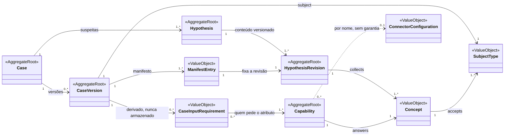

# Relação entre Case, Hypothesis, Concept, Capability e ConnectorConfiguration

Leitura da especificação em `knowledge/` (a autoridade), **e verificada contra `src/` no capítulo
"Verificação contra o código", no fim deste documento** — o que foi conferido, com que evidência, e o
que segue não verificado.
Data: 2026-09-09.

## As afirmações avaliadas

| # | afirmação | veredito | correção |
|---|---|---|---|
| 1 | Um Case é um template de investigação | **errada** | o template é a `CaseVersion`; o `Case` é só identidade (`slug`, `next_version`) |
| 2 | Este template possui hipóteses | **imprecisa** | a `CaseVersion` possui `ManifestEntry`; a `Hypothesis` pertence ao `Case` |
| 3 | Uma hipótese aceita um Subject | **errada** | a `CaseVersion` declara um `SubjectType`; `accepts` é do `Concept`; o `Subject` é montado no entry point |
| 4 | Uma hipótese coleta um ou mais Concepts | **quase** | quem coleta é a `HypothesisRevision` (`collects`, ≥1) |
| 5 | Para coletar Concepts existem Capabilities | **certa** | e é 1:1, com a `Capability` apontando para o `Concept` |
| 6 | Uma Capability depende de um Connector | **certa na intenção** | `Connector` não é entidade: `capability.connector` é um nome; o "como" está na `ConnectorConfiguration` |

### 1. Case não é o template

`knowledge/domain/knowledge/case.md` — tipo `aggregate-root`, atributos `slug` e `next_version`, operação
`create-draft`. Nada mais. Título, `when_to_use`, subject type, `fallback`, `consolidation_register`,
`state` e `manifest` são de `knowledge/domain/knowledge/case-version.md`.

O `Case` é o nome estável que sobrevive a toda versão, inclusive a uma versão descartada — daí
`next_version` viver na identidade e não na versão.

### 2. A versão não possui hipóteses; adota revisões

- `Hypothesis` (`domain/knowledge/hypothesis.md`) referencia o **Case**, cardinalidade 1, e carrega só `name`
  — único em toda versão que o case já teve, tem ou terá (`a-hypothesis-name-is-unique-within-its-case`).
- `CaseVersion.manifest` é `many` de `ManifestEntry` (`position` + referência a **uma** `HypothesisRevision`).
- Reordenar hipóteses entre versões muda apenas `position` de duas entradas — nunca a revisão referenciada,
  nunca um fato da revisão.
- Versão liberada manifesta apenas revisões liberadas (`a-released-case-version-manifests-only-released-hypothesis-revisions`).

### 3. Subject: três coisas distintas

| coisa | onde | o que é |
|---|---|---|
| `SubjectType` | `domain/glossary/subject-type.md` | vocabulário descoberto: contrato, cliente, elemento de rede, região |
| `CaseVersion.subject` | `domain/knowledge/case-version.md` | o **tipo** que aquela versão investiga — nunca valores |
| `Concept.accepts` | `domain/glossary/concept.md` | os tipos que aquele concept aceita (`many`) |
| `Subject` | `domain/investigation/subject.md` | tipo + conjunto de `subject-attribute-value`, montado pelo entry point antes de diagnose/simulate |

A junção é `rules/knowledge/a-concept-accepts-the-declared-subject-type`: todo concept coletado pelas
revisões manifestadas aceita o subject type da versão; caso contrário 422 `ConceptRefusesSubjectTypeError`.

O que "hipótese aceita um Subject" tenta capturar existe, mas **derivado e na direção inversa**:
`rules/knowledge/a-case-versions-input-requirements-are-derived` — os atributos que a versão exige saem do
`input_schema.properties` das capabilities que respondem os concepts do plano de coleta, com `required` verdadeiro
onde alguma delas lista o atributo em `required`. Recalculado a cada leitura, armazenado em lugar nenhum
(`domain/knowledge/case-input-requirement.md`).

Nenhum atributo é filtrado por concept: o connector de cada capability recebe o conjunto inteiro e resolve
sozinho o que precisa (`domain/investigation/subject.md`).

### 4. Coleta é da revisão, não da hipótese

`domain/knowledge/hypothesis-revision.md` carrega `revision`, `criterion`, `collects` (many `concept`),
`resolution` e `state`. O par `collects` + `criterion` é a investigação da revisão.
`rules/knowledge/a-hypothesis-collects-at-least-one-concept`: revisão que coletasse zero é recusada com 422
`HypothesisRevisionCollectsNoConceptError` — sem coleta ela não poderia citar nada.

### 5. Concept ↔ Capability é 1:1, com a seta saindo da Capability

`domain/integration/capability.md` tem o atributo `concept`. O `Concept` não conhece capability alguma —
é deliberadamente magro quanto à forma do dado (a forma é do `output_schema` da capability), mas não quanto ao
significado (`description` é obrigatória).

- `rules/integration/one-capability-answers-one-concept`: registrar capability de outra identidade para um
  concept já respondido → 409 `ConceptAlreadyAnsweredError`; leitura que encontre mais de uma → 500
  `DuplicateConceptAnswerError`, sem escolher.
- `rules/knowledge/every-collected-concept-has-a-read-only-capability`: revisão que colete concept sem
  capability registrada é inválida na curadoria — o erro não espera a ligação com o cliente.
- `domain/integration/capability-registry.md` é o único lookup concept → capability.

### 6. Connector é um nome, não uma entidade

`capability.connector` é `string`. O que a especificação modela é
`domain/integration/connector-configuration.md`: `connector` (a única identidade que ela tem) + `configuration`
(objeto JSON opaco, substituído inteiro a cada edição).

`domain/integration/connector-configuration-registry.md` é serviço próprio exatamente porque uma configuração
de connector **não responde a concept nenhum e não resolve para capability nenhuma: ela é nomeada, não resolvida**.

O vínculo é frouxo de propósito:

- uma capability pode ser registrada antes de seu connector existir, e vice-versa;
- a ausência degrada a observação para `unavailable` (`rules/integration/an-unresolvable-observation-ends-unavailable`),
  não é falha;
- o único acoplamento real é `rules/integration/a-connector-placeholder-is-declared-by-its-capability`:
  placeholder que nomeie atributo de Subject no texto da configuração tem de estar em `properties` do
  `input_schema` da capability registrada naquele nome — checado nas duas escritas, em qualquer ordem,
  com 422 `ConnectorPlaceholderOutsideInputSchemaError`.

No código: `src/src/investigation/http-declarative-observation-source.adapter.ts` resolve a capability pelo
concept, lê a configuração por `capability.connector`, resolve os placeholders e emite a chamada HTTP.

## A cadeia

```
Case (slug, next_version)
 |-1..*-> CaseVersion (subject: SubjectType, fallback, state, manifest)
 |          |-1..*-> ManifestEntry (position) -1-> HypothesisRevision
 |-1..*-> Hypothesis (name)
            |-1..*-> HypothesisRevision (revision, criterion, collects, resolution, state)
                       |-1..*-> Concept (name, accepts: SubjectType[], ttl, description)
                                  <-1- Capability (name, version, nature, input_schema,
                                                   output_schema, timeout, connector, concept)
                                         |- connector: string -(por nome, 0..1, sem garantia)->
                                                   ConnectorConfiguration (connector, configuration)
```

## Cardinalidades

| relação | cardinalidade | onde está declarada |
|---|---|---|
| Case → CaseVersion | 1 → 0..* | `case-version` referencia `case` |
| Case → Hypothesis | 1 → 1..* | `hypothesis` referencia `case` |
| Hypothesis → HypothesisRevision | 1 → 1..* | `hypothesis-revision` referencia `hypothesis` |
| CaseVersion → ManifestEntry | 1 → 1..* | `rules/knowledge/a-case-has-at-least-one-hypothesis` |
| ManifestEntry → HypothesisRevision | 1 → 1 | `manifest-entry` |
| HypothesisRevision → Concept | 1 → 1..* | `collects` |
| Concept ↔ Capability | 1 → 1 | `one-capability-answers-one-concept` |
| Concept → SubjectType | 1 → 1..* | `accepts` |
| CaseVersion → SubjectType | 1 → 1 | `subject` |
| Capability → ConnectorConfiguration | 1 → 0..1, por nome | `connector-configuration`, sem enforcement |
| CaseInputRequirement → Capability | 1 → 1..* | derivado, nunca armazenado |

## O mesmo grafo em execução

`diagnose(slug, Subject)`
→ `CaseVersion.collection-plan`: união deduplicada dos `collects` de toda revisão manifestada
→ por Concept, `observe-concept` (contrato `contracts/integration/concept-observation.md`)
→ registry resolve **exatamente uma** Capability
→ leitura da ConnectorConfiguration pelo nome em `capability.connector`
→ chamada dentro do `timeout` da capability, ele mesmo dentro do orçamento global de coleta
→ **uma `Evidence` por concept coletado** (`one-evidence-per-collected-concept`), referenciando qual capability
  e em que versão produziu, com semântica de campos e descrição do concept snapshotadas no momento
→ uma `Evaluation` por revisão manifestada (`one-evaluation-per-required-hypothesis`), com citações restritas
  ao que a revisão coleta (`a-citation-stays-within-the-hypothesis-collects`)
→ `resolve-outcome`: primeira hipótese confirmada na ordem de precedência declarada; `fallback` quando nenhuma
  confirma.

## Fronteiras de contexto

| contexto | entidades | papel |
|---|---|---|
| glossary | Concept, SubjectType, SubjectAttribute, Outcome | a linguagem publicada |
| knowledge | Case, CaseVersion, Hypothesis, HypothesisRevision, ManifestEntry | a curadoria |
| integration | Capability, ConnectorConfiguration e seus registries | genérico, substituível |
| investigation | Subject, Evidence, Evaluation, Assessment | uma execução |

As duas negociações knowledge ↔ integration:

- saída: `every-collected-concept-has-a-read-only-capability`
- entrada: `a-case-versions-input-requirements-are-derived`

Nenhum dos dois lados guarda a resposta do outro — ambos recomputados a cada leitura.

---

# Capítulo para leigos: o que esse sistema é, em prosa

## O problema que ele resolve

Um cliente liga reclamando que a internet está lenta. Do outro lado da linha tem um atendente de
primeiro nível que não é engenheiro de rede, não tem acesso a dez sistemas diferentes e tem alguns
minutos para dizer alguma coisa útil. A informação que resolveria o caso existe — está espalhada no
sistema de contratos, no sistema de rede, no de faturamento — mas ninguém consegue reunir e
interpretar tudo isso ao vivo.

Esse sistema faz esse trabalho. Ele recebe "quem é o cliente e qual é o problema", sai buscando os
dados nos sistemas de origem, avalia as suspeitas na ordem em que um especialista avaliaria, e
devolve um parecer: **o que provavelmente é, e o que fazer com isso**.

A parte interessante é que **as suspeitas não estão no código**. Elas são conteúdo, escrito por
gente que entende do assunto, versionado como se fosse documento. Um especialista muda o roteiro de
diagnóstico sem que ninguém precise programar nada.

## A receita e a edição da receita

Pense num livro de receitas de troubleshooting. Cada receita tem um nome — "internet lenta",
"sem sinal de TV", "fatura em duplicidade". Esse nome é o **Case**.

O Case é *só o nome*. Ele não tem conteúdo. É a lombada do livro.

O conteúdo está na **CaseVersion**: a edição número 3 daquela receita, com título, o "quando usar
esta receita", que tipo de coisa ela investiga, e a lista ordenada de suspeitas. Toda vez que o
especialista quer mudar o roteiro, ele cria uma nova edição em rascunho, mexe à vontade, e quando
está satisfeito, **libera**. Uma edição liberada nunca mais muda — nem uma vírgula. Isso não é
burocracia: é o que garante que, se alguém for auditar um atendimento de três meses atrás, o roteiro
que rodou naquele dia ainda esteja lá exatamente como estava.

Foi por isso que a separação existe. Se o Case guardasse o conteúdo, "mudar a receita" e "ter
histórico da receita" seriam a mesma operação — e não podem ser.

## As suspeitas

Cada suspeita é uma **Hypothesis** — uma afirmação que pode ser verdadeira ou falsa. Não é uma
pergunta aberta, é uma aposta: "o cliente está com o serviço suspenso por inadimplência". Ou ela se
confirma, ou não.

E aqui vem a segunda separação, que é a mesma ideia da receita. A Hypothesis também é *só um nome*.
O conteúdo dela — o que ela afirma, quais dados ela precisa, e o que fazer se ela se confirmar —
está na **HypothesisRevision**. Revisão 1, revisão 2, revisão 5.

Por que separar? Porque uma suspeita evolui, mas continua sendo a mesma suspeita. "Inadimplência"
na revisão 1 podia olhar só o status do contrato; na revisão 4 olha também as faturas em aberto e o
histórico de negociação. É a mesma suspeita, melhor escrita. Se ela virasse uma coisa nova a cada
edição, você perderia a capacidade de dizer "essa suspeita aqui já melhorou quatro vezes".

A edição da receita não aponta para a suspeita — ela aponta para **uma revisão específica** da
suspeita, e diz em que **posição** da fila ela entra. Essa lista de "posição + qual revisão" é o
**manifesto**. É por isso que reordenar as suspeitas de uma receita não mexe em nada do conteúdo
delas: só troca dois números de posição.

A ordem importa muito. O sistema não pesa probabilidades nem soma pontos: ele percorre as suspeitas
na ordem declarada e **a primeira que se confirma decide o caso**. As outras continuam com o
veredito que receberam — ninguém apaga o que elas concluíram —, mas o desfecho é da primeira. Quem
escreve o roteiro está declarando a ordem em que um especialista pensaria, e essa ordem é a regra.

Se nenhuma se confirma, existe o **fallback**: a resposta declarada de antemão para "não sei o que
é". É de propósito uma suspeita disfarçada, e ela não afirma nada sobre o mundo — só garante que o
atendente nunca fique sem resposta.

## O que a suspeita precisa saber: Concept

Para avaliar "o cliente está inadimplente", alguém precisa saber o status financeiro do contrato.
Esse *pedaço de informação nomeado* é um **Concept**.

Concept é vocabulário. É a lista de coisas que esse mundo sabe nomear: `status-do-contrato`,
`sinal-óptico`, `faturas-em-aberto`, `chamados-recentes`. Uma revisão de hipótese diz quais concepts
ela coleta — no mínimo um, senão ela não teria em que se apoiar para concluir nada.

O detalhe importante, e propositalmente estranho: **o Concept não sabe qual é a forma do dado**.
Ele não diz "isso é um objeto com os campos X, Y e Z". Ele só diz o nome, o que aquele nome
significa em português claro, que tipos de sujeito ele aceita, e por quanto tempo o dado continua
fresco. A forma do dado é problema de outra camada. Isso mantém o vocabulário estável mesmo quando
o sistema de origem muda tudo por baixo.

## Quem vai buscar: Capability

O Concept diz *o que* se quer saber. A **Capability** é *quem sabe responder*.

É uma ficha de registro: eu me chamo assim, sou a versão tal, eu sou **somente leitura** (esse
sistema diagnostica e encaminha — ele nunca mexe em nada), o dado que eu preciso receber tem esta
forma, o dado que eu devolvo tem esta outra forma, eu desisto depois de tantos milissegundos, e eu
respondo **exatamente um** Concept.

Exatamente um, e o inverso também: cada Concept é respondido por uma única Capability. Não existe
"tenta esse, se falhar tenta aquele". Se duas capabilities acabarem respondendo o mesmo concept, o
sistema **recusa a leitura** em vez de escolher uma. Isso é decisão consciente: uma escolha
silenciosa entre duas fontes do mesmo dado é o tipo de coisa que ninguém descobre até dar problema
num caso real.

Repare na direção da seta: é a Capability que aponta para o Concept, nunca o contrário. O
vocabulário não sabe quem o atende. Isso é o que permite trocar completamente a fonte de um dado
sem tocar em nenhuma receita.

## Como buscar: Connector e ConnectorConfiguration

A Capability sabe *que* dado ela entrega. Ela não sabe *como* ir buscar. Para isso ela carrega um
nome de **connector** — só um nome, tipo `crm-http` ou `rede-legado`.

Debaixo desse nome mora a **ConnectorConfiguration**: a parte suja e concreta. Qual URL chamar, qual
método, quais cabeçalhos, onde entra a credencial, de onde tirar cada campo da resposta. É um bloco
de JSON que o operador escreve à mão, e o sistema trata como opaco: ele exige que seja um JSON
válido, e **o significado das chaves é assunto do connector que executa**, não do domínio.

Duas coisas nessa ligação parecem descuido e não são:

Primeira, **o vínculo é por nome e ninguém garante que exista**. Você pode registrar uma capability
que aponta para `crm-http` antes de o `crm-http` estar configurado, e pode configurar o `crm-http`
antes de qualquer capability apontar para ele. Se na hora do atendimento a configuração não existir,
a coleta daquele dado volta como **"indisponível"** — que é um fato registrado, não um erro que
explode. O sistema foi desenhado para dar a melhor resposta possível com o que conseguiu obter, não
para desistir porque um pedaço faltou.

Segunda, **a configuração é substituída inteira a cada edição**, nunca mesclada com o que estava
antes. Mesclar configuração é como se ganha um sistema em que ninguém sabe mais o que está
valendo.

A única amarra real entre os dois lados: se a configuração usa um espaço reservado tipo
`{{cpf}}`, esse `cpf` tem que estar declarado na forma de entrada da capability. Senão a chamada
seria montada com um buraco. Essa verificação roda nos dois lados, em qualquer ordem que você
escreva.

## O sujeito da investigação

Falta a peça que amarra tudo no cliente real da ligação.

A edição da receita declara o **tipo** de coisa que ela investiga: um contrato, um cliente, um
elemento de rede, uma região. Só o tipo — nunca valores. E cada Concept declara quais tipos ele
aceita, o que impede uma receita sobre clientes de tentar coletar um dado que só existe para
equipamento.

O **Subject** — o sujeito concreto, com CPF, número de contrato, telefone — é montado na hora, pela
tela do atendimento. Se houver mais de um contrato para aquele cliente, a tela pergunta qual.

E aqui tem a coisa mais elegante da modelagem: **ninguém declara à mão quais dados o atendente
precisa digitar**. O sistema deduz. Ele olha quais concepts aquela edição coleta, descobre quais
capabilities respondem esses concepts, lê a forma de entrada de cada uma, e daí sai a lista: estes
atributos são obrigatórios, estes são opcionais, e olha aqui quem está pedindo cada um. Recalculado
a cada abertura de tela, guardado em lugar nenhum. Se alguém trocar a capability de um concept por
outra que precisa de um dado diferente, a tela do atendente muda sozinha na próxima vez que abrir —
e ninguém precisou lembrar de atualizar dois lugares.

Cada connector também recebe o conjunto **inteiro** de atributos e decide sozinho de quais precisa.
Ninguém filtra nada por ele.

## Um atendimento, do começo ao fim

O atendente escolhe a receita "internet lenta", monta o sujeito (o contrato tal), e pede o
diagnóstico.

O sistema pega a edição liberada da receita e junta tudo o que as suspeitas manifestadas coletam,
**sem repetir**: se três suspeitas diferentes olham o status do contrato, ele busca uma vez só.

Para cada dado dessa lista, ele descobre quem responde, lê a configuração daquele connector, monta
a chamada e vai buscar — tudo em paralelo, cada chamada com seu próprio limite de tempo, e o
conjunto com um orçamento global. Estourou o orçamento? Aquele dado volta como "sem dados", e a
investigação continua. Ausência de dado é um fato registrado, nunca uma exceção.

O que volta de cada busca é uma **Evidence**: o dado normalizado para o vocabulário da casa, com a
hora em que foi observado, de onde veio, quanto tempo levou, como a coleta terminou, e — este ponto
é sutil e importante — **uma fotografia do significado dos campos naquele instante**. Se alguém
reescrever a documentação daquele dado amanhã, a evidência de hoje continua carregando o que
significava hoje.

Aí vem o julgamento. Cada suspeita manifestada é julgada **isoladamente**, cada uma em sua própria
chamada, vendo só as evidências que ela mesma pediu. Quem julga é um modelo de linguagem, e a régua
que ele aplica não está no código: está na **prosa escrita pelo especialista** — uma a três frases
dizendo o que confirma aquela suspeita. Esse é o único lugar do sistema onde a nuance do
especialista é o próprio valor, e é o motivo pelo qual julgar acontece atrás de uma porta trocável:
em produção é um LLM, em teste é um dublê, e amanhã poderia ser um avaliador de regras — sem
inventar uma segunda forma de escrever critério.

Cada julgamento devolve **confirmada, refutada ou inconclusiva**, e é obrigado a **citar** as
evidências em que se apoiou — e só pode citar dados que aquela suspeita pediu. Não existe conclusão
sem lastro.

Com os vereditos na mão, a receita aplica sua própria regra: a primeira confirmada na ordem
declarada ganha, e o **desfecho** e o **encaminhamento** dela viram a resposta. Nenhuma confirmou?
Fallback.

Por último, uma única chamada escreve o **parecer** em prosa para o atendente ler. E ela escreve com
as mãos amarradas de propósito: recebe uma entrada estreitada, sem material suficiente para
contradizer o desfecho já decidido. O texto explica a conclusão; ele **não a decide**. Decidir é da
receita.

O que o atendente vê no fim são três coisas: o desfecho, o encaminhamento (**o que fazer** e **quem
faz**), e o parecer explicando o porquê. E o registro do atendimento é gravado *antes* de a resposta
sair — porque a parte que alguém vai executar não deve chegar à tela antes de estar registrada.

## Por que tanta separação

Uma pergunta justa depois de tudo isso: por que quatro entidades onde parecia caber uma?

Porque cada separação paga uma conta específica.

**Case / CaseVersion** paga a auditoria: o roteiro que rodou naquele atendimento ainda existe,
imutável.

**Hypothesis / HypothesisRevision** paga a evolução: a suspeita melhora sem perder a identidade, e
uma edição antiga continua enxergando exatamente a versão dela que sempre enxergou.

**Concept / Capability** paga a troca de fonte: o vocabulário do negócio não sabe quem o atende, e a
fonte pode ser substituída sem tocar em nenhuma receita.

**Capability / ConnectorConfiguration** paga o operacional: URL, credencial e cabeçalho mudam numa
sexta-feira à noite sem que nada do conhecimento do negócio seja tocado.

E tem uma linha que atravessa tudo: **nada que possa ser deduzido é guardado**. A lista de dados a
coletar sai das suspeitas. Os campos que o atendente digita saem das capabilities. Os requisitos de
entrada de uma edição saem do cruzamento dos dois. Nenhum desses é gravado em nenhum lugar — todos
são recalculados na hora de ler. É mais trabalho de leitura em troca de uma garantia: **não existe
uma segunda cópia de nenhum fato para ficar desatualizada.**

---

# Diagrama de classes unificado

As projeções em `knowledge/projections/` são derivadas **uma por contexto** — o que significa que
nenhuma delas mostra as travessias que são justamente o assunto deste documento (`HypothesisRevision
→ Concept`, `Capability → Concept`, `Capability → ConnectorConfiguration`). Os diagramas abaixo são
compostos à mão a partir dos nós, e não são projeções: não os regenere com `spec.py --project`, e
onde divergirem dos nós, os nós ganham.

## A cadeia, em uma tela

Só as entidades desta pergunta, sem atributos, sem telemetria, sem o registro de execução.



Três coisas para ler nesse desenho:

- **`Capability --> Concept`** aponta para dentro do glossário, nunca para fora dele. O vocabulário
  não conhece quem o atende.
- **`Capability ..> ConnectorConfiguration`** é tracejada de propósito: é uma referência por nome,
  que pode não resolver, e cuja ausência degrada a observação em vez de falhar.
- **`CaseVersion --> CaseInputRequirement`** não é composição: é uma derivação recomputada a cada
  leitura, atravessando para `integration` para ler o `input_schema` de cada capability.

## Os quatro contextos, completo

```mermaid
classDiagram
    direction TB

    namespace glossary {
        class Concept {
            <<ValueObject>>
            +string name
            +SubjectType[] accepts
            +integer ttl
            +string description
        }
        class SubjectType {
            <<ValueObject>>
            +string name
        }
        class SubjectAttribute {
            <<ValueObject>>
            +string name
        }
        class Outcome {
            <<ValueObject>>
            +string name
        }
        class Action {
            <<ValueObject>>
            +string name
        }
        class Recipient {
            <<ValueObject>>
            +string name
        }
    }

    namespace knowledge {
        class Case {
            <<AggregateRoot>>
            +string slug
            +integer nextVersion
            +createDraft()
        }
        class CaseVersion {
            <<AggregateRoot>>
            +integer version
            +string title
            +string whenToUse
            +datetime authoredAt
            +SubjectType subject
            +Resolution fallback
            +ConsolidationRegister consolidationRegister
            +CaseVersionState state
            +datetime releasedAt
            +ManifestEntry[] manifest
            +collectionPlan()
            +requiresEvaluationOf()
            +resolveOutcome()
            +placeHypothesis()
            +removeHypothesis()
            +updateDraft()
            +release()
            +discard()
        }
        class Hypothesis {
            <<AggregateRoot>>
            +string name
            +revise()
        }
        class HypothesisRevision {
            <<AggregateRoot>>
            +integer revision
            +string criterion
            +Concept[] collects
            +Resolution resolution
            +HypothesisRevisionState state
            +release()
        }
        class ManifestEntry {
            <<ValueObject>>
            +integer position
        }
        class Resolution {
            <<ValueObject>>
            +Outcome outcome
            +Referral referral
        }
        class Referral {
            <<ValueObject>>
            +Action action
            +Recipient recipient
        }
        class CaseInputRequirement {
            <<ValueObject>>
            +SubjectAttribute attribute
            +boolean required
        }
        class CaseVersionState {
            <<Enumeration>>
            DRAFT
            RELEASED
        }
        class HypothesisRevisionState {
            <<Enumeration>>
            DRAFT
            RELEASED
        }
        class ConsolidationRegister {
            <<Enumeration>>
            FORMAL
            PLAIN
        }
    }

    namespace integration {
        class Capability {
            <<AggregateRoot>>
            +string name
            +string version
            +CapabilityNature nature
            +string inputSchema
            +string outputSchema
            +integer timeout
            +string connector
            +Concept concept
        }
        class ConnectorConfiguration {
            <<ValueObject>>
            +string connector
            +string configuration
        }
        class CapabilityRegistry {
            <<Service>>
            +registerCapability()
            +resolveConcept()
        }
        class ConnectorConfigurationRegistry {
            <<Service>>
            +registerConnector()
        }
        class CapabilityNature {
            <<Enumeration>>
            READ_ONLY
            MUTATING
        }
    }

    namespace investigation {
        class Investigation {
            <<AggregateRoot>>
            +string id
            +string requester
            +string ticketRef
            +string narrative
            +Subject subject
            +string promptVersion
            +string model
            +Evidence[] evidence
            +Evaluation[] evaluations
            +Assessment assessment
            +Cost cost
            +Durations durations
            +datetime writtenAt
        }
        class Subject {
            <<ValueObject>>
            +SubjectType type
            +SubjectAttributeValue[] attributes
        }
        class SubjectAttributeValue {
            <<ValueObject>>
            +SubjectAttribute attribute
            +string value
        }
        class Evidence {
            <<ValueObject>>
            +Concept concept
            +string inputs
            +string observation
            +datetime observedAt
            +integer ttl
            +string origin
            +EvidenceResult result
            +string resultDetail
            +integer elapsedMs
            +FieldSemantics[] fields
            +string conceptDescription
        }
        class FieldSemantics {
            <<ValueObject>>
            +string name
            +string type
            +string description
        }
        class Evaluation {
            <<ValueObject>>
            +string hypothesis
            +Verdict verdict
            +EvaluationReason reason
            +Citation[] citations
            +Usage usage
            +integer elapsedMs
            +string prompt
        }
        class Citation {
            <<ValueObject>>
            +Concept concept
            +string field
        }
        class Assessment {
            <<ValueObject>>
            +Outcome outcome
            +Referral referral
            +string determiningHypothesis
            +string text
            +ConsolidationRegister register
            +Usage usage
            +integer elapsedMs
            +string prompt
        }
        class HypothesisEvaluator {
            <<Service>>
            +evaluate()
        }
        class AssessmentConsolidator {
            <<Service>>
            +consolidate()
        }
        class Cost {
            <<ValueObject>>
            +integer calls
            +integer inputTokens
            +integer outputTokens
        }
        class Durations {
            <<ValueObject>>
            +integer collection
            +integer judgment
            +integer writing
            +integer total
        }
        class Usage {
            <<ValueObject>>
            +integer inputTokens
            +integer outputTokens
        }
        class Verdict {
            <<Enumeration>>
            CONFIRMED
            REFUTED
            INCONCLUSIVE
        }
        class EvidenceResult {
            <<Enumeration>>
            OK
            UNAVAILABLE
            DENIED
            TIMEOUT
        }
        class EvaluationReason {
            <<Enumeration>>
            NO_DATA
            JUDGMENT_FAILURE
            DEADLINE_EXCEEDED
        }
    }

    CaseVersion "0..*" --> "1" Case
    Hypothesis "0..*" --> "1" Case
    HypothesisRevision "0..*" --> "1" Hypothesis
    CaseVersion "1" *-- "1..*" ManifestEntry
    ManifestEntry "0..*" --> "1" HypothesisRevision
    HypothesisRevision "1" --> "1..*" Concept : collects
    HypothesisRevision "1" *-- "1" Resolution
    CaseVersion "1" *-- "1" Resolution : fallback
    Resolution "1" *-- "1" Referral
    Resolution "1" --> "1" Outcome
    Referral "1" --> "1" Action
    Referral "1" --> "1" Recipient
    CaseVersion "1" --> "1" SubjectType : subject
    CaseVersion "1" ..> "0..*" CaseInputRequirement : derivado
    CaseInputRequirement "1" --> "1" SubjectAttribute
    CaseInputRequirement "0..*" --> "1..*" Capability
    CaseVersion "1" --> "0..1" ConsolidationRegister

    Concept "1" --> "1..*" SubjectType : accepts
    Capability "1" --> "1" Concept : answers
    Capability "1" --> "1" CapabilityNature
    Capability "0..*" ..> "0..1" ConnectorConfiguration : por nome
    CapabilityRegistry ..> Capability : resolve o concept
    ConnectorConfigurationRegistry ..> ConnectorConfiguration : guarda por nome

    Investigation "0..*" --> "1" Case : pinnedCase
    Investigation "1" *-- "1" Subject
    Investigation "1" *-- "0..*" Evidence
    Investigation "1" *-- "0..*" Evaluation
    Investigation "1" *-- "0..1" Assessment
    Investigation "1" *-- "1" Cost
    Investigation "1" *-- "1" Durations
    Subject "1" *-- "1..*" SubjectAttributeValue
    Subject "1" --> "1" SubjectType
    SubjectAttributeValue "1" --> "1" SubjectAttribute
    Evidence "1" --> "1" Concept
    Evidence "0..*" --> "1" Capability
    Evidence "1" --> "1" EvidenceResult
    Evidence "1" *-- "0..*" FieldSemantics
    Evaluation "1" --> "1" Verdict
    Evaluation "1" --> "0..1" EvaluationReason
    Evaluation "1" *-- "0..*" Citation
    Evaluation "1" *-- "0..1" Usage
    Citation "1" --> "1" Concept
    Assessment "1" --> "1" Outcome
    Assessment "1" *-- "1" Referral
    Assessment "1" --> "1" ConsolidationRegister
    Assessment "1" *-- "1" Usage
    HypothesisEvaluator ..> Evaluation : produz
    AssessmentConsolidator ..> Assessment : produz
```



## Convenções de leitura

| notação | significado |
|---|---|
| `*--` | composição: o lado esquerdo é dono, o direito não existe sozinho |
| `-->` | referência: o alvo tem identidade própria |
| `..>` | dependência frouxa ou derivação — nada é armazenado nessa ponta |
| `<<AggregateRoot>>` | tem identidade e ciclo de vida próprios |
| `<<ValueObject>>` | não tem identidade; é substituído inteiro |
| `<<Service>>` | não guarda estado; é a porta por onde a operação acontece |

## O que o diagrama deixa de fora

O diagrama mostra estrutura, e a estrutura sozinha não decide nada aqui. Fora dele ficam:

- **A ordem.** `ManifestEntry.position` é um inteiro no desenho; que a **primeira suspeita
  confirmada decide o caso** é `CaseVersion.resolveOutcome()`, não uma seta.
- **A imutabilidade.** Que uma `CaseVersion` liberada nunca mais muda, e que uma versão liberada só
  manifesta revisões liberadas, são regras — o estado aparece como enumeração e nada mais.
- **A unicidade concept → capability.** O diagrama mostra `1 --> 1`; que registrar uma segunda seja
  409 e que ler duas seja 500 sem escolher está em `one-capability-answers-one-concept`.
- **A degradação.** `EvidenceResult` lista `UNAVAILABLE`, `DENIED`, `TIMEOUT`; que a ausência de dado
  seja fato registrado e nunca exceção está nas regras de degradação.
- **O isolamento do julgamento.** Que cada suspeita seja julgada em sua própria chamada, vendo só as
  próprias evidências, é a constraint `hypotheses-are-judged-in-isolated-parallel-calls`.

Quem quiser a estrutura autoritativa por contexto, sem composição manual, lê as quatro projeções em
`knowledge/projections/`.

---

# Verificação contra o código

## O que este capítulo é

Os capítulos anteriores foram escritos **da especificação**, que é a autoridade declarada do projeto.
Isso não é garantia de implementação. Este capítulo é a conferência: cada afirmação estrutural do
documento posta contra `src/`, com o arquivo e a linha, ou a constraint de banco, que a sustenta.

**Método.** Leitura direta do esquema relacional (`src/migrations/`), dos tipos e serviços de domínio
(`src/src/`), e recomputação de todos os digests de `siegard-trace.json`. Nada foi executado.

**Escopo.** Backend (`src/`) apenas. O frontend (`frontend/app`) não foi lido — ele é um target
`edits_freely`, portanto editado sem task, e nada aqui afirma nada sobre ele.

## Afirmação por afirmação

| afirmação do documento | evidência no código | veredito |
|---|---|---|
| `Case` é só identidade (`slug`, `next_version`) | `migrations/0004`: `CREATE TABLE cases (slug TEXT PRIMARY KEY)`; `migrations/0009`: `ALTER TABLE cases ADD COLUMN next_version` | **confirmada** |
| `next_version` é contador durável, não `MAX(version)` | `migrations/0009`, comentário e coluna: "a durable counter rather than MAX(case_versions.version)" | **confirmada** |
| `CaseVersion` carrega título, `when_to_use`, subject, fallback, state | `migrations/0004` + `0009`: `case_versions` com PK `(slug, version)`, FK para `cases`, `state` CHECK draft/released, `released_at` | **confirmada** |
| Versão liberada nunca mais muda | `migrations/0009`: `RULE case_versions_no_update ... WHERE OLD.state = 'released' DO INSTEAD NOTHING`, mais as duas regras equivalentes sobre `case_version_hypotheses` | **confirmada, no banco** |
| `Hypothesis` é identidade-only e pertence ao Case | `migrations/0009`: `CREATE TABLE hypotheses (case_slug, name, PK (case_slug, name))` — nenhuma coluna de conteúdo, e a coluna `case_version` do esquema antigo foi **removida** | **confirmada** |
| `HypothesisRevision` carrega `criterion`, `collects`, `resolution` | `migrations/0009`: `hypothesis_revisions` PK `(case_slug, hypothesis_name, revision)` + `hypothesis_revision_collects` → `concepts(name)` | **confirmada** |
| Revisão liberada é imutável | `migrations/0009`: `RULE hypothesis_revisions_no_update ... DO INSTEAD NOTHING` — incondicional, mais forte que a regra pede | **confirmada** |
| Manifesto é `position` + revisão fixada | `migrations/0009`: `case_version_hypotheses` PK `(case_slug, case_version, hypothesis_name)`, `UNIQUE (case_slug, case_version, position)`, FK para `hypothesis_revisions` | **confirmada** |
| Reordenar não toca a revisão | a `UNIQUE` é sobre `position` isolada, e a FK da revisão é uma coluna separada — `migrations/0009` diz isso explicitamente | **confirmada** |
| Revisão coleta ≥ 1 concept | `src/src/case/revise-hypothesis.operation.ts:85` lança `HypothesisRevisionCollectsNoConceptError`; `src/src/errors/status-map.ts:69` mapeia para **422** | **confirmada, com o status** |
| `Concept` tem `name`, `accepts[]`, `ttl`, `description` | `src/src/glossary/terms.ts:19-27`; `DEFAULT_CONCEPT_TTL_SECONDS = 60` (`terms.ts:35`); `migrations/0002`: `concepts` + `concept_accepts` → `subject_types` | **confirmada** |
| Capability aponta para **um** concept | `src/src/capability-registry/capability.ts:20` (`readonly concept: string`); `migrations/0007`: `ADD COLUMN concept TEXT NOT NULL REFERENCES concepts (name)` | **confirmada** |
| Concept → capability é 1:1, recusado em vez de escolhido | `capability-registry.service.ts:205-207` lança `ConceptAlreadyAnsweredError` no registro; `:56-58` lança `DuplicateConceptAnswerError` na leitura, **sem escolher** | **confirmada** |
| `Connector` não é entidade | busca por `type Connector` / `class Connector` em `src/src`: **nenhum resultado**. Existe `src/src/http-connector/` — o executor (descriptor, resolver, issuer, extractor), nenhum agregado | **confirmada** |
| `ConnectorConfiguration` é `connector` + JSON opaco, guardado por nome | `connector-registry/connector-configuration.ts:1-4`; `migrations/0008`: `connector_configurations` PK `(connector)` | **confirmada** |
| O vínculo capability→connector é por nome e sem garantia | **não existe FK** de `capabilities.connector` para `connector_configurations.connector` em nenhuma migração; `http-declarative-observation-source.adapter.ts` trata a ausência com `ConnectorConfigurationNotRegisteredError` → resultado `unavailable` | **confirmada, pela ausência** |
| Configuração é substituída inteira, nunca mesclada | `connector-configuration-registry.service.ts:37`: filtra fora a entrada do mesmo connector e insere a nova | **confirmada** |
| Checagem de placeholder nos dois lados | `connector-registry/connector-placeholder-declaration-check.ts` (`orphanedPlaceholders`), usado em `connector-configuration-registry.service.ts:77-81` e no registro de capability | **confirmada** |
| Plano de coleta = união deduplicada, em ordem de precedência | `src/src/case/case-resolution.ts:23-25`: `[...new Set(byPrecedence(theCase).flatMap(e => e.hypothesis_revision.collects))]` | **confirmada** |
| Primeira confirmada na ordem decide; senão fallback | `case-resolution.ts:30-43`: `byPrecedence(...).find(verdict === 'confirmed')`, e `fallback` quando `undefined` | **confirmada** |
| Uma Evidence por concept coletado | `evidence-collection-stage.ts:35-39`: `Promise.all(concepts.map(collectOneEvidence))` — um por entrada do plano | **confirmada** |
| Coleta em paralelo, com teto de orçamento | `evidence-collection-stage.ts:12` (`COLLECTION_STAGE_BUDGET_MS = 7_000`) e `:33` (`Math.min(budget, deadline - now)`) | **confirmada** |
| Ausência de dado é resultado, não exceção | `observation-source.port.ts:6-8`: `ObservationOutcome` é união com `result` — nunca lança para o caso normal | **confirmada** |
| Requisitos de entrada são derivados e não armazenados | `case/case-input-requirements.ts`: `soleAnswerer()` ignora concept com zero ou mais de uma capability; `foldContribution()` lê `properties`/`required` do `input_schema`; nenhuma tabela correspondente em `migrations/` | **confirmada** |
| Capability com input schema malformado sai à parte | `case-input-requirements.ts:20` e `:73-76`: `capabilities_with_malformed_input_schema` | **confirmada** |
| Subject é tipo + ≥1 atributo-valor, montado fora do case | `investigation/subject.ts:4-14`: `buildSubject` lança `SubjectCarriesNoAttributeError` com zero atributos | **confirmada** |
| Nenhum atributo é filtrado por concept | `observation-source.port.ts:10-16`: `observeConcept` recebe o `Subject` inteiro | **confirmada** |

Nenhuma afirmação estrutural do documento foi contrariada pelo código.

## A única divergência encontrada — e é de nome, não de estrutura

`src/src/case/case.ts` exporta um tipo chamado **`Case`** que **não é** o `domain/knowledge/case` da
especificação. Ele carrega `slug`, `title`, `when_to_use`, `version`, `subject`, `fallback`, `state`,
`manifest` — ou seja, é a **case version montada**, o modelo de leitura da constraint
`constraints/a-case-is-read-whole`. O mesmo arquivo exporta um tipo `Hypothesis` com `criterion`,
`collects` e `resolution`, que na especificação é conteúdo de revisão, não de hipótese.

Isso **não** é uma segunda fonte de verdade, e foi verificado:

- `case-query.service.ts:113` e `parse-case-document.ts:267` constroem `hypotheses` como
  `manifest.map(...)` — é um achatamento derivado do manifesto, calculado na leitura;
- a camada de escrita usa os nomes certos: `case-store.port.ts` fala em `AssembledCaseVersion`,
  `HypothesisRevisionContent`, `ManifestEntry`, `CaseIdentity`;
- o esquema relacional separa as quatro tabelas exatamente como a especificação separa os quatro nós.

Ou seja: a **estrutura** do código bate com o documento; o **vocabulário** de um arquivo do caminho de
leitura não bate. Quem ler `src/src/case/case.ts` sem contexto vai concluir que Case e CaseVersion são
a mesma coisa — e vai concluir errado. Isso é candidato a achado da rota de conformidade, não a
correção deste documento.

## Estado do trace

`siegard-trace.json` liga nó da especificação a arquivo, com digest de ambos os lados. Como o `bin/`
do framework não vive neste repositório, recomputei os digests do próprio arquivo (mesmo algoritmo:
SHA-256 do conteúdo do arquivo — conferido contra duas entradas conhecidas antes de contar). **A
execução autoritativa é `bin/trace.py --check backend`, e é de uma pessoa.**

| medida | valor |
|---|---|
| ligações | 231 |
| pares nó↔arquivo | 1572 |
| `orphaned` (nó não existe mais) | **0** |
| `moved` (nó mudou sob a ligação) | 7 |
| `code` em `frontend/` | 218 — contados, não listados: `edits_freely` |
| `code` em `src/` | **48** |
| arquivos ligados que não existem mais | 2 (ambos `frontend/app/src/routes/connector-configuration-form-dialog.tsx`) |

Os 7 `moved`: `constraints/no-route-enforces-authentication`,
`rules/integration/a-presented-connector-configuration-states-an-outstanding-or-failed-read`,
`rules/integration/a-single-capability-surface-offers-a-route-to-the-capabilities-listing`,
`rules/investigation/only-a-released-case-version-is-diagnosed`,
`rules/investigation/written-at-records-when-the-write-settled`,
`rules/knowledge/a-case-has-at-least-one-hypothesis`,
`scenarios/knowledge/releasing-an-already-released-revision-tells-the-curator-so`.
Nenhum deles é nó que este documento use como evidência estrutural, e `moved` cicatriza sozinho na
próxima entrega da task do nó.

Dos nós que este documento cita, **19 de 23 estão inteiramente limpos** no backend. Quatro carregam
drift de classe `code`:

| nó | arquivo em drift |
|---|---|
| `domain/knowledge/case` | `case-query.service.ts`, `validate-case-coherence.ts`, `relational-case-store.repository.ts` |
| `domain/investigation/evidence` | `simulate-case.dto.ts`, `simulate-hypothesis.dto.ts`, `assessment-consolidator.port.ts`, `fake-assessment-consolidator.adapter.ts`, `investigation-pipeline.ts` |
| `rules/knowledge/a-hypothesis-collects-at-least-one-concept` | `seed.ts` |
| `constraints/a-case-is-read-whole` | `case-query.service.ts`, `relational-case-store.repository.ts`, `seed.ts` |

**Como ler isso, sem exagerar em nenhuma direção.** Drift `code` significa que o arquivo mudou desde o
último rebind — não que ele esteja errado. Mas significa que, para esses arquivos, **o trace não
avaliza nada**: a leitura que os aprovou é anterior ao estado atual. E é exatamente
`case-query.service.ts` — o arquivo da divergência de nome da seção anterior — que está nessa lista.
Onde o trace não avaliza, quem avaliza é a leitura registrada acima, com arquivo e linha.

## O que segue não verificado

Sendo explícito sobre os limites desta conferência:

- **A suíte de testes não foi executada.** Nada aqui diz que os testes passam hoje. Rodar exige o
  Postgres de laboratório e é uma execução, não uma leitura.
- **O frontend não foi lido.** Target `edits_freely`, 218 drifts de classe `code` suprimidos por
  declaração, e dois arquivos ligados que não existem mais.
- **Comportamento em execução não foi exercido.** Nada foi observado rodando: nem julgamento por LLM,
  nem chamada real a connector, nem timeout real, nem degradação real. As garantias acima são sobre
  **estrutura e caminho de código**, e o julgamento em si é prosa avaliada por modelo — por
  construção, não é uma propriedade que leitura de código consiga garantir.
- **Regras de apresentação não foram conferidas.** A especificação tem 133 regras; conferi as que
  este documento usa como evidência estrutural, não o conjunto.

Se o que se quer é garantia executável e não leitura, o caminho declarado do projeto é
`/review-change` sobre o conjunto de arquivos, que roda a suíte, captura o que ela imprimiu e passa
cada arquivo pelo julgamento de conformidade contra todo nó que o trace liga a ele.
